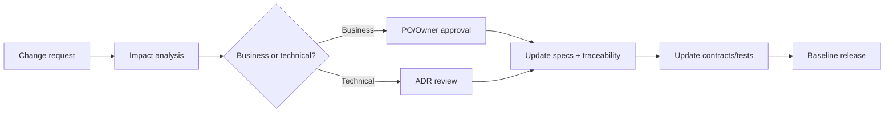

# Quản trị bộ tài liệu

## 1. Thông tin tài liệu

| Thuộc tính | Giá trị |
|---|---|
| Sản phẩm | SunSwim |
| Tên dự án | Hệ thống Quản lý Hoạt động Chuỗi Bể bơi SunSwim |
| Mã dự án | `SSMS-2026-BTL` |
| Loại | Business, Architecture & Functional Specification Suite |
| Phiên bản | 1.0-academic-baseline |
| Trạng thái | Baselined for course report |
| Phạm vi | Một chuỗi từ 1 đến 3 cơ sở |
| Tiền tệ mặc định | VND |
| Timezone mặc định | `Asia/Ho_Chi_Minh`, cho phép cấu hình theo branch |
| Kênh | Admin Web, Member Responsive Web/PWA, Device API |
| Thời gian dự án | 15/08/2026 đến 25/11/2026, gồm 14 tuần |
| Kinh phí được duyệt | 150.000.000 VNĐ |

## 2. Chủ sở hữu và người duyệt

| Nhóm tài liệu | Owner trong nhóm báo cáo | Người review nội bộ |
|---|---|---|
| Business | Vũ Thành Công | Trần Nhật Nam |
| Architecture | Phạm Tuấn Đạt và Trần Nhật Nam | Vũ Thành Công |
| Functional | Vũ Thành Công và Phạm Tuấn Đạt | Vũ Thành Nguyên |
| Contracts | Phạm Tuấn Đạt | Trần Nhật Nam |
| Delivery, chất lượng và báo cáo | Trần Nhật Nam và Vũ Thành Nguyên | Cả nhóm |

Trần Nhật Nam là Project Manager và chịu trách nhiệm điều phối bản hợp nhất. Bảng trên mô tả chủ sở hữu nội dung dự án, còn trách nhiệm viết từng chương báo cáo được quy định riêng trong [Phân công báo cáo PTIT](../05-delivery/06-phan-cong-bao-cao-ptit.md). Người duyệt và đại diện khách hàng được xác định trong [Tôn chỉ dự án](../05-delivery/00-project-charter.md).

## 3. Quy tắc phiên bản

- Major dùng khi thay đổi business contract theo cách không tương thích hoặc thay kiến trúc nền.
- Minor dùng khi thêm feature, module hoặc endpoint nhưng vẫn tương thích ngược.
- Patch dùng để làm rõ hoặc sửa lỗi tài liệu mà không đổi hành vi.
- Khi sửa rule, người thực hiện phải ghi các ID bị ảnh hưởng và cập nhật traceability.

## 4. Quy trình thay đổi

## 5. Quy ước ID

| Loại | Pattern | Ví dụ |
|---|---|---|
| Objective | `OBJ-{DOMAIN}-{NNN}` | `OBJ-ACCESS-001` |
| Business rule | `BR-{DOMAIN}-{NNN}` | `BR-GATE-007` |
| Functional requirement | `FR-{DOMAIN}-{NNN}` | `FR-PASS-012` |
| Non-functional | `NFR-{AREA}-{NNN}` | `NFR-PERF-001` |
| Decision | `DEC-{NNN}` | `DEC-004` |
| Decision question | `OQ-{NNN}` | `OQ-008` |
| Event | `{domain}.{aggregate}.{past-tense}.v{n}` | `commerce.payment.settled.v1` |
| Acceptance criterion | `AC-{DOMAIN}-{NNN}` | `AC-GATE-003` |

## 6. Cách dùng thuật ngữ

- Dùng "hội viên" cho `Member` và "gói/vé" cho `Pass` tùy ngữ cảnh. Trong model vẫn dùng `Pass`.
- "Check-in" và "check-out" chỉ việc vào hoặc ra khu vực kiểm soát, không phải điểm danh lớp.
- `Cancelled` là hủy có lưu lịch sử; không dùng hard delete cho transaction.
- Timestamp trong JSON phải theo RFC 3339 và có offset. Database lưu UTC bằng `timestamptz`.

## Thuật ngữ cần biết

| Thuật ngữ | Giải thích dễ hiểu |
|---|---|
| Baseline | Bản tài liệu đã chốt để nhóm dùng làm mốc chung. |
| Sign-off | Việc người có trách nhiệm xác nhận một tài liệu hoặc kết quả đã đạt yêu cầu. |
| Approver | Người có quyền phê duyệt. |
| Breaking change | Thay đổi làm hệ thống hoặc bên tích hợp cũ không còn hoạt động như trước. |
| Traceability | Khả năng lần theo một yêu cầu từ business rule đến thiết kế, API và kiểm thử. |
