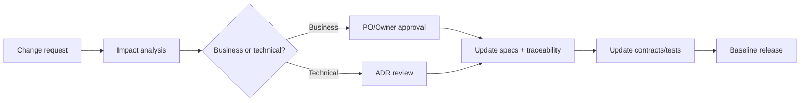

# Quản trị bộ tài liệu

## 1. Metadata

| Thuộc tính | Giá trị |
|---|---|
| Sản phẩm | SunSwim |
| Loại | Business, Architecture & Functional Specification Suite |
| Phiên bản | 1.0-academic-baseline |
| Trạng thái | Baselined for course report |
| Phạm vi | Một chuỗi 1–3 cơ sở |
| Tiền tệ mặc định | VND |
| Timezone mặc định | `Asia/Ho_Chi_Minh`, cho phép cấu hình theo branch |
| Kênh | Admin Web, Member Responsive Web/PWA, Device API |

## 2. Chủ sở hữu và người duyệt

| Nhóm tài liệu | Owner trong nhóm báo cáo | Người review nội bộ |
|---|---|---|
| Business | Đạt | Nguyên |
| Architecture | Nguyên và Nam | Công |
| Functional | Đạt và Nam | Công |
| Contracts | Nam | Nguyên |
| Delivery và báo cáo | Đạt | Cả nhóm |

Sign-off trên xác nhận bộ tài liệu đủ làm đầu vào cho báo cáo học phần. Khi triển khai thật, các approver theo vai trò tại [Baseline dự án](../05-delivery/07-academic-project-baseline.md) phải xác nhận lại.

## 3. Versioning

- Major: thay đổi breaking business contract hoặc kiến trúc nền.
- Minor: thêm feature/module/endpoint tương thích ngược.
- Patch: làm rõ, sửa lỗi tài liệu, không đổi hành vi.
- Mọi thay đổi rule phải ghi ID bị ảnh hưởng và cập nhật traceability.

## 4. Change workflow

## 5. Quy ước ID

| Loại | Pattern | Ví dụ |
|---|---|---|
| Objective | `OBJ-{DOMAIN}-{NNN}` | `OBJ-ACCESS-001` |
| Business rule | `BR-{DOMAIN}-{NNN}` | `BR-GATE-007` |
| Functional requirement | `FR-{DOMAIN}-{NNN}` | `FR-PASS-012` |
| Non-functional | `NFR-{AREA}-{NNN}` | `NFR-PERF-001` |
| Decision | `DEC-{NNN}` | `DEC-004` |
| Decision question | `OQ-{NNN}` | `OQ-008` |
| Event | `{domain}.{aggregate}.{past-tense}.v{n}` | `commerce.payment.settled.v1` |
| Acceptance criterion | `AC-{DOMAIN}-{NNN}` | `AC-GATE-003` |

## 6. Ngôn ngữ chuẩn

- Dùng “hội viên” cho `Member`, “gói/vé” cho `Pass` tùy ngữ cảnh; trong model dùng `Pass`.
- “Check-in” và “check-out” chỉ mô tả quyền vào/ra khu vực kiểm soát, không đồng nghĩa điểm danh lớp.
- `Cancelled` là hủy có lưu lịch sử; không dùng hard delete cho transaction.
- Các timestamp trong JSON phải là RFC 3339 có offset; database lưu UTC bằng `timestamptz`.
