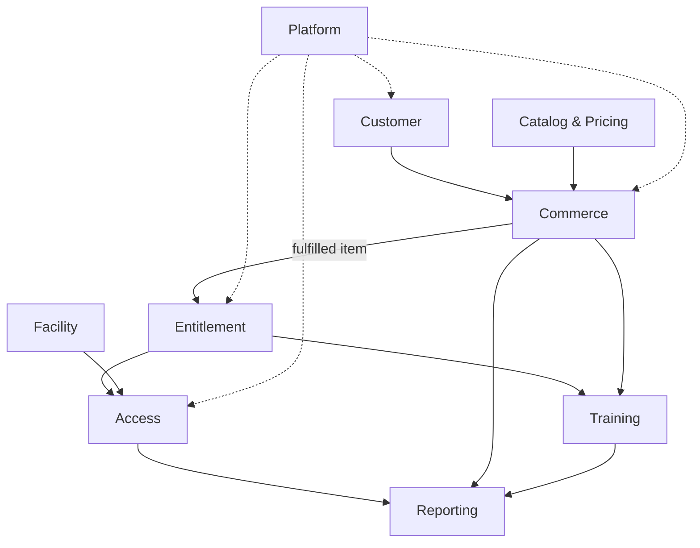

# Capability map và ranh giới domain

## 1. Capability map

| Cấp 1 | Cấp 2 | Release | Domain owner |
|---|---|---|---|
| Customer | Member profile, guest, contact | R1 | Customer |
| Catalog | Pass/class/locker products | R1–R3 | Catalog |
| Entitlement | Issue, activate, expire, consume, adjust, freeze | R1–R2 | Entitlement |
| Commerce | Quote, order, payment, refund, receipt, fulfillment | R1–R2 | Commerce |
| Access | Credential, decision, session, override | R1 | Access |
| Facility | Branch, zone, gate, capacity, locker | R1–R2 | Facility |
| Training | Class, course, session, coach, enrollment, attendance | R3 | Training |
| Reporting | Revenue, traffic, occupancy, export | R1–R2 | Reporting |
| Platform | Identity, RBAC, audit, notification, scheduler | R1 | Platform |

## 2. Bounded contexts

## 3. Ownership và source of truth

| Dữ liệu | Owner | Consumers không được làm gì |
|---|---|---|
| Member identity/profile | Customer | Tự tạo bản sao authoritative |
| Product definition/base price | Catalog | Sửa snapshot order lịch sử |
| Member Pass/usage/freeze | Entitlement | Gate tự sửa remaining entry ngoài command |
| Order/payment/refund/receipt | Commerce | Report suy diễn Paid từ redirect client |
| Access event/session/presence | Access | Dashboard tự cộng trừ thành nguồn chuẩn |
| Branch/zone/capacity limit/locker | Facility | Access bỏ qua limit/version |
| Class/session/enrollment/attendance | Training | Commerce tự xác nhận enrollment ngoài fulfillment |
| Aggregate/read model | Reporting | Ghi ngược transaction gốc |
| User/role/audit/outbox | Platform | Frontend tự quyết quyền |

## 4. Dependency rule

- Gọi đồng bộ chỉ dùng khi cần quyết định ngay trong request, ví dụ Access hỏi Entitlement eligibility.
- Side effect không cần trả ngay dùng event/outbox, ví dụ notification và report projection.
- Trong modular monolith, module gọi qua application interface, không query trực tiếp table của module khác.
- Mỗi aggregate có command owner duy nhất; read model có thể join/projection nhưng không sở hữu write.

