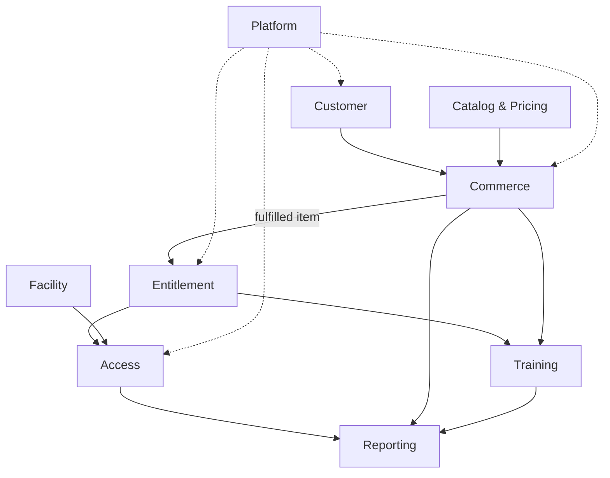

# Bản đồ capability và ranh giới domain

## 1. Capability map

| Cấp 1 | Cấp 2 | Mốc mục tiêu | Domain owner |
|---|---|---|---|
| Customer | Member profile, guest, contact | M3 pilot | Customer |
| Catalog | Pass/class/locker products | M3 pilot | Catalog |
| Entitlement | Issue, activate, expire, consume, adjust, freeze | M3 cốt lõi, M4 hoàn thiện | Entitlement |
| Commerce | Quote, order, payment, refund, receipt, fulfillment | M3 cốt lõi, M4 hoàn thiện | Commerce |
| Access | Credential, decision, session, override, offline sync | M3 pilot | Access |
| Facility | Branch, zone, gate, capacity, locker | M3 pilot | Facility |
| Training | Class, course, session, coach, enrollment, attendance | M3 pilot | Training |
| Reporting | Revenue, traffic, occupancy, export | M4 bàn giao | Reporting |
| Platform | Identity, RBAC, audit, notification, scheduler | M3 cốt lõi, M4 hoàn thiện | Platform |

## 2. Bounded contexts

## 3. Quyền sở hữu dữ liệu và source of truth

| Dữ liệu | Owner | Consumers không được làm gì |
|---|---|---|
| Member identity/profile | Customer | Tự tạo bản sao authoritative |
| Product definition/base price | Catalog | Sửa snapshot order lịch sử |
| Member Pass/usage/freeze | Entitlement | Gate tự sửa remaining entry ngoài command |
| Order/payment/refund/receipt | Commerce | Report suy diễn Paid từ redirect client |
| Access event/session/presence | Access | Dashboard tự cộng trừ thành nguồn chuẩn |
| Branch/zone/capacity limit/locker | Facility | Access bỏ qua limit/version |
| Class/session/enrollment/attendance | Training | Commerce tự xác nhận enrollment ngoài fulfillment |
| Aggregate/read model | Reporting | Ghi ngược transaction gốc |
| User/role/audit/outbox | Platform | Frontend tự quyết quyền |

## 4. Quy tắc phụ thuộc

- Chỉ gọi đồng bộ khi request cần kết quả ngay, chẳng hạn Access kiểm tra eligibility với Entitlement.
- Với side effect không cần trả kết quả ngay, hệ thống dùng event/outbox. Notification và report projection thuộc nhóm này.
- Trong modular monolith, các module liên lạc qua application interface và không query trực tiếp table nội bộ của nhau.
- Mỗi aggregate chỉ có một command owner. Read model có thể dùng join hoặc projection nhưng không được ghi vào dữ liệu nguồn.

## Thuật ngữ cần biết

| Thuật ngữ | Giải thích dễ hiểu |
|---|---|
| Capability | Một nhóm chức năng phục vụ cùng mục tiêu nghiệp vụ. |
| Domain | Khu vực nghiệp vụ có dữ liệu, quy tắc và trách nhiệm riêng. |
| Bounded context | Ranh giới xác định một mô hình và cách dùng thuật ngữ trong domain. |
| Aggregate | Nhóm dữ liệu được thay đổi cùng nhau để giữ business rule. |
| Projection | Bản dữ liệu được tạo từ nguồn chính để đọc hoặc lập báo cáo nhanh hơn. |
