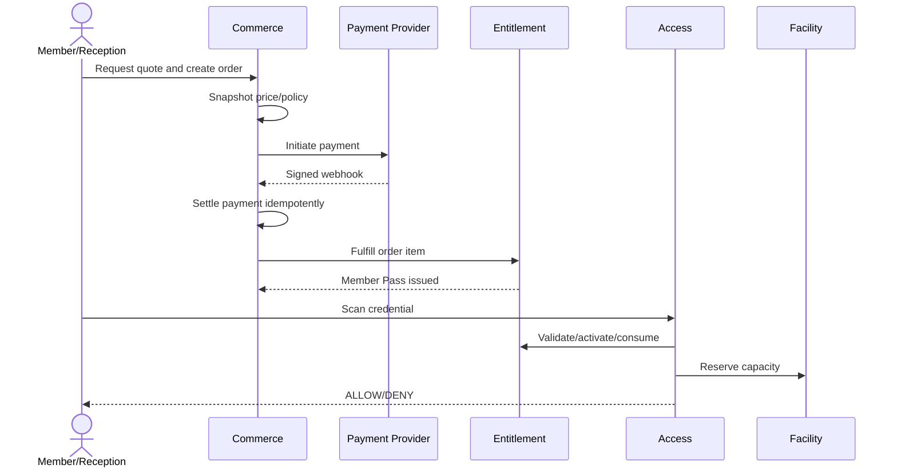
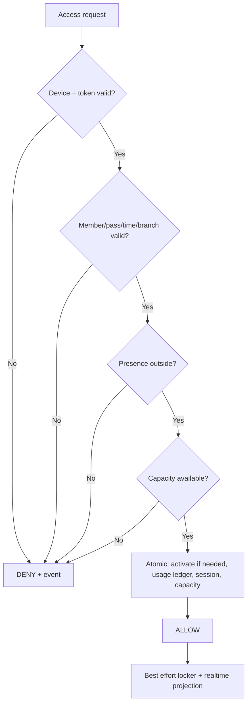

# Quy trình nghiệp vụ từ đầu đến cuối

## 1. Mua pass và lần đầu sử dụng

Các điểm cần kiểm soát:

- Browser redirect không được dùng để xác nhận settlement.
- Order và Member Pass phải lưu snapshot của price và product policy.
- Khi kích hoạt ở lần check-in đầu, việc activate, consume và reserve capacity phải nằm trong cùng một transaction logic.
- Nếu gate vật lý không mở, hệ thống chờ ack trong 10 giây rồi tự compensation và ghi recovery audit theo `OQ-005`.

## 2. Freeze lifecycle

1. Request được tạo ở `PENDING` sau validation sơ bộ.
2. Approver revalidate quota, overlap và pass state.
3. Approval tạo `FreezePeriod` và expiry adjustment ledger.
4. Scheduler chuyển `SCHEDULED → ACTIVE → COMPLETED` theo timezone branch/pass policy.
5. Eligibility đọc freeze period hiệu lực, không chỉ dựa vào job đã chạy đúng giây.
6. Early resume tạo adjustment có audit; không xóa period cũ.

## 3. Check-in/out và reconciliation

Checkout phải đóng đúng session đang mở, release temporary locker và cập nhật projection. Nightly reconciliation không xóa hoặc sửa event cũ. Thay vào đó, tác vụ tạo `access.reconciled` kèm actor, reason và policy.

### Khi chi nhánh mất kết nối Internet

1. Ứng dụng tại quầy chuyển sang chế độ ngoại tuyến và hiển thị rõ thời điểm đồng bộ gần nhất.
2. RFID hoặc QR được kiểm tra bằng dữ liệu tối thiểu trong Local Cache, gồm trạng thái thẻ, quyền còn hiệu lực và các giới hạn cần thiết đã được đồng bộ.
3. Mỗi lần quét được lưu vào hàng đợi cục bộ với mã yêu cầu duy nhất, thời gian thiết bị và kết quả xử lý.
4. Nếu dữ liệu đã cũ, thiếu hoặc không đủ để đưa ra quyết định an toàn, hệ thống từ chối tự động và hướng dẫn lễ tân xử lý thủ công có ghi nhận.
5. Khi có mạng trở lại, ứng dụng gửi lại các bản ghi theo thứ tự. Máy chủ dùng mã yêu cầu để chống ghi trùng, đối soát chênh lệch và tạo cảnh báo nếu phát hiện xung đột.

## 4. Class enrollment

1. Validate member/dependent, enrollment window, age/waiver nếu áp dụng.
2. Reserve seat có TTL khi cần payment.
3. Settlement fulfillment chuyển enrollment sang `CONFIRMED`.
4. Hết TTL hoặc payment failed giải phóng reservation.
5. Cancellation áp policy refund/credit rồi mời waitlist theo FIFO có priority rule rõ.
6. Attendance chỉ ghi cho session hợp lệ; khóa sau cutoff.

## 5. Refund và entitlement reversal

Refund được xử lý theo một saga nghiệp vụ có kiểm soát:

1. Tạo refund request và đánh giá usage.
2. Approve theo threshold/separation of duties.
3. Gửi provider; chỉ `SETTLED` khi có xác nhận.
4. Áp policy entitlement: cancel, reduce, hoặc giữ nguyên kèm reason.
5. Ghi event để report phản ánh net revenue.

Hệ thống phải giữ lại lịch sử order, payment và pass.

## Thuật ngữ cần biết

| Thuật ngữ | Giải thích dễ hiểu |
|---|---|
| End-to-end | Toàn bộ luồng từ lúc người dùng bắt đầu đến khi nhận kết quả cuối. |
| Snapshot | Bản sao dữ liệu được giữ tại thời điểm giao dịch để lịch sử không đổi. |
| Compensation | Giao dịch bù để xử lý tác động đã xảy ra khi không thể rollback trực tiếp. |
| Saga | Chuỗi nhiều bước nghiệp vụ, trong đó mỗi bước có cách xử lý khi bước sau thất bại. |
| Cutoff | Mốc thời gian sau đó một thao tác không còn được xử lý theo quy tắc thông thường. |
| Local Cache | Phần dữ liệu cần thiết được lưu tạm trên máy quầy để làm việc khi mất mạng. |
