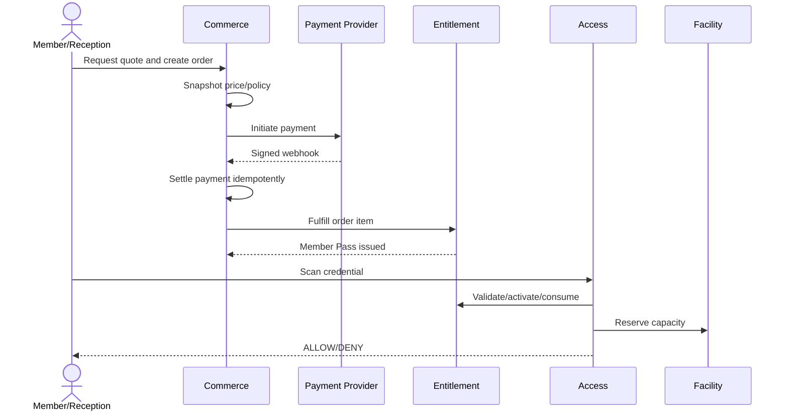
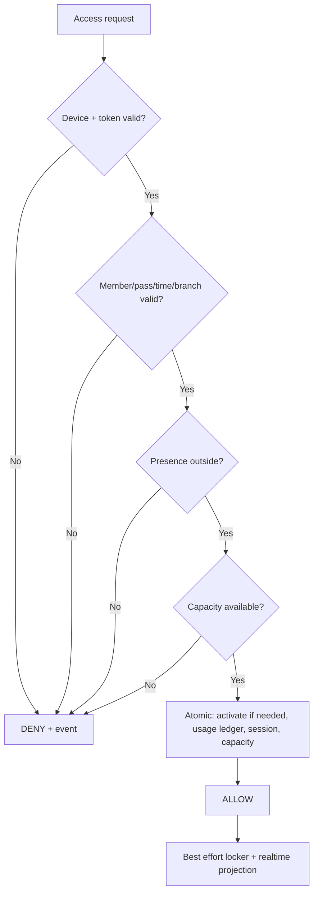

# Quy trình nghiệp vụ end-to-end

## 1. Mua pass và lần đầu sử dụng

Điểm kiểm soát:

- Browser redirect không settlement.
- Price và product policy cần snapshot ở order/member pass.
- First-check-in activation và consume/reserve capacity nằm trong một transaction logic.
- Gate physical open failure áp dụng ack timeout 10 giây, compensation tự động và recovery audit theo `OQ-005`.

## 2. Freeze lifecycle

1. Request được tạo ở `PENDING` sau validation sơ bộ.
2. Approver revalidate quota, overlap và pass state.
3. Approval tạo `FreezePeriod` và expiry adjustment ledger.
4. Scheduler chuyển `SCHEDULED → ACTIVE → COMPLETED` theo timezone branch/pass policy.
5. Eligibility đọc freeze period hiệu lực, không chỉ dựa vào job đã chạy đúng giây.
6. Early resume tạo adjustment có audit; không xóa period cũ.

## 3. Check-in/out và reconciliation

Checkout đóng đúng session mở, release temporary locker và cập nhật projection. Nightly reconciliation không xóa/sửa event; nó tạo `access.reconciled` với actor/reason/policy.

## 4. Class enrollment

1. Validate member/dependent, enrollment window, age/waiver nếu áp dụng.
2. Reserve seat có TTL khi cần payment.
3. Settlement fulfillment chuyển enrollment sang `CONFIRMED`.
4. Hết TTL hoặc payment failed giải phóng reservation.
5. Cancellation áp policy refund/credit rồi mời waitlist theo FIFO có priority rule rõ.
6. Attendance chỉ ghi cho session hợp lệ; khóa sau cutoff.

## 5. Refund và entitlement reversal

Refund là saga nghiệp vụ có kiểm soát:

1. Tạo refund request và đánh giá usage.
2. Approve theo threshold/separation of duties.
3. Gửi provider; chỉ `SETTLED` khi có xác nhận.
4. Áp policy entitlement: cancel, reduce, hoặc giữ nguyên kèm reason.
5. Ghi event để report phản ánh net revenue.

Không xóa order/payment/pass lịch sử.
