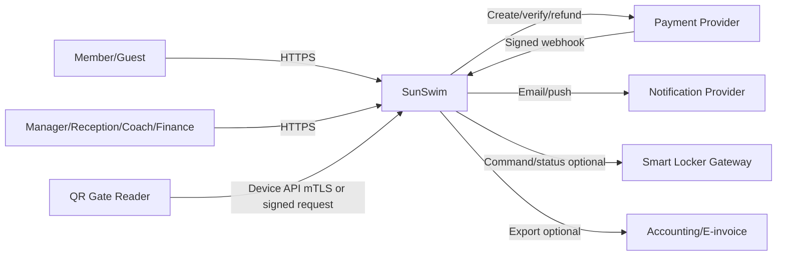

# System context và trust boundaries

## 1. System context

## 2. System boundary

SunSwim sở hữu:

- member profile, pass, usage, access session và capacity state;
- product/price quote/order/fulfillment;
- class/enrollment/attendance và locker assignment;
- operational report projection, audit và notification intent.

External provider sở hữu:

- card/bank authorization và settlement evidence;
- delivery status cuối cùng của email/SMS/push;
- physical gate/lock actuation và device health;
- accounting/e-invoice record nếu tích hợp ngoài.

## 3. Trust boundaries

| Boundary | Không được tin trực tiếp | Control bắt buộc |
|---|---|---|
| Browser/PWA → API | role, memberId, price, branch, redirect status | auth, authorization, server-side resolution/validation |
| Gate → Device API | branchId, timestamp, repeated request | device identity, branch binding, nonce/request ID, skew/rate limits |
| PSP → Webhook | body, amount, status, transaction | signature, raw-body verify, provider lookup khi cần, idempotency |
| Worker/queue → modules | event độc nhất/thứ tự hoàn hảo | consumer inbox/dedupe, version, retry/DLQ |
| Admin export → user | quyền tồn tại mãi | authorize khi tạo và khi tải, signed URL ngắn hạn |
| Smart lock → system | command đã thực thi | correlation ID, acknowledgment, timeout, reconciliation |

## 4. External interface assumptions

- Payment và locker/gate provider cụ thể được chọn qua Procurement Plan; contract adapter phải che khác biệt provider.
- Gate có network ổn định trong MVP; mất kết nối dùng fail closed + reception override.
- Notification không nằm trên critical path của payment/access.
- Export file lưu object storage private, mã hóa và tự hết hạn.

## 5. Context-level risks

- Physical access không thể đạt “exactly once” chỉ bằng phần mềm nếu gate mở thất bại sau response.
- Payment/webhook và lock commands có retry, duplicate, out-of-order.
- Device clock có thể lệch; server clock là authoritative.
- Branch network chập chờn tác động trực tiếp gate MVP; cần runbook và manual fallback.
