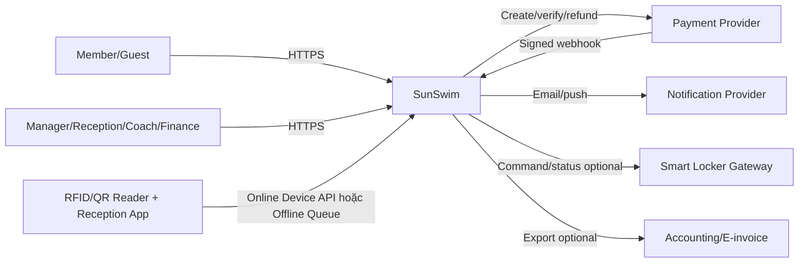

# System context và trust boundaries

## 1. Bối cảnh hệ thống

## 2. System boundary

SunSwim quản lý các dữ liệu và quy trình sau:

- member profile, pass, usage, access session và capacity state;
- product/price quote/order/fulfillment;
- class/enrollment/attendance và locker assignment;
- operational report projection, audit và notification intent.

Các external provider chịu trách nhiệm cho:

- card/bank authorization và settlement evidence;
- delivery status cuối cùng của email/SMS/push;
- physical gate/lock actuation và device health;
- accounting/e-invoice record nếu tích hợp ngoài.

## 3. Ranh giới tin cậy

| Boundary | Không được tin trực tiếp | Control bắt buộc |
|---|---|---|
| Browser/PWA → API | role, memberId, price, branch, redirect status | auth, authorization, server-side resolution/validation |
| Gate → Device API | branchId, timestamp, repeated request | device identity, branch binding, nonce/request ID, skew/rate limits |
| PSP → Webhook | body, amount, status, transaction | signature, raw-body verify, provider lookup khi cần, idempotency |
| Worker/queue → modules | event độc nhất/thứ tự hoàn hảo | consumer inbox/dedupe, version, retry/DLQ |
| Admin export → user | quyền tồn tại mãi | authorize khi tạo và khi tải, signed URL ngắn hạn |
| Smart lock → system | command đã thực thi | correlation ID, acknowledgment, timeout, reconciliation |

## 4. Giả định về giao diện bên ngoài

- Nhà cung cấp payment, locker và gate sẽ được chọn theo Procurement Plan. Contract adapter phải che phần khác nhau giữa các provider.
- Máy quầy lễ tân có Local Cache và hàng đợi bản ghi quét. Khi mất mạng, ứng dụng chỉ xử lý bằng dữ liệu cục bộ còn hiệu lực; khi có mạng trở lại, dữ liệu được đồng bộ và đối soát bằng mã yêu cầu duy nhất.
- Notification không nằm trên critical path của payment hoặc access.
- File export được mã hóa, lưu trong private object storage và tự hết hạn.

## 5. Context-level risks

- Phần mềm không thể bảo đảm physical access "exactly once" nếu gate không mở sau khi hệ thống đã trả response.
- Payment webhook và lock command có thể bị retry, trùng hoặc đến sai thứ tự.
- Đồng hồ của device có thể lệch, vì vậy hệ thống dùng thời gian của server làm chuẩn.
- Local Cache có thể cũ hoặc thiếu dữ liệu khi mất mạng kéo dài. Ứng dụng phải hiển thị độ mới của dữ liệu, giới hạn quyết định tự động và có runbook xử lý thủ công.

## Thuật ngữ cần biết

| Thuật ngữ | Giải thích dễ hiểu |
|---|---|
| System context | Sơ đồ cho biết hệ thống giao tiếp với người dùng và hệ thống bên ngoài nào. |
| Trust boundary | Ranh giới mà dữ liệu đi qua và phải được kiểm tra lại trước khi tin cậy. |
| Provider | Đơn vị hoặc dịch vụ bên ngoài cung cấp payment, notification hay thiết bị. |
| Acknowledgement hoặc ack | Tín hiệu xác nhận thiết bị đã nhận hoặc thực hiện command. |
| Offline Queue | Hàng đợi lưu tạm thao tác tại quầy để gửi lên máy chủ sau khi kết nối trở lại. |
