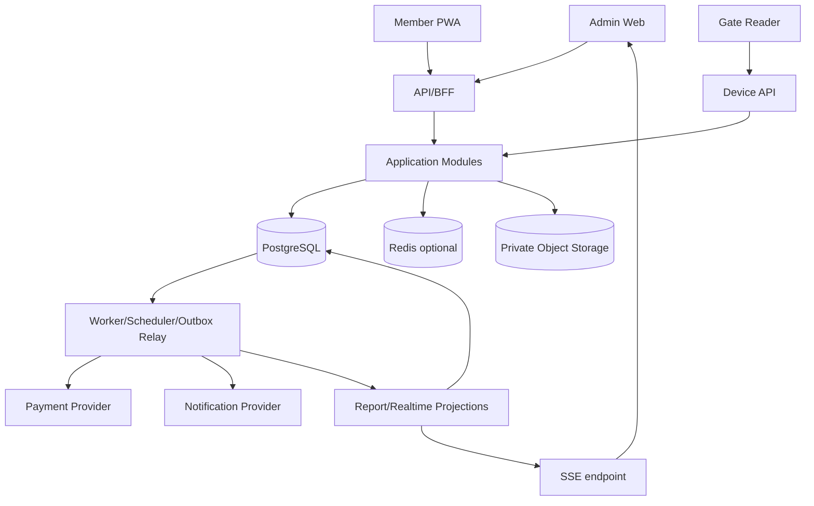

# Solution architecture

## 1. Architectural style

Kiến trúc đã chốt là modular monolith. Web/API và worker chạy ở các process riêng nhưng dùng chung codebase và PostgreSQL. Trong giai đoạn đầu, toàn bộ hệ thống là một đơn vị deploy có ranh giới module và contract rõ ràng.

Lý do:

- Quy mô từ 1 đến 3 branch chưa cần gánh thêm chi phí vận hành microservice.
- Access, entitlement và facility có các invariant cần strong transaction.
- Commerce fulfillment cần cơ chế retry đáng tin cậy nhưng không cần distributed transaction.
- Ranh giới module cho phép tách service sau này nếu số liệu tải hoặc cách chia ownership cho thấy điều đó là cần thiết.

## 2. Logical components

## 3. Module boundaries

| Module | Write aggregates | Public application interfaces |
|---|---|---|
| Customer | Member, Household optional | get member, resolve identity, update profile |
| CatalogPricing | Product, TimeRule, PriceRule | quote, validate product availability |
| Commerce | Order, Payment, Refund, Fulfillment | create order, settle payment, fulfill/retry |
| Entitlement | MemberPass, PassUsage, Freeze | issue, eligibility, consume, adjust, freeze |
| Access | Credential, AccessEvent, AccessSession | decide access, checkout, override, reconcile |
| Facility | Branch, Zone, CapacityState, Locker | reserve/release capacity, assign/release locker |
| Training | Class, Session, Enrollment, Attendance | enroll, cancel, schedule, record attendance |
| Reporting | Projections, ExportJob | query dashboards, generate export |
| Platform | User, Role, Audit, Idempotency, Outbox | authorize, audit, publish, notify |

## 4. Giới hạn phụ thuộc

- Domain layer không phụ thuộc vào HTTP, ORM, queue hoặc provider SDK.
- Application layer điều phối use case và transaction.
- Infrastructure adapter triển khai các repository port và provider port.
- Một module không được import repository hoặc table nội bộ của module khác.
- Không cho phép circular dependency. Side effect giữa các domain phải đi qua application contract hoặc event.
- Không dùng API DTO làm domain entity.

## 5. Request paths

### Critical synchronous path

`Gate → Device auth → Access orchestration → Entitlement + Facility transaction → decision`.

Path này không gọi payment, notification hoặc reporting provider. Audit và outbox được ghi trong cùng DB transaction; relay chỉ chạy sau khi commit.

### Commerce path

`Client → Quote → Order → Provider initiation → Webhook verification → Payment settlement → Outbox → Fulfillment`.

Client có thể poll order hoặc nhận notification. Redirect không được thay đổi settlement.

### Read/report path

Chi tiết vận hành được đọc từ các normalized table có index. Dashboard nặng đọc từ projection. MVP không dùng CQRS với hai database; projection nằm trong một PostgreSQL schema riêng và có thể rebuild.

## 6. Realtime choice

Dashboard dùng SSE vì client chủ yếu nhận cập nhật một chiều về occupancy và access. Chỉ dùng WebSocket khi có use case điều khiển hai chiều. Khi SSE kết nối lại bằng `Last-Event-ID`, client vẫn phải tải lại snapshot để tránh bỏ sót sự kiện.

## 7. Scale-out rules

- API phải stateless để có thể scale ngang sau load balancer.
- Worker job dùng lease hoặc advisory lock để tránh chạy trùng một logical job.
- Mỗi instance có hard limit cho database connection pool.
- Query quan trọng của gate không được phụ thuộc vào report projection.
- Chỉ tách service khi có số liệu hoặc yêu cầu rõ về tải, fault isolation, compliance hay team ownership.

## Thuật ngữ cần biết

| Thuật ngữ | Giải thích dễ hiểu |
|---|---|
| Modular monolith | Một ứng dụng được triển khai chung nhưng chia thành các module có ranh giới rõ. |
| Worker | Process chạy công việc nền như gửi event, reconciliation hoặc notification. |
| Adapter | Lớp chuyển đổi giữa logic SunSwim và giao diện của hệ thống bên ngoài. |
| Stateless | Instance không giữ trạng thái phiên riêng nên request có thể đi tới instance bất kỳ. |
| SSE | Cách server gửi luồng cập nhật một chiều liên tục cho trình duyệt. |
