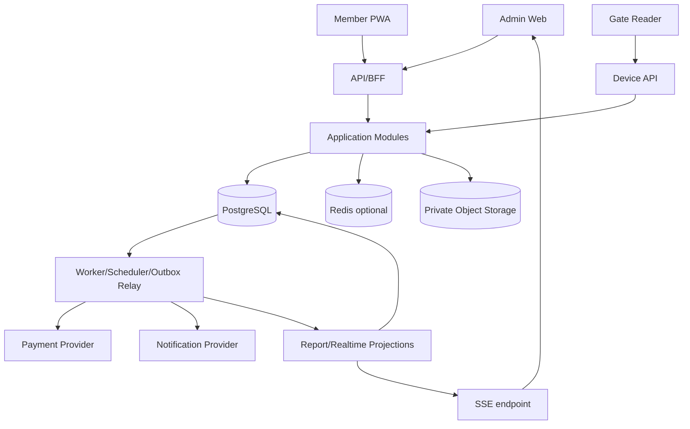

# Solution architecture

## 1. Architectural style

Baseline `BASELINED`: modular monolith với process web/API và worker tách biệt, dùng chung codebase và PostgreSQL. Đây là đơn vị deploy chính trong giai đoạn đầu nhưng có module boundaries và contract rõ.

Lý do:

- Quy mô 1–3 branch chưa cần chi phí vận hành microservice.
- Access, entitlement và facility có invariant cần transaction mạnh.
- Commerce fulfillment cần retry đáng tin cậy nhưng không cần distributed transaction.
- Module boundary cho phép tách service sau khi có số liệu tải hoặc nhu cầu ownership độc lập.

## 2. Logical components

## 3. Module boundaries

| Module | Write aggregates | Public application interfaces |
|---|---|---|
| Customer | Member, Household optional | get member, resolve identity, update profile |
| CatalogPricing | Product, TimeRule, PriceRule | quote, validate product availability |
| Commerce | Order, Payment, Refund, Fulfillment | create order, settle payment, fulfill/retry |
| Entitlement | MemberPass, PassUsage, Freeze | issue, eligibility, consume, adjust, freeze |
| Access | Credential, AccessEvent, AccessSession | decide access, checkout, override, reconcile |
| Facility | Branch, Zone, CapacityState, Locker | reserve/release capacity, assign/release locker |
| Training | Class, Session, Enrollment, Attendance | enroll, cancel, schedule, record attendance |
| Reporting | Projections, ExportJob | query dashboards, generate export |
| Platform | User, Role, Audit, Idempotency, Outbox | authorize, audit, publish, notify |

## 4. Dependency constraints

- Domain layer không phụ thuộc HTTP, ORM, queue hoặc provider SDK.
- Application layer điều phối use case và transaction.
- Infrastructure adapters implement repository/provider ports.
- Module không import repository/table nội bộ của module khác.
- Circular dependency bị cấm. Cross-domain side effects đi qua application contract hoặc event.
- API DTO không được dùng làm domain entity.

## 5. Request paths

### Critical synchronous path

`Gate → Device auth → Access orchestration → Entitlement + Facility transaction → decision`.

Không gọi payment, notification, reporting provider trên path này. Audit/outbox được ghi cùng DB transaction; relay chạy sau commit.

### Commerce path

`Client → Quote → Order → Provider initiation → Webhook verification → Payment settlement → Outbox → Fulfillment`.

Client có thể poll order hoặc nhận notification; redirect không đổi settlement.

### Read/report path

Operational detail đọc normalized tables có index. Dashboard nặng đọc projection. Không đưa CQRS hai database vào MVP; projection vẫn trong PostgreSQL schema riêng và có thể rebuild.

## 6. Realtime choice

SSE là baseline cho dashboard one-way vì client chủ yếu nhận occupancy/access updates. WebSocket chỉ cần nếu có bidirectional device/control use case thực tế. SSE reconnect dùng `Last-Event-ID`; client luôn refetch snapshot khi reconnect để tránh bỏ sự kiện.

## 7. Scale-out rules

- API stateless; scale ngang sau load balancer.
- Worker job dùng lease/advisory lock để một logical job không chạy đồng thời ngoài ý muốn.
- Database connection pool có hard limit theo instance.
- Gate critical query không phụ thuộc report projection.
- Chỉ tách service khi có bằng chứng: tải, fault isolation, compliance hoặc team ownership.
