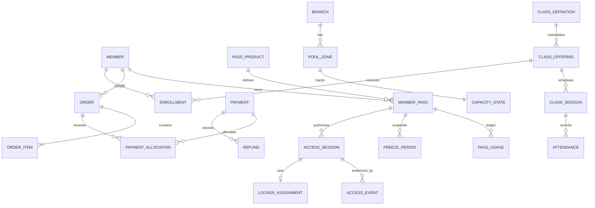

# Kiến trúc domain và dữ liệu

## 1. Nguyên tắc dữ liệu

- PostgreSQL là system of record của hệ thống.
- Dữ liệu được normalize đến 3NF. Lịch sử giá và policy dùng snapshot có chủ đích.
- Public ID dùng UUID không tuần tự để khó suy đoán. Business code có unique constraint riêng và không dùng làm primary key.
- `timestamptz` cho event time, `date` cho ngày nghiệp vụ, `numeric(19,0)` cho VND.
- Business status dùng `text` + `check`/lookup để dễ tiến hóa có kiểm soát.
- Mỗi foreign key được dùng thường xuyên cần có index riêng; foreign key không tự tạo index.
- Mọi interval dùng dạng `[start, end)`. Có thể dùng range hoặc exclusion constraint khi phù hợp.

## 2. Aggregate model

## 3. Table catalog tối thiểu

| Schema/module | Tables chính |
|---|---|
| customer | `members`, `member_contacts`, `households` optional |
| catalog | `products`, `product_branch_scopes`, `time_rules`, `pricing_rules`, `pricing_rule_scopes` |
| entitlement | `member_passes`, `pass_usages`, `freeze_policies`, `freeze_requests`, `freeze_periods` |
| commerce | `orders`, `order_items`, `payments`, `payment_allocations`, `refunds`, `fulfillments`, `receipts` |
| access | `access_credentials`, `access_requests`, `access_events`, `access_sessions` |
| facility | `branches`, `pool_zones`, `gates`, `capacity_states`, `capacity_adjustments`, `lockers`, `locker_assignments` |
| training | `coaches`, `class_definitions`, `class_offerings`, `class_sessions`, `enrollments`, `seat_reservations`, `attendance` |
| platform | `users`, `roles`, `permissions`, `user_role_scopes`, `audit_logs`, `idempotency_records`, `outbox_events`, `consumer_inbox` |
| reporting | projections và `export_jobs` |

## 4. Invariants bằng constraint/index

| Invariant | Cơ chế database đề xuất |
|---|---|
| Phone unique khi có | unique expression index trên normalized phone, partial `where phone is not null` |
| Provider transaction không trùng | unique `(provider, provider_transaction_id)` |
| Webhook không xử lý hai lần | unique `(provider, provider_event_id)` hoặc payload fingerprint fallback |
| Một open session/member trên toàn chuỗi | partial unique index theo DEC-003 và OQ-001 |
| Remaining không âm | usage command atomic + check trên materialized balance; ledger là audit source |
| Freeze không overlap | exclusion constraint trên `member_pass_id` + `tstzrange`/`daterange` |
| Coach/session không overlap | exclusion constraint trên `coach_id` + `tstzrange` cho trạng thái active |
| Locker assignment không overlap | exclusion trên `locker_id` + assignment range active |
| Capacity không âm/vượt max | row lock `capacity_states`, check constraints và command guard |
| Fulfillment không trùng | unique `(order_item_id, fulfillment_type)` |
| Event consumer không trùng | unique `(consumer_name, event_id)` |

## 5. Hot-path state

### Pass balance

`pass_usages` chỉ cho phép ghi thêm. Mỗi bản ghi có `delta_entries` âm hoặc dương và reason. `member_passes.consumed_entries` hoặc `remaining_entries` có thể lưu materialized balance để kiểm tra eligibility nhanh, nhưng phải cập nhật trong cùng transaction. Reconciliation so sánh balance này với `sum(delta_entries)`.

### Capacity

`access_sessions` là lịch sử authoritative. `capacity_states.current_occupancy` là trạng thái dùng cho quyết định đồng bộ; row này được lock và cập nhật cùng lúc với việc mở hoặc đóng session. Có thể rebuild giá trị từ các session đang mở, nhưng cache ngoài database không được dùng làm nguồn quyết định.

### Audit

Audit log chỉ cho phép ghi thêm. Mỗi bản ghi có actor, user hoặc device, action, target, branch scope, old/new JSONB đã lọc secret, reason, request/correlation ID, IP hoặc device metadata và `occurred_at`.

## 6. Concurrency lock order

Để giảm deadlock, mọi luồng check-in phải lock dữ liệu theo cùng thứ tự:

1. Idempotency/access request row.
2. Open presence/member lock.
3. Member pass row/version.
4. Capacity state theo thứ tự zone ID cố định.
5. Locker row nếu locker là điều kiện bắt buộc.

Transaction phải ngắn và không được gọi network hoặc provider khi đang mở.

## 7. Indexing baseline

- `member_passes(member_id, status, valid_until)`.
- `pass_usages(member_pass_id, occurred_at desc)`.
- `access_events(branch_id, occurred_at desc)` và `(member_id, occurred_at desc)`.
- `access_sessions(branch_id, status)` partial cho `OPEN`.
- `orders(branch_id, created_at desc)`, `payments(order_id)`, `refunds(payment_id)`.
- `class_sessions(branch_id, start_at)` và `enrollments(offering_id, status)`.
- FK columns đều có index nếu được join/delete-check thường xuyên.

Không partition dữ liệu quá sớm. Chỉ cân nhắc time partition cho access, audit hoặc outbox sau khi đo volume và xác định rõ nhu cầu retention hoặc maintenance.

## 8. PII và retention flags

Mỗi table/column cần data classification (`PUBLIC`, `INTERNAL`, `CONFIDENTIAL`, `RESTRICTED`) và retention owner. Hồ sơ member được giữ trong thời gian hoạt động và 24 tháng sau giao dịch cuối; payment và audit giữ 5 năm. Xóa hoặc anonymize không được phá financial/access audit bắt buộc theo `OQ-012`.

## Thuật ngữ cần biết

| Thuật ngữ | Giải thích dễ hiểu |
|---|---|
| 3NF | Cách tổ chức bảng để giảm dữ liệu lặp và hạn chế cập nhật sai lệch. |
| Primary key hoặc PK | Giá trị nhận diện duy nhất một bản ghi trong bảng. |
| Foreign key hoặc FK | Trường liên kết một bản ghi với bản ghi ở bảng khác. |
| Append-only | Chỉ thêm bản ghi mới, không sửa hoặc xóa lịch sử cũ. |
| Exclusion constraint | Ràng buộc database dùng để ngăn các khoảng thời gian hoặc tài nguyên bị trùng. |
