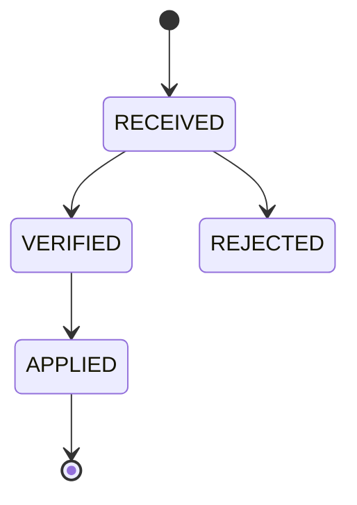

# Consistency, concurrency và event architecture

## 1. Consistency model

| Luồng | Yêu cầu | Cơ chế |
|---|---|---|
| Check-in | Strong consistency | Một DB transaction + row lock/atomic update |
| Payment settlement | Idempotent, ordered per transaction | Unique provider IDs + state transition guard |
| Fulfillment | Eventual, không mất intent | Outbox + idempotent fulfillment record |
| Notification | Eventual, best effort có retry | Outbox/queue + delivery status |
| Report projection | Eventual, rebuildable | Outbox event + checkpoint/inbox |
| Realtime UI | Eventual snapshot + stream | SSE và refetch snapshot |
| Smart locker | Eventual command/ack | Command log + timeout/reconciliation |

## 2. Atomic check-in algorithm

```text
BEGIN
  claim idempotency key/request_id
  authenticate device and bind branch/gate
  resolve credential and member
  lock/check open presence
  select deterministic eligible pass; lock pass row
  evaluate date/time/branch/frequency/freeze
  lock capacity_state; assert current < max
  activate pass if FIRST_CHECK_IN
  append pass_usage if consumption required
  create access_session and ALLOW access_event
  increment capacity_state
  insert audit/outbox event
COMMIT
return stored decision
```

Mọi DENY được ghi thành access event theo policy nhưng không consume/increment. Retry cùng request ID trả response đã lưu. Duplicate scan với request ID khác trong debounce window trả `DUPLICATE_SCAN` và không tạo side effect; có thể vẫn tăng metric chống abuse.

## 3. Checkout algorithm

- Claim request ID.
- Lock open session và capacity state theo cùng lock order.
- Đóng session, ghi checkout event, giảm occupancy không dưới 0.
- Tạo outbox `access.session.closed.v1`.
- Locker release là cùng transaction nếu locker chỉ là logical state trong DB; physical reset command gửi sau commit.

## 4. Payment webhook state machine



Processor phải:

1. Giữ raw body vừa đủ để verify theo policy, không log secret.
2. Xác minh signature, provider account, amount, currency và merchant reference.
3. Deduplicate provider event/transaction.
4. Chỉ cho state transition hợp lệ; stale/out-of-order event không lùi trạng thái.
5. Ghi payment change và outbox trong cùng transaction.
6. Trả success cho duplicate đã xử lý để provider dừng retry.

## 5. Transactional outbox

Business state và outbox row được commit cùng transaction. Relay publish sau commit, retry có backoff và chuyển dead-letter sau ngưỡng. Delivery là at-least-once, vì vậy:

- event có `id`, `source`, `type`, `subject`, `time`, `correlationid`, `causationid`, `dataschema`, `data`;
- consumer ghi inbox/checkpoint trước hoặc cùng transaction xử lý;
- producer không hứa global order; chỉ bảo toàn thứ tự theo aggregate/version khi cần;
- schema evolution tương thích ngược trong cùng major event version.

## 6. Scheduler correctness

Eligibility không được chỉ tin scheduler đã chuyển status. Nó luôn đánh giá effective timestamps. Scheduler giúp materialize state, gửi notification và reconciliation. Job phải idempotent, có lease và lưu `last_success_at`, cursor, duration, affected rows, error.

## 7. Compensation boundaries

- DB transaction rollback cho check-in trước response.
- Sau khi physical gate đã mở, không thể “rollback” vật lý; dùng compensation/recovery event.
- Payment settlement không đảo bằng cách sửa trạng thái; dùng refund/reversal transaction.
- Notification failure không rollback payment/fulfillment.

