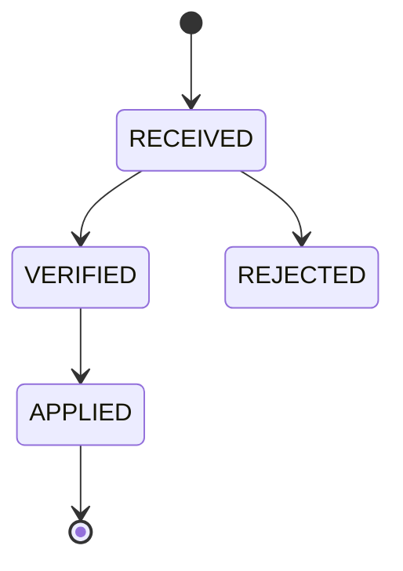

# Kiến trúc consistency, concurrency và event

## 1. Consistency model

| Luồng | Yêu cầu | Cơ chế |
|---|---|---|
| Check-in | Strong consistency | Một DB transaction + row lock/atomic update |
| Payment settlement | Idempotent, ordered per transaction | Unique provider IDs + state transition guard |
| Fulfillment | Eventual, không mất intent | Outbox + idempotent fulfillment record |
| Notification | Eventual, best effort có retry | Outbox/queue + delivery status |
| Report projection | Eventual, rebuildable | Outbox event + checkpoint/inbox |
| Realtime UI | Eventual snapshot + stream | SSE và refetch snapshot |
| Smart locker | Eventual command/ack | Command log + timeout/reconciliation |

## 2. Atomic check-in algorithm

```text
BEGIN
  claim idempotency key/request_id
  authenticate device and bind branch/gate
  resolve credential and member
  lock/check open presence
  select deterministic eligible pass; lock pass row
  evaluate date/time/branch/frequency/freeze
  lock capacity_state; assert current < max
  activate pass if FIRST_CHECK_IN
  append pass_usage if consumption required
  create access_session and ALLOW access_event
  increment capacity_state
  insert audit/outbox event
COMMIT
return stored decision
```

Mỗi quyết định DENY được ghi thành access event theo policy nhưng không consume pass hoặc tăng capacity. Khi retry cùng request ID, hệ thống trả response đã lưu. Nếu cùng credential được quét lại trong debounce window bằng request ID khác, hệ thống trả `DUPLICATE_SCAN` và không tạo side effect. Metric chống abuse vẫn có thể tăng.

## 3. Checkout algorithm

- Claim request ID.
- Lock open session và capacity state theo cùng lock order.
- Đóng session, ghi checkout event, giảm occupancy không dưới 0.
- Tạo outbox `access.session.closed.v1`.
- Locker release là cùng transaction nếu locker chỉ là logical state trong DB; physical reset command gửi sau commit.

## 4. Payment webhook state machine



Processor thực hiện các bước sau:

1. Giữ raw body đủ để verify theo policy và không ghi secret vào log.
2. Xác minh signature, provider account, amount, currency và merchant reference.
3. Deduplicate provider event/transaction.
4. Chỉ chấp nhận state transition hợp lệ. Event cũ hoặc đến sai thứ tự không được đưa trạng thái lùi lại.
5. Ghi payment change và outbox trong cùng transaction.
6. Trả success cho duplicate đã xử lý để provider dừng retry.

## 5. Transactional outbox

Business state và outbox row được commit trong cùng transaction. Relay chỉ publish sau commit, dùng backoff khi retry và chuyển sang dead-letter sau khi vượt ngưỡng. Vì delivery là at-least-once:

- event có `id`, `source`, `type`, `subject`, `time`, `correlationid`, `causationid`, `dataschema`, `data`;
- consumer ghi inbox/checkpoint trước hoặc cùng transaction xử lý;
- producer không hứa global order; chỉ bảo toàn thứ tự theo aggregate/version khi cần;
- schema evolution tương thích ngược trong cùng major event version.

## 6. Scheduler correctness

Eligibility luôn đánh giá effective timestamp thay vì chỉ dựa vào status do scheduler chuyển. Scheduler dùng để materialize state, gửi notification và chạy reconciliation. Mỗi job phải idempotent, có lease và lưu `last_success_at`, cursor, duration, affected rows và error.

## 7. Compensation boundaries

- DB transaction rollback cho check-in trước response.
- Sau khi physical gate đã mở, hệ thống không thể "rollback" hành động vật lý. Trường hợp này phải dùng compensation hoặc recovery event.
- Payment settlement không đảo bằng cách sửa trạng thái; dùng refund/reversal transaction.
- Notification failure không rollback payment/fulfillment.

## Thuật ngữ cần biết

| Thuật ngữ | Giải thích dễ hiểu |
|---|---|
| Strong consistency | Sau khi giao dịch hoàn tất, mọi lần đọc liên quan phải thấy ngay kết quả đúng. |
| Eventual consistency | Dữ liệu ở phần khác có thể cập nhật chậm một khoảng ngắn nhưng cuối cùng phải khớp. |
| Transactional outbox | Lưu thay đổi nghiệp vụ và yêu cầu phát event trong cùng transaction để không mất event. |
| DLQ | Hàng đợi chứa event đã thử xử lý nhiều lần nhưng vẫn lỗi. |
| Compensation | Hành động bù lại tác động đã xảy ra khi không thể rollback trực tiếp. |
