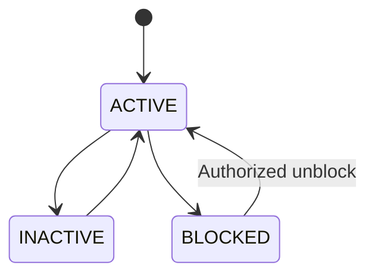
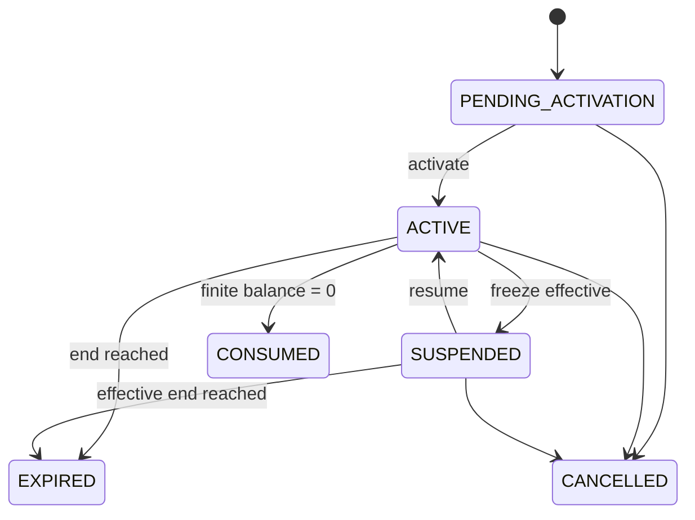

# Đặc tả chức năng 01: Member và Pass

## 1. Mục tiêu và phạm vi

Module quản lý hồ sơ member và quyền sử dụng bể theo ba loại pass: `SINGLE`, `SUBSCRIPTION`, `MULTI_ENTRY`. Module này chịu trách nhiệm cho lifecycle của entitlement; Commerce xử lý việc bán hàng và thu tiền.

Payment settlement, thao tác mở gate vật lý và class attendance nằm ngoài phạm vi của module.

## 2. Actors và quyền

| Use case | Manager | Receptionist | Member |
|---|---:|---:|---:|
| Tạo/tìm/sửa member | Branch | Branch, field-limited | Self-register/update limited |
| Deactivate/block member | Yes | No | No |
| Xem pass | Branch | Branch | Own |
| Cấu hình/publish product | Yes | Read | Read active |
| Issue pass | Yes | Qua paid/free order | Qua checkout |
| Adjust entry/cancel | Yes | Permission + reason | No |
| Chọn pass ưu tiên | Yes | Yes | Own, nếu bật |

## 3. Member model

### Trạng thái



- `INACTIVE`: không còn hoạt động nhưng giữ lịch sử.
- `BLOCKED`: chặn sử dụng tức thời theo lý do; eligibility luôn deny.
- Khi deactivate hoặc block member, hệ thống không tự refund hay cancel pass.

### Dữ liệu tối thiểu

Dữ liệu tối thiểu gồm `id`, `member_code`, `full_name`, `normalized_phone`, `email`, `dob`, `status`, `home_branch_id`, audit và version. Theo baseline nguồn, phone là trường bắt buộc. Nếu Product cho phép minor không có phone, hệ thống cần có household/guardian model trước khi bỏ yêu cầu này.

## 4. Product và entitlement

### Pass Product

- Nhóm identity và version gồm `product_id`, `version`, `name`, `pass_type`, `status`.
- Nhóm commercial gồm `base_price`, sale window và branch scope.
- Entitlement policy gồm duration, total entries, activation, frequency, time/branch rule và freeze policy reference.
- Chỉ product ở trạng thái `PUBLISHED/ACTIVE` và còn trong sale window mới được dùng để tạo quote hoặc order.
- Khi product thay đổi, hệ thống tạo version hoặc effective-dated policy mới. Pass đã issue không bị thay đổi.

### Member Pass state



Hệ thống có thể materialize state để hiển thị. Tuy nhiên, eligibility vẫn phải kiểm tra effective time, freeze và balance thay vì phụ thuộc hoàn toàn vào scheduler.

## 5. Pass behavior

### Single

- `total_entries = 1`.
- Pass có validity window hoặc session scope.
- Sau khi usage thành công, balance bằng 0 và state chuyển thành `CONSUMED`.

### Subscription

- `UNLIMITED`: không có total entry, nhưng vẫn áp dụng validity hoặc frequency policy nếu được cấu hình.
- `LIMITED_FREQUENCY`: giới hạn theo ngày lịch, tuần từ thứ Hai đến Chủ nhật hoặc tháng dương lịch tại timezone chi nhánh.

### Multi-entry

- `total_entries > 0`.
- Balance bằng tổng các ledger delta đã commit. Issue ghi credit ban đầu, check-in ghi debit, còn adjustment hoặc refund tạo entry mới.
- Transaction không được làm balance nhỏ hơn 0.

## 6. Activation và expiry

| Policy | `valid_from` | Điều kiện |
|---|---|---|
| `IMMEDIATE` | paid/issued time theo policy | Không nằm trước settlement |
| `FIRST_CHECK_IN` | server time của first successful access | Activate và access cùng transaction |
| `SPECIFIC_DATE` | ngày user chọn tại branch timezone | Trong allowed activation window |

Duration theo ngày lịch:

```text
start = start-of-day(valid_from_date, policy_timezone)
end_exclusive = start-of-day(valid_from_date + duration_days, policy_timezone)
```

UI có thể hiển thị ngày cuối bằng `end_exclusive - 1 calendar day`. Duration theo tháng phải dùng calendar arithmetic và có policy xử lý ngày 29 đến 31. Không thêm loại duration này khi chưa có test rule rõ ràng.

## 7. Deterministic pass selection

1. Pass ID do subject/staff chọn và vẫn eligible.
2. Pass có `valid_end` sớm nhất.
3. Nếu bằng nhau, finite-entry trước unlimited khi cấu hình `protect_unlimited = false` theo baseline nguồn.
4. `issued_at` sớm hơn.
5. UUID lexical chỉ làm tie-break cuối để deterministic.

Access response phải trả `selectedPassId`. Hệ thống audit selection strategy và version để hỗ trợ xử lý khiếu nại.

## 8. Flows

### Tạo member

1. Actor nhập profile.
2. Server normalize phone/email, validate DOB.
3. Tìm duplicate trong toàn organization.
4. Nếu trùng, trả `409 MEMBER_PHONE_EXISTS` kèm reference actor được phép xem.
5. Nếu không, tạo member `ACTIVE`, audit và trả `201`.

Hệ thống không tự merge hồ sơ chỉ vì tên hoặc email gần giống nhau.

### Issue pass

1. Commerce gọi idempotent fulfillment với `orderItemId`.
2. Entitlement validate order item đã đủ điều kiện.
3. Snapshot product version/policy và tạo Member Pass.
4. Ghi initial usage credit nếu finite-entry.
5. Tạo hoặc liên kết credential RFID/QR theo chiến lược credential đã duyệt.
6. Ghi fulfillment/outbox; retry trả cùng pass.

### Adjust entries

1. Staff có permission nhập delta và reason.
2. Validate resulting balance ≥ 0 và pass không cancelled.
3. Optimistic version check.
4. Append ledger `MANUAL_ADJUSTMENT`; cập nhật balance materialized.
5. Audit old/new/delta/reason.

## 9. API impacts

- `GET/POST /api/v1/members`
- `GET/PATCH /api/v1/members/{memberId}`
- `GET /api/v1/members/{memberId}/passes`
- `GET /api/v1/member-passes/{passId}`
- `GET /api/v1/member-passes/{passId}/eligibility`
- `POST /api/v1/member-passes/{passId}/adjustments`
- `POST /api/v1/member-passes/{passId}/cancellations`
- Product endpoints trong API catalog.

Client không được gọi trực tiếp mutation để issue pass. Việc cấp pass phải đi qua Commerce fulfillment hoặc complimentary workflow.

## 10. Errors

`MEMBER_PHONE_EXISTS`, `MEMBER_BLOCKED`, `PRODUCT_NOT_FOR_SALE`, `PASS_PENDING_ACTIVATION`, `PASS_EXPIRED`, `PASS_SUSPENDED`, `PASS_CONSUMED`, `NO_REMAINING_ENTRY`, `FREQUENCY_LIMIT_REACHED`, `TIME_RESTRICTION`, `BRANCH_RESTRICTION`, `VERSION_CONFLICT`.

## 11. UI

- Member list: search normalized phone/code/name, branch/status filters, cursor pagination.
- Member detail: Profile, Passes, Usage, Access, Freeze, Orders, Classes, Audit summary.
- Pass card: type, status, valid period, remaining/frequency, branch/time restrictions, freeze state.
- Sensitive action modal: impact preview, reason, permission/approval status.

## 12. Acceptance criteria

- `AC-PASS-001`: Given phone đã tồn tại, when create member, then không tạo row mới và trả conflict an toàn.
- `AC-PASS-002`: Given paid order item được fulfillment retry 5 lần, then chỉ có một Member Pass.
- `AC-PASS-003`: Given multi-entry balance 1 và hai consume đồng thời, then một thành công, một `NO_REMAINING_ENTRY`, balance 0.
- `AC-PASS-004`: Given first-check-in pass, when access transaction commit, then activation, expiry, usage cùng tồn tại; rollback thì không có thay đổi nào.
- `AC-PASS-005`: Given product price/policy đổi, then pass đã issue giữ snapshot cũ.
- `AC-PASS-006`: Given pass hết hạn tại `end_exclusive`, then trước mốc eligible và tại mốc không eligible.
- `AC-PASS-007`: Given manual adjustment, then ledger/audit có actor, delta, reason và version.

## 13. Quyết định baseline

Quota của pass toàn chuỗi được dùng chung giữa ba chi nhánh. Hiệu lực kết thúc vào cuối ngày theo timezone chi nhánh. Member có thể chọn pass ưu tiên; nếu không chọn, hệ thống dùng pass hợp lệ hết hạn sớm nhất. Transfer, gift và share pass nằm ngoài phạm vi. Chi tiết truy vết tại `OQ-002`, `OQ-003`, `OQ-004`, `OQ-016` và `OQ-022`.

## Thuật ngữ cần biết

| Thuật ngữ | Giải thích dễ hiểu |
|---|---|
| Lifecycle | Các trạng thái mà một đối tượng đi qua từ lúc tạo đến khi kết thúc. |
| Entitlement | Quyền sử dụng dịch vụ được cấp cho member. |
| Ledger | Sổ ghi từng lần cộng, trừ hoặc điều chỉnh để có thể kiểm tra lại lịch sử. |
| Materialized balance | Số dư được lưu sẵn để đọc nhanh, nhưng vẫn phải đối chiếu được với ledger. |
| Eligibility | Kết quả kiểm tra một pass có đủ điều kiện sử dụng tại thời điểm hiện tại hay không. |
