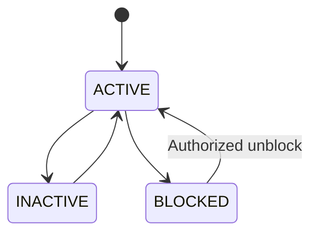
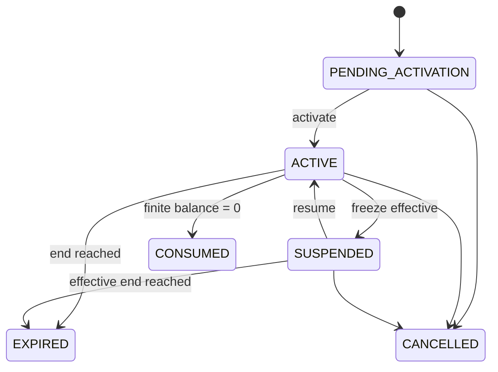

# Functional Spec 01: Member và Pass

## 1. Mục tiêu và phạm vi

Quản lý hồ sơ member và quyền sử dụng bể dưới ba loại pass: `SINGLE`, `SUBSCRIPTION`, `MULTI_ENTRY`. Module sở hữu lifecycle của entitlement; việc bán/thu tiền thuộc Commerce.

Ngoài phạm vi module: payment settlement, physical gate actuation, class attendance.

## 2. Actors và quyền

| Use case | Manager | Receptionist | Member |
|---|---:|---:|---:|
| Tạo/tìm/sửa member | Branch | Branch, field-limited | Self-register/update limited |
| Deactivate/block member | Yes | No | No |
| Xem pass | Branch | Branch | Own |
| Cấu hình/publish product | Yes | Read | Read active |
| Issue pass | Yes | Qua paid/free order | Qua checkout |
| Adjust entry/cancel | Yes | Permission + reason | No |
| Chọn pass ưu tiên | Yes | Yes | Own, nếu bật |

## 3. Member model

### Trạng thái



- `INACTIVE`: không còn hoạt động nhưng giữ lịch sử.
- `BLOCKED`: chặn sử dụng tức thời theo lý do; eligibility luôn deny.
- Deactivate/block không tự refund hoặc cancel pass.

### Dữ liệu tối thiểu

`id`, `member_code`, `full_name`, `normalized_phone`, `email`, `dob`, `status`, `home_branch_id`, audit/version. Phone là required theo baseline nguồn; nếu Product cho minor không phone, cần household/guardian model trước khi bỏ required.

## 4. Product và entitlement

### Pass Product

- Identity/version: `product_id`, `version`, `name`, `pass_type`, `status`.
- Commercial: `base_price`, sale window, branch scope.
- Entitlement policy: duration, total entries, activation, frequency, time/branch rules, freeze policy reference.
- Product phải `PUBLISHED/ACTIVE` và trong sale window để quote/order mới.
- Thay đổi product tạo version mới hoặc effective-dated policy; không đổi pass đã issue.

### Member Pass state



State hiển thị có thể materialize, nhưng eligibility luôn xét effective time/freeze/balance để không phụ thuộc scheduler.

## 5. Pass behavior

### Single

- `total_entries = 1`.
- Có validity window hoặc session scope.
- Sau usage thành công, balance 0 và state `CONSUMED`.

### Subscription

- `UNLIMITED`: không có total entry nhưng vẫn có validity/frequency policy nếu cấu hình.
- `LIMITED_FREQUENCY`: giới hạn theo ngày lịch, tuần từ thứ Hai đến Chủ nhật hoặc tháng dương lịch tại timezone chi nhánh.

### Multi-entry

- `total_entries > 0`.
- Balance = tổng ledger delta đã commit; issue ghi credit ban đầu, check-in ghi debit, adjustment/refund ghi entry mới.
- Không cho transaction làm balance < 0.

## 6. Activation và expiry

| Policy | `valid_from` | Điều kiện |
|---|---|---|
| `IMMEDIATE` | paid/issued time theo policy | Không nằm trước settlement |
| `FIRST_CHECK_IN` | server time của first successful access | Activate và access cùng transaction |
| `SPECIFIC_DATE` | ngày user chọn tại branch timezone | Trong allowed activation window |

Duration theo ngày lịch:

```text
start = start-of-day(valid_from_date, policy_timezone)
end_exclusive = start-of-day(valid_from_date + duration_days, policy_timezone)
```

UI có thể hiển thị ngày cuối là `end_exclusive - 1 calendar day`. Duration theo tháng phải dùng calendar arithmetic và policy xử lý ngày 29–31; chưa được thêm nếu chưa có test rule rõ.

## 7. Deterministic pass selection

1. Pass ID do subject/staff chọn và vẫn eligible.
2. Pass có `valid_end` sớm nhất.
3. Nếu bằng nhau, finite-entry trước unlimited khi cấu hình `protect_unlimited = false` theo baseline nguồn.
4. `issued_at` sớm hơn.
5. UUID lexical chỉ làm tie-break cuối để deterministic.

Response access phải trả `selectedPassId`; selection strategy/version được audit để xử lý khiếu nại.

## 8. Flows

### Tạo member

1. Actor nhập profile.
2. Server normalize phone/email, validate DOB.
3. Tìm duplicate trong toàn organization.
4. Nếu trùng, trả `409 MEMBER_PHONE_EXISTS` kèm reference actor được phép xem.
5. Nếu không, tạo member `ACTIVE`, audit và trả `201`.

Không tự merge dựa chỉ trên tên/email gần giống.

### Issue pass

1. Commerce gọi idempotent fulfillment với `orderItemId`.
2. Entitlement validate order item đã đủ điều kiện.
3. Snapshot product version/policy và tạo Member Pass.
4. Ghi initial usage credit nếu finite-entry.
5. Tạo/associate QR credential theo credential strategy.
6. Ghi fulfillment/outbox; retry trả cùng pass.

### Adjust entries

1. Staff có permission nhập delta và reason.
2. Validate resulting balance ≥ 0 và pass không cancelled.
3. Optimistic version check.
4. Append ledger `MANUAL_ADJUSTMENT`; cập nhật balance materialized.
5. Audit old/new/delta/reason.

## 9. API impacts

- `GET/POST /api/v1/members`
- `GET/PATCH /api/v1/members/{memberId}`
- `GET /api/v1/members/{memberId}/passes`
- `GET /api/v1/member-passes/{passId}`
- `GET /api/v1/member-passes/{passId}/eligibility`
- `POST /api/v1/member-passes/{passId}/adjustments`
- `POST /api/v1/member-passes/{passId}/cancellations`
- Product endpoints trong API catalog.

Mutation issue trực tiếp không public cho client; đi qua Commerce fulfillment hoặc complimentary workflow.

## 10. Errors

`MEMBER_PHONE_EXISTS`, `MEMBER_BLOCKED`, `PRODUCT_NOT_FOR_SALE`, `PASS_PENDING_ACTIVATION`, `PASS_EXPIRED`, `PASS_SUSPENDED`, `PASS_CONSUMED`, `NO_REMAINING_ENTRY`, `FREQUENCY_LIMIT_REACHED`, `TIME_RESTRICTION`, `BRANCH_RESTRICTION`, `VERSION_CONFLICT`.

## 11. UI

- Member list: search normalized phone/code/name, branch/status filters, cursor pagination.
- Member detail: Profile, Passes, Usage, Access, Freeze, Orders, Classes, Audit summary.
- Pass card: type, status, valid period, remaining/frequency, branch/time restrictions, freeze state.
- Sensitive action modal: impact preview, reason, permission/approval status.

## 12. Acceptance criteria

- `AC-PASS-001`: Given phone đã tồn tại, when create member, then không tạo row mới và trả conflict an toàn.
- `AC-PASS-002`: Given paid order item được fulfillment retry 5 lần, then chỉ có một Member Pass.
- `AC-PASS-003`: Given multi-entry balance 1 và hai consume đồng thời, then một thành công, một `NO_REMAINING_ENTRY`, balance 0.
- `AC-PASS-004`: Given first-check-in pass, when access transaction commit, then activation, expiry, usage cùng tồn tại; rollback thì không có thay đổi nào.
- `AC-PASS-005`: Given product price/policy đổi, then pass đã issue giữ snapshot cũ.
- `AC-PASS-006`: Given pass hết hạn tại `end_exclusive`, then trước mốc eligible và tại mốc không eligible.
- `AC-PASS-007`: Given manual adjustment, then ledger/audit có actor, delta, reason và version.

## 13. Quyết định baseline

Quota của pass toàn chuỗi được dùng chung giữa ba chi nhánh. Hiệu lực kết thúc vào cuối ngày theo timezone chi nhánh. Member có thể chọn pass ưu tiên; nếu không chọn, hệ thống dùng pass hợp lệ hết hạn sớm nhất. Transfer, gift và share pass nằm ngoài phạm vi. Chi tiết truy vết tại `OQ-002`, `OQ-003`, `OQ-004`, `OQ-016` và `OQ-022`.
