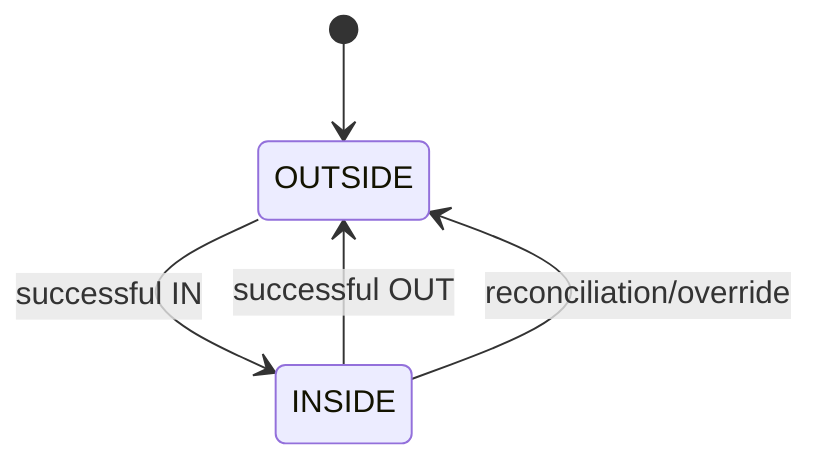

# Đặc tả chức năng 02: QR Access và Capacity

## 1. Mục tiêu

Module phải đưa ra quyết định access nhanh, nhất quán và có thể audit. Presence và occupancy vẫn phải chính xác khi nhiều gate quét đồng thời. Việc mở gate vật lý là external effect và không nằm trong DB transaction.

## 2. Actor và preconditions

- Gate Reader phải là authenticated device và được gắn với gate, branch cùng direction cụ thể.
- Manager hoặc Receptionist được manual check-in, check-out và override theo permission.
- Member hoặc Guest cần có credential chưa bị revoke.
- Branch, gate và zone phải active; capacity policy phải tồn tại.

## 3. Request và response

### Request bắt buộc

```json
{
  "requestId": "0199...",
  "credential": "opaque-token",
  "direction": "IN",
  "deviceObservedAt": "2026-09-10T08:30:00+07:00"
}
```

Hệ thống lấy `branchId/gateId` từ device identity. Nếu client gửi hai giá trị này, server chỉ dùng để cross-check. Header `Idempotency-Key` phải bằng hoặc ánh xạ 1:1 với `requestId`.

### Response

```json
{
  "decision": "ALLOW",
  "reasonCode": "ACCESS_ALLOWED",
  "accessEventId": "uuid",
  "selectedPassId": "uuid",
  "serverTime": "2026-09-10T01:30:00Z",
  "occupancy": {"zoneId": "uuid", "current": 88, "limit": 120},
  "locker": null
}
```

Response gửi cho device không được chứa PII không cần thiết. Với request trùng, response phải có cùng ý nghĩa với lần xử lý đầu tiên.

## 4. Decision order

1. Authenticate/authorize device; validate request schema/rate.
2. Claim request ID/idempotency.
3. Resolve credential; check revoke/expiry/audience.
4. Resolve member/guest; check status.
5. Check presence transition.
6. Select và lock pass; validate activation, date, time, branch, freeze, frequency, balance.
7. Resolve branch/zone capacity và lock state.
8. Nếu mọi bước đều đạt, hệ thống tạo hoặc đóng session, ghi usage, capacity, event và outbox trong cùng transaction.

Hệ thống trả lỗi theo thứ tự cố định để UI và Support xử lý nhất quán. Chi tiết nội bộ không được làm lộ việc account hoặc token có tồn tại cho caller không đáng tin cậy.

## 5. Presence và session



- Check-in tạo `OPEN` Access Session.
- Checkout đóng session đó bằng `checkout_at`, `close_reason`.
- `OUTSIDE + OUT` trả `NOT_CHECKED_IN`, không giảm capacity.
- `INSIDE + IN` trả `ALREADY_CHECKED_IN`, trừ khi authorized recovery flow.
- Presence có phạm vi toàn chuỗi: một member chỉ có một access session mở tại một thời điểm.

## 6. Capacity

- Gate được map tới branch và pool zone; check-in chỉ thành công khi cả hai scope còn capacity.
- `current` được cập nhật trong cùng transaction với session.
- Check-in chỉ trả ALLOW khi tất cả capacity scope bắt buộc đều còn chỗ.
- Threshold mặc định có thể cấu hình: `NORMAL <80%`, `WARNING >=80% và <95%`, `CRITICAL >=95% và <100%`, `FULL >=100%`.
- Manual adjustment phải tạo ledger và audit, không được sửa hoặc xóa access event.
- Dashboard hiển thị snapshot `asOf` và connection freshness.

## 7. Duplicate và concurrency

- Với cùng `requestId`, hệ thống trả stored response và không tạo thêm event, usage hoặc session.
- Credential scan lại trong debounce window bằng request ID khác: `DENY/DUPLICATE_SCAN`, không side effect.
- Hai gates với cùng pass: partial unique presence + pass/capacity locks bảo đảm tối đa một ALLOW.
- Capacity còn một chỗ: capacity row lock bảo đảm một ALLOW.

## 8. Gate actuation acknowledgement

Theo baseline, hệ thống trả ALLOW trước khi gate mở. Nếu hardware hỗ trợ ack, luồng xử lý là:

1. Device gửi `POST /gate/access-events/{id}/acknowledgements` với `OPENED/FAILED`.
2. `FAILED` tạo incident/recovery candidate, không tự xóa access history.
3. Sau 10 giây không có ack mở cổng, hệ thống đóng session vừa tạo, hoàn usage, giảm occupancy và ghi recovery audit.

## 9. Manual actions

### Override denied access

- Staff mở denied event, chọn override reason và xem trước tác động đến pass hoặc capacity.
- Backend kiểm tra lại permission và current state.
- Hệ thống tạo linked override event thay vì đổi DENY cũ thành ALLOW.
- Capacity override chỉ được phép nếu feature flag và permission riêng.

### Reconciliation

- Open session quá ngưỡng xuất hiện trong work queue.
- Staff/worker đóng với `RECONCILED`, reason và policy version.
- Occupancy cập nhật cùng transaction; historical metric giữ dấu vết correction.

## 10. Realtime UI

- Snapshot endpoint trả current/limit/threshold/asOf.
- SSE gửi `access.event.recorded.v1`, `facility.capacity.changed.v1`.
- Reconnect phải refetch snapshot; UI không tự cộng/trừ dựa duy nhất trên stream.
- Có banner `LIVE`, `RECONNECTING`, `STALE`.

## 11. API impacts

- `POST /api/v1/gate/access-requests`
- `POST /api/v1/gate/access-events/{eventId}/acknowledgements`
- `GET /api/v1/branches/{branchId}/capacity`
- `GET /api/v1/branches/{branchId}/access-events`
- `POST /api/v1/access-events/{eventId}/overrides`
- `POST /api/v1/access-sessions/{sessionId}/reconciliations`
- `GET /api/v1/realtime/capacity` (SSE)

## 12. Errors

`INVALID_CREDENTIAL`, `DEVICE_UNAUTHORIZED`, `DEVICE_BRANCH_MISMATCH`, `DUPLICATE_SCAN`, `MEMBER_BLOCKED`, `NO_ELIGIBLE_PASS`, `ALREADY_CHECKED_IN`, `NOT_CHECKED_IN`, `CAPACITY_FULL`, `PASS_PENDING_ACTIVATION`, `PASS_EXPIRED`, `PASS_SUSPENDED`, `PASS_CONSUMED`, `NO_REMAINING_ENTRY`, `FREQUENCY_LIMIT_REACHED`, `TIME_RESTRICTION`, `BRANCH_RESTRICTION`, `GATE_UNAVAILABLE`, `VERSION_CONFLICT`.

## 13. Acceptance criteria

- `AC-GATE-001`: Given hợp lệ và capacity còn, when IN, then session/usage/capacity/event commit atomically.
- `AC-GATE-002`: Given một bước DB lỗi, then không usage/session/capacity partial.
- `AC-GATE-003`: Given retry cùng request ID, then cùng decision/event ID và một side effect.
- `AC-GATE-004`: Given two concurrent scans và một remaining entry, then tối đa một ALLOW.
- `AC-GATE-005`: Given capacity còn một chỗ và hai requests, then một ALLOW, một `CAPACITY_FULL`.
- `AC-GATE-006`: Given member INSIDE, when IN again, then deny và không consume.
- `AC-GATE-007`: Given checkout hợp lệ, then session closed/capacity decreased; pass balance unchanged.
- `AC-GATE-008`: Given network/server unavailable, then device fail closed và staff fallback có audit.
- `AC-GATE-009`: Given SSE reconnect, then UI refetch snapshot và không double-apply old event.

## 14. Quyết định baseline

Presence dùng phạm vi toàn chuỗi; capacity kiểm soát cả branch và zone; locker là tùy chọn. Session còn mở được auto-close sau 2 giờ kể từ giờ đóng cửa với trạng thái `RECONCILED`. Quy tắc ack và recovery áp dụng như mục 8. Chi tiết truy vết tại `OQ-001`, `OQ-005`, `OQ-006`, `OQ-007` và `OQ-019`.

## Thuật ngữ cần biết

| Thuật ngữ | Giải thích dễ hiểu |
|---|---|
| Presence | Trạng thái cho biết member đang ở ngoài hay trong khu vực bể. |
| Occupancy | Số người đang được tính là có mặt trong khu vực kiểm soát. |
| Idempotency | Gửi lại cùng request nhưng không tạo thêm session, usage hoặc capacity change. |
| Debounce window | Khoảng thời gian ngắn dùng để nhận biết một QR vừa bị quét lặp. |
| Reconciliation | Đối chiếu và sửa trạng thái vận hành bằng một bản ghi có audit. |
