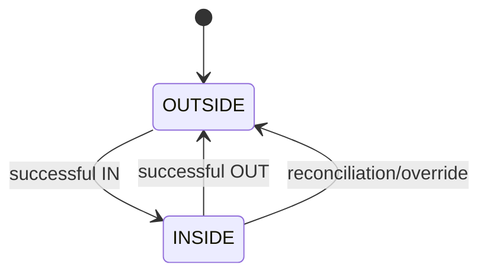

# Functional Spec 02: QR Access và Capacity

## 1. Mục tiêu

Đưa ra quyết định access nhanh, nhất quán và audit được; quản lý presence/occupancy chính xác khi có concurrent scans. Physical gate actuation là external effect, không phải DB transaction.

## 2. Actor và preconditions

- Gate Reader: authenticated device bound với gate/branch/direction.
- Manager/Receptionist: manual check-in/out/override theo permission.
- Member/Guest: có credential chưa revoke.
- Branch, gate, zone active; capacity policy tồn tại.

## 3. Request và response

### Request bắt buộc

```json
{
  "requestId": "0199...",
  "credential": "opaque-token",
  "direction": "IN",
  "deviceObservedAt": "2026-09-10T08:30:00+07:00"
}
```

`branchId/gateId` lấy từ device identity; nếu client gửi thì chỉ dùng cross-check. Header `Idempotency-Key` bằng hoặc map 1:1 với `requestId`.

### Response

```json
{
  "decision": "ALLOW",
  "reasonCode": "ACCESS_ALLOWED",
  "accessEventId": "uuid",
  "selectedPassId": "uuid",
  "serverTime": "2026-09-10T01:30:00Z",
  "occupancy": {"zoneId": "uuid", "current": 88, "limit": 120},
  "locker": null
}
```

Không trả PII không cần thiết cho device. Response duplicate request phải tương đương semantic với lần đầu.

## 4. Decision order

1. Authenticate/authorize device; validate request schema/rate.
2. Claim request ID/idempotency.
3. Resolve credential; check revoke/expiry/audience.
4. Resolve member/guest; check status.
5. Check presence transition.
6. Select và lock pass; validate activation, date, time, branch, freeze, frequency, balance.
7. Resolve branch/zone capacity và lock state.
8. Nếu tất cả pass: create/close session, usage, capacity, event, outbox atomically.

Thứ tự lỗi trả về là ổn định để UI/support nhất quán; chi tiết nội bộ không được làm lộ account/token existence cho caller không tin cậy.

## 5. Presence và session



- Check-in tạo `OPEN` Access Session.
- Checkout đóng session đó bằng `checkout_at`, `close_reason`.
- `OUTSIDE + OUT` trả `NOT_CHECKED_IN`, không giảm capacity.
- `INSIDE + IN` trả `ALREADY_CHECKED_IN`, trừ khi authorized recovery flow.
- Presence có phạm vi toàn chuỗi: một member chỉ có một access session mở tại một thời điểm.

## 6. Capacity

- Gate được map tới branch và pool zone; check-in chỉ thành công khi cả hai scope còn capacity.
- `current` thay đổi cùng transaction session.
- Check-in chỉ ALLOW nếu mọi capacity scope bắt buộc còn chỗ.
- Threshold `NORMAL <80%`, `WARNING 80–<95%`, `CRITICAL 95–<100%`, `FULL ≥100%` là default configurable.
- Manual adjustment tạo ledger/audit và không sửa/xóa access event.
- Dashboard hiển thị snapshot `asOf` và connection freshness.

## 7. Duplicate và concurrency

- Cùng `requestId`: trả stored response, không tạo event/usage/session mới.
- Credential scan lại trong debounce window bằng request ID khác: `DENY/DUPLICATE_SCAN`, không side effect.
- Hai gates với cùng pass: partial unique presence + pass/capacity locks bảo đảm tối đa một ALLOW.
- Capacity còn một chỗ: capacity row lock bảo đảm một ALLOW.

## 8. Gate actuation acknowledgement

Baseline flow trả ALLOW rồi gate mở. Nếu hardware hỗ trợ ack:

1. Device gửi `POST /gate/access-events/{id}/acknowledgements` với `OPENED/FAILED`.
2. `FAILED` tạo incident/recovery candidate, không tự xóa access history.
3. Sau 10 giây không có ack mở cổng, hệ thống đóng session vừa tạo, hoàn usage, giảm occupancy và ghi recovery audit.

## 9. Manual actions

### Override denied access

- Staff mở denied event, chọn override reason, pass/capacity impact preview.
- Backend re-evaluate permission và current state.
- Tạo linked override event, không biến DENY cũ thành ALLOW.
- Capacity override chỉ được phép nếu feature flag và permission riêng.

### Reconciliation

- Open session quá ngưỡng xuất hiện trong work queue.
- Staff/worker đóng với `RECONCILED`, reason và policy version.
- Occupancy cập nhật cùng transaction; historical metric giữ dấu vết correction.

## 10. Realtime UI

- Snapshot endpoint trả current/limit/threshold/asOf.
- SSE gửi `access.event.recorded.v1`, `facility.capacity.changed.v1`.
- Reconnect phải refetch snapshot; UI không tự cộng/trừ dựa duy nhất trên stream.
- Có banner `LIVE`, `RECONNECTING`, `STALE`.

## 11. API impacts

- `POST /api/v1/gate/access-requests`
- `POST /api/v1/gate/access-events/{eventId}/acknowledgements`
- `GET /api/v1/branches/{branchId}/capacity`
- `GET /api/v1/branches/{branchId}/access-events`
- `POST /api/v1/access-events/{eventId}/overrides`
- `POST /api/v1/access-sessions/{sessionId}/reconciliations`
- `GET /api/v1/realtime/capacity` (SSE)

## 12. Errors

`INVALID_CREDENTIAL`, `DEVICE_UNAUTHORIZED`, `DEVICE_BRANCH_MISMATCH`, `DUPLICATE_SCAN`, `MEMBER_BLOCKED`, `NO_ELIGIBLE_PASS`, `ALREADY_CHECKED_IN`, `NOT_CHECKED_IN`, `CAPACITY_FULL`, `PASS_PENDING_ACTIVATION`, `PASS_EXPIRED`, `PASS_SUSPENDED`, `PASS_CONSUMED`, `NO_REMAINING_ENTRY`, `FREQUENCY_LIMIT_REACHED`, `TIME_RESTRICTION`, `BRANCH_RESTRICTION`, `GATE_UNAVAILABLE`, `VERSION_CONFLICT`.

## 13. Acceptance criteria

- `AC-GATE-001`: Given hợp lệ và capacity còn, when IN, then session/usage/capacity/event commit atomically.
- `AC-GATE-002`: Given một bước DB lỗi, then không usage/session/capacity partial.
- `AC-GATE-003`: Given retry cùng request ID, then cùng decision/event ID và một side effect.
- `AC-GATE-004`: Given two concurrent scans và một remaining entry, then tối đa một ALLOW.
- `AC-GATE-005`: Given capacity còn một chỗ và hai requests, then một ALLOW, một `CAPACITY_FULL`.
- `AC-GATE-006`: Given member INSIDE, when IN again, then deny và không consume.
- `AC-GATE-007`: Given checkout hợp lệ, then session closed/capacity decreased; pass balance unchanged.
- `AC-GATE-008`: Given network/server unavailable, then device fail closed và staff fallback có audit.
- `AC-GATE-009`: Given SSE reconnect, then UI refetch snapshot và không double-apply old event.

## 14. Quyết định baseline

Presence dùng phạm vi toàn chuỗi; capacity kiểm soát cả branch và zone; locker là tùy chọn. Session còn mở được auto-close sau 2 giờ kể từ giờ đóng cửa với trạng thái `RECONCILED`. Quy tắc ack và recovery áp dụng như mục 8. Chi tiết truy vết tại `OQ-001`, `OQ-005`, `OQ-006`, `OQ-007` và `OQ-019`.
