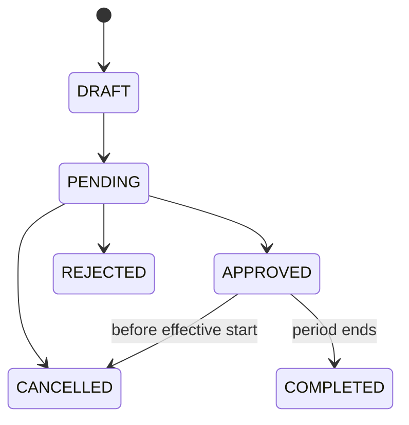

# Đặc tả chức năng 03: Freeze và vòng đời Pass

## 1. Mục tiêu

Module cho phép tạm ngưng entitlement trong khoảng thời gian được policy cho phép. Quyền lợi của member phải được giữ đúng, và access vẫn bị chặn chính xác ngay cả khi scheduler chạy chậm.

## 2. Actors

| Action | Manager | Receptionist | Member |
|---|---:|---:|---:|
| Create request | Yes | Branch | Own pass |
| Approve/reject | Yes | Conditional | No |
| Cancel pending | Yes | Yes | Own |
| Early resume | Yes | Conditional | Request |
| Override quota/dates | Permission + audit | No | No |

## 3. Freeze policy

Mỗi versioned policy snapshot hoặc reference gồm:

- minimum/maximum effective days per request;
- maximum total days và request count per pass;
- advance notice/cutoff;
- allowed reasons/evidence required;
- fee/approval policy;
- early-resume quota behavior;
- timezone và cách tính ngày.

Khi policy thay đổi, request đã approved vẫn giữ policy cũ, trừ khi có migration kèm audit.

## 4. State models

### Request



### Period effect

Period ở trạng thái `SCHEDULED` sau khi được approved nhưng chưa đến start. Trong khoảng `[start, end)`, trạng thái là `ACTIVE`; sau end là `COMPLETED`. Nếu resume sớm, trạng thái chuyển thành `ENDED_EARLY`.

Pass có thể hiển thị status `SUSPENDED`, nhưng eligibility phải query effective period để chặn access đúng thời điểm.

## 5. Date semantics

Nếu user chọn ngày 10/09 đến 19/09 "bao gồm cả hai ngày":

```text
start_at = 2026-09-10 00:00 branch timezone
end_exclusive = 2026-09-20 00:00 branch timezone
effective_days = 10
```

Expiry adjustment ledger ghi `+10 calendar days`. UI hiển thị ngày kết thúc theo kiểu inclusive, còn API dùng `endExclusive` để tránh mơ hồ.

## 6. Request flow

1. Load pass, active policy và remaining entitlement.
2. Validate pass/product cho freeze, date order, min/max, notice và overlap.
3. Nếu cần evidence, attachment phải được upload ở chế độ private và scan trước khi approval.
4. Create `PENDING` với policy version và requested days.
5. Notify approver sau commit.

## 7. Approval flow

1. Actor xem pass usage, expiry, prior freeze và request details.
2. Backend revalidate pass version, quota, count, overlap, date và quyền.
3. Trong transaction: mark request approved, create period, append expiry adjustment, audit/outbox.
4. Nếu period đã có hiệu lực, eligibility bị chặn ngay mà không chờ job.
5. Retry approval idempotent trả cùng result; concurrent approver chỉ một thành công.

## 8. Reject/cancel/resume

- Khi reject, người xử lý phải nhập reason. Hệ thống không tạo period hoặc expiry adjustment.
- Cancel pending do member/staff theo quyền.
- Chỉ được cancel request đã approved trước start và theo policy. Hệ thống đảo expiry adjustment bằng một ledger entry thay vì xóa dữ liệu cũ.
- Early resume đặt actual `end_exclusive`, tính effective days thật và tạo delta correction.
- Early resume hoàn lại quota freeze chưa dùng, làm tròn theo ngày.

## 9. Validation/errors

`FREEZE_NOT_ALLOWED`, `FREEZE_DATE_INVALID`, `FREEZE_TOO_SHORT`, `FREEZE_TOO_LONG`, `FREEZE_NOTICE_REQUIRED`, `FREEZE_QUOTA_EXCEEDED`, `FREEZE_OVERLAP`, `EVIDENCE_REQUIRED`, `PASS_NOT_FREEZABLE`, `REQUEST_ALREADY_DECIDED`, `VERSION_CONFLICT`.

## 10. API impacts

- `GET/POST /api/v1/freeze-requests`
- `GET /api/v1/freeze-requests/{requestId}`
- `POST /api/v1/freeze-requests/{requestId}/decisions`
- `POST /api/v1/freeze-requests/{requestId}/cancellations`
- `POST /api/v1/freeze-periods/{periodId}/early-resumptions`
- `GET /api/v1/member-passes/{passId}/freeze-entitlement`

Decision request gồm `decision: APPROVE|REJECT`, `reason` và `expectedVersion`; request này phải dùng idempotency key.

## 11. UI

- Member: calendar chỉ cho ngày hợp lệ, preview effective days/new expiry/quota remaining.
- Manager queue: age, branch, member, evidence, current pass state, quota, conflict warnings.
- Decision modal: impact preview, reason, expected version.
- Timeline pass: request, period, suspension, expiry adjustments và early resume.

## 12. Acceptance criteria

- `AC-FRZ-001`: Two approved periods của cùng pass không overlap kể cả concurrent approval.
- `AC-FRZ-002`: At effective start, gate denies `PASS_SUSPENDED` kể cả scheduler chưa materialize status.
- `AC-FRZ-003`: 10 ngày inclusive user selection tạo `[start,end)` đúng 10 ngày và expiry +10 ngày.
- `AC-FRZ-004`: Approval retry không tạo period/adjustment thứ hai.
- `AC-FRZ-005`: Reject bắt buộc reason và expiry không đổi.
- `AC-FRZ-006`: Early resume tạo correction ledger/audit, không sửa mất history.
- `AC-FRZ-007`: Policy mới không tự đổi approved period cũ.

## 13. Quyết định baseline

Ngày freeze tính theo ngày lịch của chi nhánh. Early resume hoàn quota chưa dùng. Giai đoạn này không thu phí freeze nên không tạo order hoặc payment riêng. Dữ liệu freeze được giữ cùng vòng đời của pass và audit. Chi tiết truy vết tại `OQ-003`, `OQ-012` và `OQ-017`.

## Thuật ngữ cần biết

| Thuật ngữ | Giải thích dễ hiểu |
|---|---|
| Freeze | Khoảng thời gian tạm dừng quyền sử dụng pass. |
| Policy snapshot | Bản policy được giữ lại tại thời điểm tạo yêu cầu để thay đổi sau này không làm sai lịch sử. |
| Effective period | Khoảng thời gian mà freeze thực sự có hiệu lực. |
| Optimistic version | Số phiên bản dùng để phát hiện dữ liệu đã bị người khác thay đổi trước khi lưu. |
| Audit | Lịch sử ghi lại ai làm gì, lúc nào và vì sao. |
