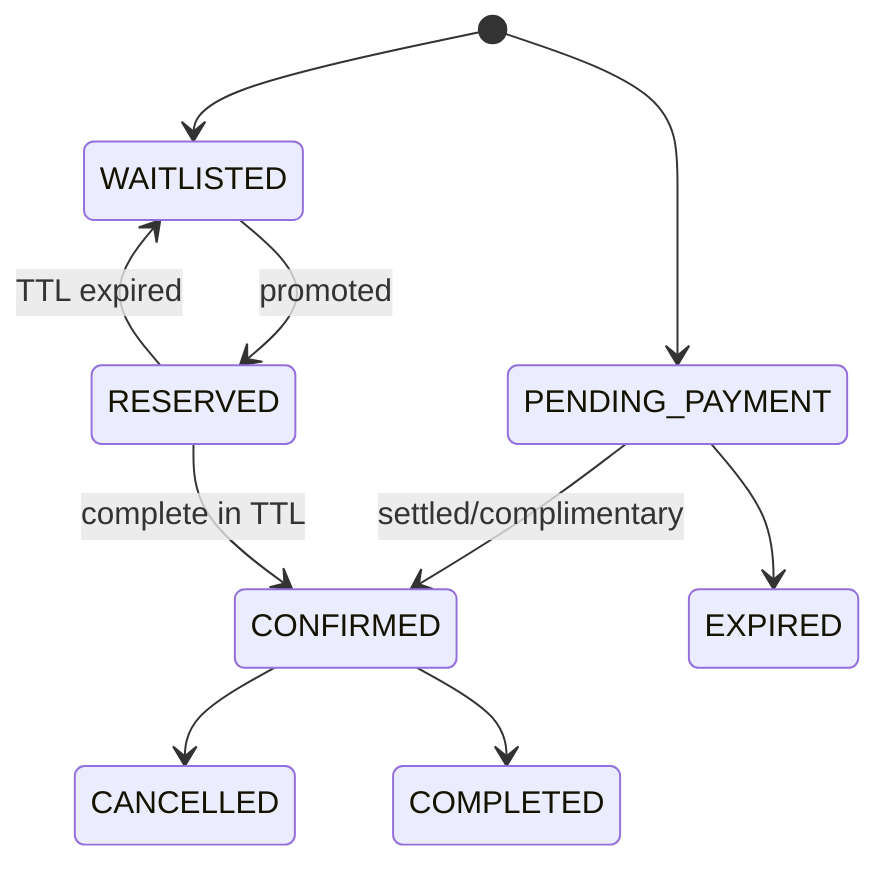

# Đặc tả chức năng 04: Class, Coach và Attendance

## 1. Mục tiêu

Module quản lý chương trình học, offering hoặc course, session, coach, enrollment, waitlist và attendance. Hệ thống phải ngăn double-book và over-capacity.

## 2. Các thành phần trong mô hình

| Entity | Ý nghĩa |
|---|---|
| Class Definition | Template chương trình, audience, level, duration mặc định |
| Class Offering | Một đợt mở bán/vận hành tại branch, có enrollment window, capacity, price |
| Class Session | Một buổi cụ thể thuộc offering, có start/end, coach, pool zone |
| Enrollment | Member đăng ký offering; drop-in dùng offering một session |
| Seat Reservation | Giữ chỗ có TTL trong lúc thanh toán/waitlist promotion |
| Attendance | Kết quả member tại một session |

`Class Offering` giúp phân biệt rõ "class", "course 12 buổi" và từng session trong bản gốc.

## 3. Actors và permissions

- Manager: cấu hình/publish/cancel, assign coach, override attendance.
- Receptionist: enroll/cancel theo branch/policy; schedule edit nếu có permission.
- Coach: xem assigned sessions/roster, record attendance trước lock.
- Member/guardian: xem và enroll subject được phép.

## 4. State models

### Offering

`DRAFT → PUBLISHED → ENROLLMENT_OPEN → FULL → IN_PROGRESS → COMPLETED`, với nhánh `PUBLISHED/OPEN/FULL → CANCELLED`.

`FULL` có thể là derived state, được tính từ capacity, confirmed enrollment và active reservation.

### Enrollment

Attendance không phải là một enrollment state. `NO_SHOW` là attendance outcome của một session.

## 5. Scheduling rules

- Interval `[start_at,end_at)`; start < end.
- Coach không có active sessions overlap; DB exclusion + application message.
- Nếu Operations yêu cầu, hệ thống phải kiểm tra concurrent capacity của pool zone.
- Member conflict check khi policy bật.
- Recurrence generation idempotent; mỗi generated session có recurrence occurrence key unique.
- Khi sửa một series, giao diện phải cho chọn "this session", "future" hoặc "all". Hệ thống không được tự sửa các session đã completed.

## 6. Enrollment/capacity

- Tổng `confirmed + active seat reservations` không được vượt quá capacity.
- Paid flow giữ seat theo TTL. Nếu settlement đến sau TTL, hệ thống kiểm tra lại chỗ trống và chuyển sang exception hoặc refund queue khi không còn seat.
- Complimentary/free enrollment vẫn qua idempotent fulfillment path.
- Eligibility có thể kiểm tra age, level, waiver/guardian, schedule conflict và window.
- Cancellation áp cutoff, refund/credit policy version.

## 7. Waitlist

- Thứ tự baseline FIFO theo `joined_at`; tie-break ID.
- Promotion tạo reservation có expiry và notification.
- Worker dùng lock để tránh promote hai người vào cùng một seat.
- Hết TTL quay về waitlist hoặc expire theo policy, sau đó promote người tiếp theo.
- Nếu có priority hoặc family rule, policy phải được khai báo rõ và có audit.

## 8. Attendance

- Outcome: `PRESENT`, `ABSENT`, `LATE`, `EXCUSED`, `NO_SHOW`.
- Unique `(session_id, enrollment_id)`.
- Coach chỉ record roster của assigned session và trong attendance window.
- Sau `locked_at`, chỉ manager override với old/new/reason.
- Remaining course sessions được suy theo attendance consumption policy, không chỉ đếm row.

## 9. Cancellation

Khi cancel offering hoặc session, hệ thống phải:

1. Preview affected sessions/enrollments/payments.
2. Require reason.
3. Ghi trạng thái cancellation và không hard delete.
4. Tạo refund/credit tasks theo policy.
5. Notify member/guardian và coach sau commit.
6. Release seat reservations.

## 10. API impacts

- `GET/POST /api/v1/class-definitions`
- `GET/POST /api/v1/class-offerings`
- `GET/PATCH /api/v1/class-offerings/{offeringId}`
- `POST /api/v1/class-offerings/{offeringId}/publication`
- `GET /api/v1/class-sessions`
- `POST /api/v1/class-offerings/{offeringId}/enrollments`
- `POST /api/v1/enrollments/{enrollmentId}/cancellations`
- `POST /api/v1/class-offerings/{offeringId}/waitlist-entries`
- `GET /api/v1/coaches/{coachId}/schedule`
- `PUT /api/v1/class-sessions/{sessionId}/attendance`

## 11. Errors

`CLASS_FULL`, `ENROLLMENT_CLOSED`, `AGE_RESTRICTION`, `LEVEL_RESTRICTION`, `WAIVER_REQUIRED`, `COACH_CONFLICT`, `STUDENT_CONFLICT`, `SESSION_LOCKED`, `SEAT_RESERVATION_EXPIRED`, `ALREADY_ENROLLED`, `VERSION_CONFLICT`.

## 12. UI

- Calendar theo branch/zone/coach, conflict inline.
- Offering detail: sessions, capacity, confirmed/reserved/waitlist, payment state.
- Coach mobile roster: large tap targets, offline mode không thuộc MVP.
- Attendance save hiển thị lock time và unsaved changes warning.
- Cancellation preview thể hiện refund/credit/notification impact.

## 13. Acceptance criteria

- `AC-CLS-001`: Hai enrollment concurrent cho seat cuối chỉ một confirmed/reserved.
- `AC-CLS-002`: Coach overlap bị chặn ở application và database.
- `AC-CLS-003`: Payment settlement retry chỉ tạo một enrollment.
- `AC-CLS-004`: Waitlist promotion chỉ giữ một seat, hết TTL chuyển đúng người kế tiếp.
- `AC-CLS-005`: Coach không sửa attendance sau lock; manager override tạo audit.
- `AC-CLS-006`: Edit recurrence không sửa completed sessions.
- `AC-CLS-007`: Cancel offering tạo tasks/notifications idempotently và không xóa history.

## 14. Quyết định baseline

Member dưới 16 tuổi cần guardian, emergency contact và waiver còn hiệu lực. Course bán theo Offering; drop-in bán theo Session. Waitlist giữ chỗ 2 giờ sau invitation. Nghỉ có lý do không consume và Manager có thể cấp một make-up credit. Swimmer progression và coach compensation nằm ngoài phạm vi. Chi tiết truy vết tại `OQ-011`, `OQ-015` và `OQ-018`.

## Thuật ngữ cần biết

| Thuật ngữ | Giải thích dễ hiểu |
|---|---|
| Class Offering | Một đợt lớp cụ thể được mở tại một branch để member đăng ký. |
| Class Session | Một buổi học cụ thể thuộc Class Offering. |
| Enrollment | Bản ghi member đã đăng ký một lớp. |
| Waitlist | Danh sách chờ khi lớp đã hết chỗ. |
| TTL | Khoảng thời gian một chỗ được giữ; hết thời gian này, chỗ có thể chuyển cho người khác. |
