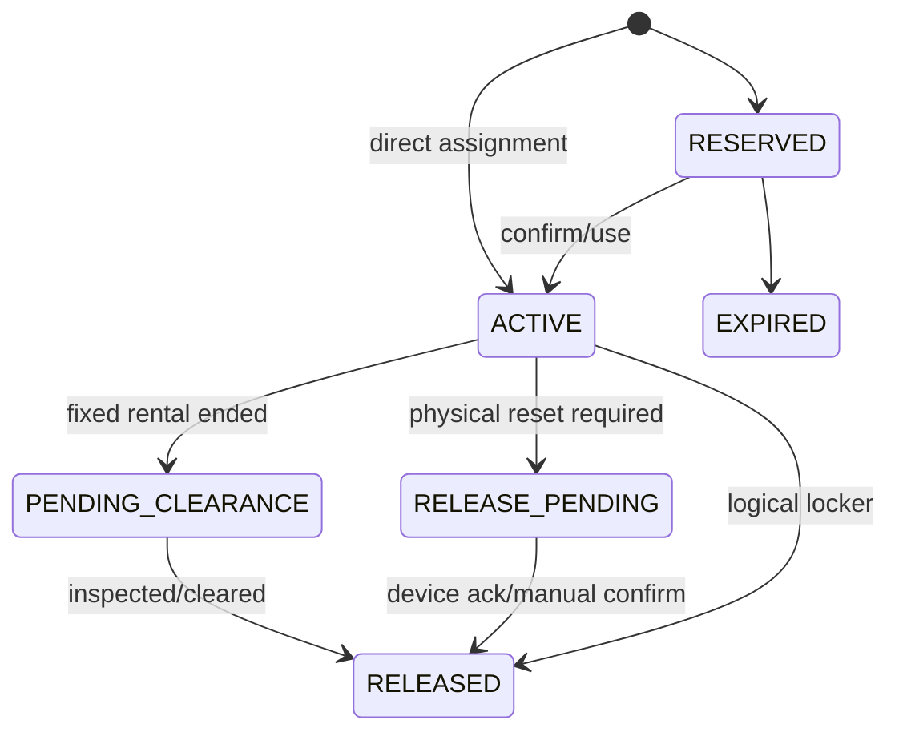

# Đặc tả chức năng 05: Quản lý Locker

## 1. Mục tiêu

Module quản lý locker vật lý, temporary assignment theo access session, fixed rental và trạng thái thiết bị. Một locker không được cấp trùng.

## 2. Hai nhóm trạng thái

Bản gốc dùng chung một nhóm cho trạng thái vận hành và trạng thái sử dụng. Baseline tách chúng thành hai nhóm riêng:

### Operational status

- `IN_SERVICE`
- `MAINTENANCE`
- `EMERGENCY_LOCKED`
- `RETIRED`

### Allocation state được tính từ dữ liệu

- `AVAILABLE`: in service, không có active reservation/assignment.
- `RESERVED`: có reservation chưa bắt đầu/hết TTL.
- `OCCUPIED`: có active temporary assignment/fixed rental.
- `PENDING_CLEARANCE`: fixed rental hết hạn nhưng chưa bàn giao.

Chỉ được assign locker khi locker ở trạng thái `IN_SERVICE + AVAILABLE`.

## 3. Assignment lifecycle

## 4. Actors và permissions

- Manager được tạo và cấu hình locker, quản lý fixed rental, maintenance và emergency unlock.
- Receptionist được xem, cấp temporary hoặc fixed locker và release trong branch. Maintenance và unlock phụ thuộc vào permission.
- Member chỉ xem locker thuộc open session hoặc rental của mình.
- Smart Locker Gateway gửi ack cho command và status, nhưng không quyết định assignment.

## 5. Assignment rules

- Locker, member và access session phải cùng branch.
- Temporary assignment phải gắn với `access_session_id` và không được kéo dài quá session.
- Fixed rental dùng interval `[start,end)` và không overlap assignment/rental khác.
- Locker hết fixed rental không tự `AVAILABLE` nếu policy cần inspection; chuyển `PENDING_CLEARANCE`.
- Việc chọn locker phải deterministic theo zone, type, priority, number hoặc distribution strategy version.
- Database exclusion và lock phải ngăn double assignment.

## 6. Auto assignment at check-in

1. Sau eligibility/capacity pass, kiểm tra branch policy.
2. Nếu locker là optional, check-in có thể commit trước. Nếu xử lý locker trong cùng transaction, lỗi locker cũng không được rollback access.
3. Nếu required, lock candidate locker trước commit; không có thì deny `LOCKER_UNAVAILABLE` và không consume/capacity.
4. Create assignment `ACTIVE`; physical credential command được gửi qua outbox sau commit.
5. Response có locker number và zone nhưng không được để lộ smart lock secret.

Vì locker là tùy chọn, access transaction không giữ lock trên nhiều locker row. Sau khi check-in thành công, hệ thống cấp locker bằng một transaction riêng có unique constraint.

## 7. Release

- Checkout tạo logical release command idempotent.
- Locker không IoT: assignment `RELEASED` cùng transaction checkout.
- Locker IoT: `RELEASE_PENDING`, gửi reset command, ack chuyển `RELEASED`.
- Timeout hoặc failed ack tạo một operations task. Hệ thống không tự cấp lại locker khi trạng thái vật lý chưa an toàn.
- Manual release/emergency unlock bắt buộc reason và audit.

## 8. Fixed rental

1. Quote/order/payment thuộc Commerce.
2. Fulfillment idempotent tạo rental hoặc assignment theo khoảng thời gian đã thống nhất.
3. Gia hạn tạo/extend range theo rule, không overlap.
4. Expiry job chuyển `PENDING_CLEARANCE` hoặc `RELEASE_PENDING`.
5. Refund/cancel dùng compensation workflow, không xóa rental.

## 9. API impacts

- `GET/POST /api/v1/lockers`
- `PATCH /api/v1/lockers/{lockerId}`
- `POST /api/v1/locker-assignments`
- `POST /api/v1/locker-assignments/{assignmentId}/releases`
- `POST /api/v1/lockers/{lockerId}/operational-status-changes`
- `POST /api/v1/lockers/{lockerId}/emergency-unlocks`
- `POST /api/v1/locker-device-events`

## 10. Errors

`LOCKER_UNAVAILABLE`, `LOCKER_NOT_IN_SERVICE`, `LOCKER_ALREADY_ASSIGNED`, `LOCKER_BRANCH_MISMATCH`, `ACCESS_SESSION_REQUIRED`, `ASSIGNMENT_ALREADY_RELEASED`, `DEVICE_COMMAND_FAILED`, `VERSION_CONFLICT`.

## 11. UI

- Map/list theo zone với operational và allocation badge riêng.
- Assignment drawer hiển thị member/session/rental, started/expected end, device state.
- Maintenance/unlock modal có reason, step-up auth nếu yêu cầu.
- Pending clearance/failed command work queue cho Reception/Manager.

## 12. Acceptance criteria

- `AC-LCK-001`: Two concurrent assigns cho một locker, tối đa một thành công.
- `AC-LCK-002`: Required locker không còn thì access deny và không consume/capacity.
- `AC-LCK-003`: Optional locker không còn thì access vẫn allow và locker null.
- `AC-LCK-004`: Checkout retry chỉ tạo một release command.
- `AC-LCK-005`: IoT reset fail thì locker không trở thành assignable.
- `AC-LCK-006`: Fixed rentals overlap bị database và application chặn.
- `AC-LCK-007`: Emergency unlock có actor/reason/time/correlation audit.

## 13. Quyết định baseline

Locker là tùy chọn. Device integration dùng adapter với signed command và acknowledgement; credential được đổi cho mỗi assignment. Reset hoặc emergency unlock chỉ thành công sau ack vật lý trong 10 giây. Fixed locker hết hạn phải được kiểm tra trong 24 giờ trước khi về `AVAILABLE`. Chi tiết truy vết tại `OQ-007`.

## Thuật ngữ cần biết

| Thuật ngữ | Giải thích dễ hiểu |
|---|---|
| Temporary assignment | Việc cấp locker tạm thời cho một access session. |
| Fixed rental | Việc thuê một locker cố định trong một khoảng thời gian. |
| Allocation state | Trạng thái cho biết locker đang trống, được giữ chỗ hay đang sử dụng. |
| Acknowledgement hoặc ack | Phản hồi xác nhận thiết bị đã thực hiện command. |
| Unique constraint | Ràng buộc database ngăn tạo hai bản ghi trùng theo điều kiện đã chọn. |
