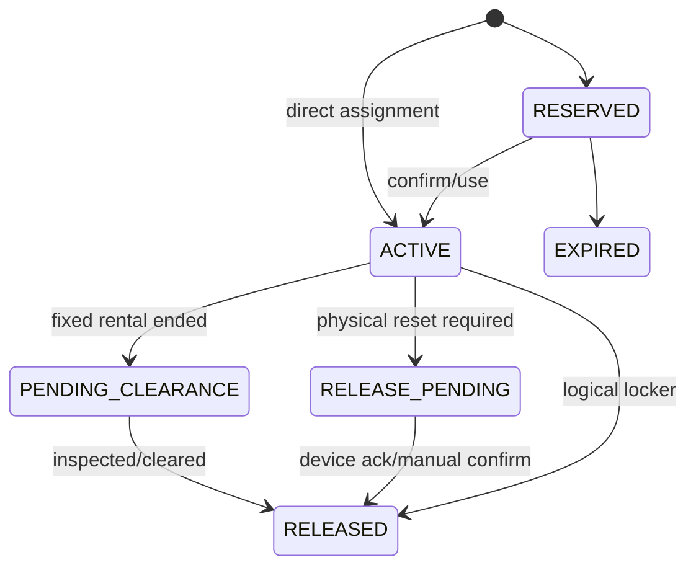

# Functional Spec 05: Locker Management

## 1. Mục tiêu

Quản lý locker vật lý, temporary assignment theo access session, fixed rental và trạng thái thiết bị mà không cấp trùng.

## 2. Mô hình trạng thái được làm rõ

Bản gốc trộn trạng thái vận hành và trạng thái sử dụng. Baseline tách hai chiều:

### Operational status

- `IN_SERVICE`
- `MAINTENANCE`
- `EMERGENCY_LOCKED`
- `RETIRED`

### Allocation state dẫn xuất

- `AVAILABLE`: in service, không có active reservation/assignment.
- `RESERVED`: có reservation chưa bắt đầu/hết TTL.
- `OCCUPIED`: có active temporary assignment/fixed rental.
- `PENDING_CLEARANCE`: fixed rental hết hạn nhưng chưa bàn giao.

Một locker chỉ assign được khi `IN_SERVICE + AVAILABLE`.

## 3. Assignment lifecycle

## 4. Actors và permissions

- Manager: create/configure, fixed rental, maintenance, emergency unlock.
- Receptionist: view, temporary/fixed assign, release trong branch; maintenance/unlock theo permission.
- Member: xem locker của own open session/rental.
- Smart Locker Gateway: ack command/status; không quyết định assignment.

## 5. Assignment rules

- Locker, member và access session phải cùng branch.
- Temporary assignment phải gắn `access_session_id` và không vượt session.
- Fixed rental dùng interval `[start,end)` và không overlap assignment/rental khác.
- Locker hết fixed rental không tự `AVAILABLE` nếu policy cần inspection; chuyển `PENDING_CLEARANCE`.
- Selection deterministic theo zone/type/priority/number hoặc distribution strategy version.
- Database exclusion/lock bảo đảm không double assignment.

## 6. Auto assignment at check-in

1. Sau eligibility/capacity pass, kiểm tra branch policy.
2. Nếu locker optional, check-in commit trước hoặc locker logic cùng transaction nhưng failure không rollback access.
3. Nếu required, lock candidate locker trước commit; không có thì deny `LOCKER_UNAVAILABLE` và không consume/capacity.
4. Create assignment `ACTIVE`; physical credential command được gửi qua outbox sau commit.
5. Response có locker number/zone, không lộ smart lock secret.

Locker là tùy chọn nên access transaction không giữ khóa trên nhiều locker row. Việc cấp locker chạy sau khi check-in thành công bằng một transaction riêng có unique constraint.

## 7. Release

- Checkout tạo logical release command idempotent.
- Locker không IoT: assignment `RELEASED` cùng transaction checkout.
- Locker IoT: `RELEASE_PENDING`, gửi reset command, ack chuyển `RELEASED`.
- Timeout/failed ack tạo operations task; không tự cấp locker lại khi physical state chưa an toàn.
- Manual release/emergency unlock bắt buộc reason và audit.

## 8. Fixed rental

1. Quote/order/payment thuộc Commerce.
2. Fulfillment idempotent tạo rental/assignment với agreed range.
3. Gia hạn tạo/extend range theo rule, không overlap.
4. Expiry job chuyển `PENDING_CLEARANCE` hoặc `RELEASE_PENDING`.
5. Refund/cancel dùng compensation workflow, không xóa rental.

## 9. API impacts

- `GET/POST /api/v1/lockers`
- `PATCH /api/v1/lockers/{lockerId}`
- `POST /api/v1/locker-assignments`
- `POST /api/v1/locker-assignments/{assignmentId}/releases`
- `POST /api/v1/lockers/{lockerId}/operational-status-changes`
- `POST /api/v1/lockers/{lockerId}/emergency-unlocks`
- `POST /api/v1/locker-device-events`

## 10. Errors

`LOCKER_UNAVAILABLE`, `LOCKER_NOT_IN_SERVICE`, `LOCKER_ALREADY_ASSIGNED`, `LOCKER_BRANCH_MISMATCH`, `ACCESS_SESSION_REQUIRED`, `ASSIGNMENT_ALREADY_RELEASED`, `DEVICE_COMMAND_FAILED`, `VERSION_CONFLICT`.

## 11. UI

- Map/list theo zone với operational và allocation badge riêng.
- Assignment drawer hiển thị member/session/rental, started/expected end, device state.
- Maintenance/unlock modal có reason, step-up auth nếu yêu cầu.
- Pending clearance/failed command work queue cho Reception/Manager.

## 12. Acceptance criteria

- `AC-LCK-001`: Two concurrent assigns cho một locker, tối đa một thành công.
- `AC-LCK-002`: Required locker không còn thì access deny và không consume/capacity.
- `AC-LCK-003`: Optional locker không còn thì access vẫn allow và locker null.
- `AC-LCK-004`: Checkout retry chỉ tạo một release command.
- `AC-LCK-005`: IoT reset fail thì locker không trở thành assignable.
- `AC-LCK-006`: Fixed rentals overlap bị database và application chặn.
- `AC-LCK-007`: Emergency unlock có actor/reason/time/correlation audit.

## 13. Quyết định baseline

Locker là tùy chọn. Device integration dùng adapter với signed command và acknowledgement; credential được đổi cho mỗi assignment. Reset hoặc emergency unlock chỉ thành công sau ack vật lý trong 10 giây. Fixed locker hết hạn phải được kiểm tra trong 24 giờ trước khi về `AVAILABLE`. Chi tiết truy vết tại `OQ-007`.
