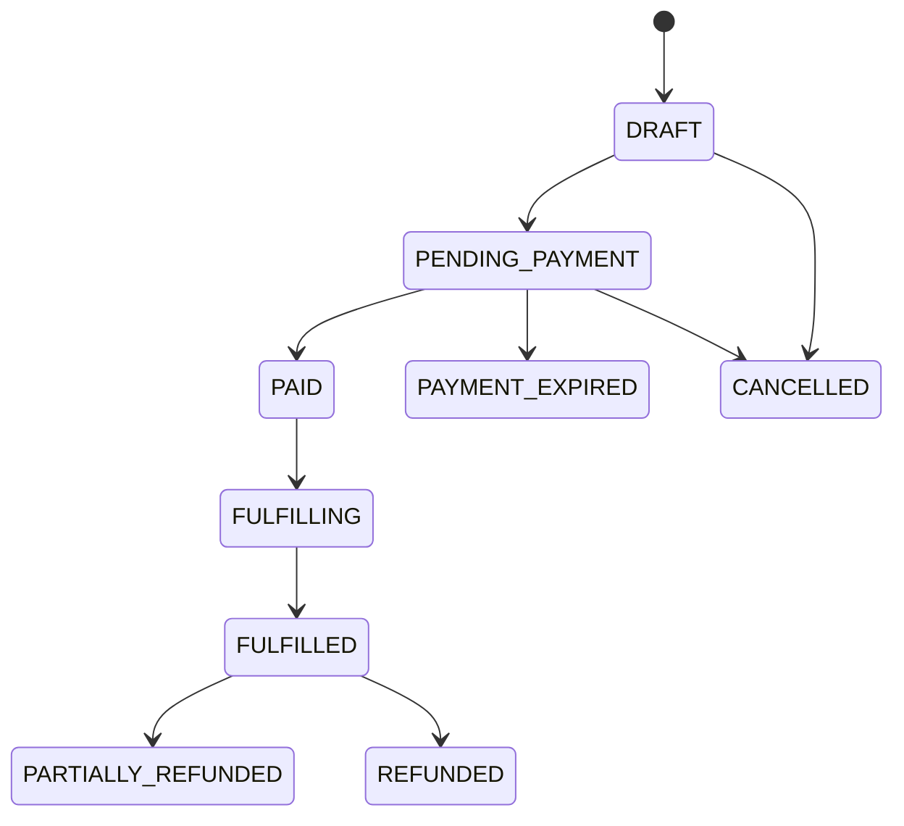

# Đặc tả chức năng 06: Commerce, POS và Payment

## 1. Mục tiêu

Module quản lý quote, order, payment, refund, receipt và fulfillment để có thể đối soát. Commerce không sở hữu pass, enrollment hoặc rental. Module chỉ gửi yêu cầu fulfillment idempotent đến domain tương ứng.

## 2. Money model

- Currency theo ISO 4217; MVP dùng `VND`.
- Amount trong API là số nguyên theo minor unit hoặc business unit. Với VND, đơn vị là đồng.
- Database `numeric(19,0)` cho VND; không dùng float.
- `grand_total = subtotal - discounts + surcharges + taxes` và không được nhỏ hơn 0.
- Giá niêm yết đã gồm thuế, số tiền làm tròn đến 1 VND và policy version được lưu trên receipt. E-invoice nằm ngoài phạm vi giai đoạn này.

## 3. Order model

### Order states

`PAYMENT_FAILED` là outcome của một payment attempt, không nhất thiết là terminal state của order. User có thể thử phương thức khác trước khi order hết hạn.

### Order item snapshot

Mỗi line lưu product, version, name, category, quantity, unit list price, các rule ID và version đã áp dụng, breakdown của discount, surcharge, tax, final amount cùng fulfillment target hoặc subject. Khi dựng lại receipt cũ, hệ thống không query catalog hiện tại.

## 4. Payment model

- Một order có nhiều payment attempts và allocations nếu split payment.
- States: `INITIATED`, `PENDING`, `SETTLED`, `FAILED`, `CANCELLED`, `PARTIALLY_REFUNDED`, `REFUNDED`.
- Provider transaction phải unique trong provider account.
- Order đạt `PAID` khi tổng settled allocations bằng grand total.
- Hệ thống không tự accept overpayment mà chuyển giao dịch vào exception hoặc refund queue.

## 5. Create order/checkout

1. Client lấy quote có expiry/fingerprint.
2. Create order với quote ID và subject/branch/channel.
3. Server revalidate quote, product sale window và scope.
4. Persist immutable line snapshot; order `PENDING_PAYMENT`.
5. Order zero-amount hoặc complimentary cần reason và permission rõ ràng trước khi chuyển thành Paid.
6. Initiate payment adapter với merchant order/payment IDs và idempotency.

## 6. POS cash

- Cashier nhập amount tendered; change = tendered − allocated amount.
- Chỉ chấp nhận số tiền chưa đủ khi split payment được bật.
- Cash settlement là privileged server mutation, có cashier/shift/branch/audit.
- Void unpaid order khác refund paid order.
- End-of-shift cash reconciliation là phần còn thiếu so với benchmark. Nội dung này chưa có trong scope gốc và cần được xác nhận.

## 7. Online/QR payment

1. API initiate provider payment, trả redirect/QR payload an toàn.
2. Kết quả trên browser chỉ hiển thị `processing` và tiếp tục poll order.
3. Signed webhook/server verify tạo settlement authoritative.
4. Duplicate/out-of-order webhook idempotent và không lùi state.
5. Paid outbox kích hoạt fulfillment.
6. Pending quá timeout chuyển order `PAYMENT_EXPIRED` nếu chưa settled; late settlement đi exception handling, không bỏ qua.

Hệ thống không dùng ảnh chụp chuyển khoản để tự động xác nhận thanh toán.

## 8. Fulfillment

- Một fulfillment row cho mỗi order item/type, unique.
- State `PENDING → PROCESSING → SUCCEEDED|RETRYABLE_FAILED|MANUAL_REVIEW`.
- Adapter gọi Entitlement/Training/Facility với `orderItemId` làm idempotency identity.
- Order chỉ chuyển thành `FULFILLED` khi tất cả required item thành công.
- Paid nhưng fulfillment chậm hiển thị `Payment received, provisioning` và tạo alert theo SLA.

## 9. Refund

1. Request chứa amount, items, reason, usage snapshot.
2. Policy check refundable amount/usage/cutoff và approval threshold.
3. Approved request gọi provider idempotently.
4. Chỉ ghi settled refund khi provider xác nhận.
5. Entitlement reversal/credit là compensation riêng, có trạng thái và audit.
6. Partial refunds cộng dồn không vượt payment settled amount.

## 10. Receipt

Receipt gồm organization, branch, order number, issued time, cashier hoặc channel, các line, price breakdown, total, currency, payment method, reference đã masking và refund reference. Receipt có version và không được sửa. Hoạt động reprint hoặc download được audit khi cần.

## 11. API impacts

- `POST/GET /api/v1/price-quotes`
- `POST/GET /api/v1/orders`, `GET /api/v1/orders/{orderId}`
- `POST /api/v1/orders/{orderId}/payment-attempts`
- `POST /api/v1/orders/{orderId}/cash-payments`
- `POST /api/v1/payments/webhooks/{provider}`
- `POST /api/v1/payments/{paymentId}/refund-requests`
- `POST /api/v1/refund-requests/{refundId}/decisions`
- `GET /api/v1/orders/{orderId}/receipt`
- `POST /api/v1/fulfillments/{fulfillmentId}/retries`

## 12. Errors

`QUOTE_EXPIRED`, `QUOTE_MISMATCH`, `PRODUCT_NOT_FOR_SALE`, `ORDER_NOT_PAYABLE`, `PAYMENT_AMOUNT_MISMATCH`, `PAYMENT_SIGNATURE_INVALID`, `PAYMENT_DUPLICATE`, `PAYMENT_NOT_SETTLED`, `INSUFFICIENT_TENDERED_AMOUNT`, `OVERPAYMENT_NOT_ALLOWED`, `REFUND_NOT_ALLOWED`, `REFUND_LIMIT_EXCEEDED`, `FULFILLMENT_PENDING`, `VERSION_CONFLICT`.

Webhook có signature không hợp lệ trả status theo provider contract nhưng không để lộ chi tiết verification.

## 13. Acceptance criteria

- `AC-COM-001`: Order receipt vẫn giữ giá/rule cũ sau catalog update.
- `AC-COM-002`: 5 duplicate webhooks tạo một settlement và một fulfillment per item.
- `AC-COM-003`: Redirect success trước webhook không issue entitlement.
- `AC-COM-004`: Split payments chỉ Paid khi tổng settled đúng grand total.
- `AC-COM-005`: Cash thiếu bị chặn nếu split disabled; change đúng nếu đủ.
- `AC-COM-006`: Paid order fulfillment transient failure được retry, không cấp trùng.
- `AC-COM-007`: Partial refunds không vượt paid amount và payment gốc không bị sửa/xóa.
- `AC-COM-008`: Late settlement sau expiry vào exception flow, không mất tiền/không silent fulfill.

## 14. Quyết định baseline

Dự án chọn một payment provider qua quy trình mua sắm và che khác biệt bằng adapter. Payment session hết hạn sau 15 phút; late settlement chuyển `MANUAL_REVIEW`. Cash shift đóng hằng ngày, có đối soát theo cashier và branch. Receipt có bản in và PDF; e-invoice ngoài phạm vi. Refund thực hiện theo `OQ-010`. Chi tiết truy vết tại `OQ-008`, `OQ-009` và `OQ-010`.

## Thuật ngữ cần biết

| Thuật ngữ | Giải thích dễ hiểu |
|---|---|
| Quote | Kết quả tính giá có thời hạn dùng để tạo order. |
| Settlement | Xác nhận từ nguồn đáng tin cậy rằng payment đã hoàn tất. |
| Fulfillment | Bước cấp pass, enrollment hoặc rental sau khi đủ điều kiện thanh toán. |
| Split payment | Thanh toán một order bằng nhiều lần hoặc nhiều phương thức. |
| Late settlement | Payment được xác nhận sau khi order hoặc payment session đã hết hạn. |
