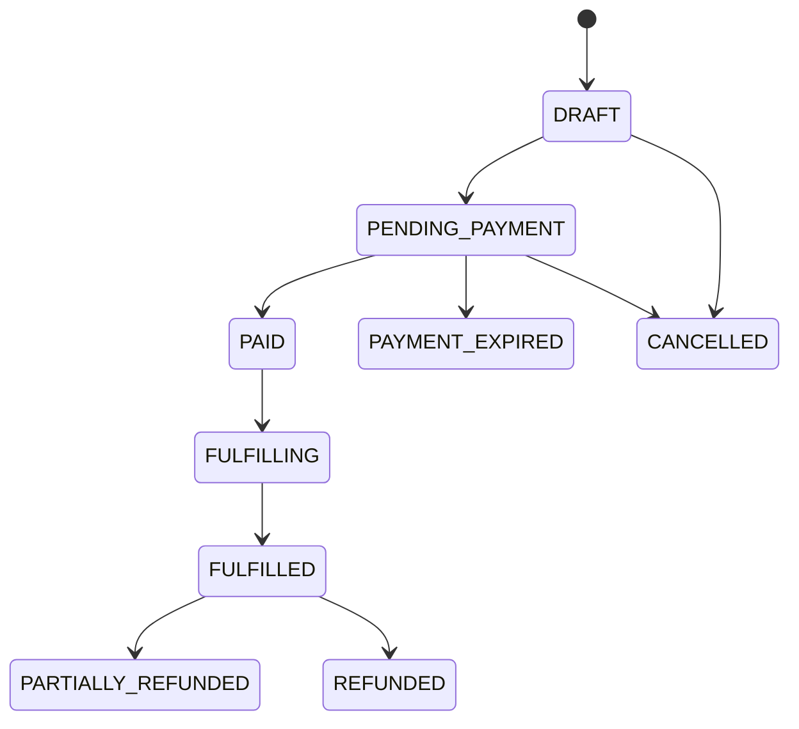

# Functional Spec 06: Commerce, POS và Payments

## 1. Mục tiêu

Quản lý quote, order, payment, refund, receipt và fulfillment có thể đối soát. Commerce không sở hữu pass/enrollment/rental, chỉ yêu cầu domain tương ứng fulfillment idempotently.

## 2. Money model

- Currency ISO 4217, MVP `VND`.
- API amount là integer minor-unit/business unit; với VND là đồng.
- Database `numeric(19,0)` cho VND; không dùng float.
- `grand_total = subtotal - discounts + surcharges + taxes`, luôn ≥ 0.
- Giá niêm yết đã gồm thuế, số tiền làm tròn đến 1 VND và policy version được lưu trên receipt. E-invoice nằm ngoài phạm vi giai đoạn này.

## 3. Order model

### Order states

`PAYMENT_FAILED` là payment attempt outcome, không nhất thiết là terminal order state; user có thể thử phương thức khác trước order expiry.

### Order item snapshot

Mỗi line lưu product/version/name/category, quantity, unit list price, applied rule IDs/versions, discount/surcharge/tax breakdown, final amount và fulfillment target/subject. Không query catalog hiện tại để dựng receipt cũ.

## 4. Payment model

- Một order có nhiều payment attempts và allocations nếu split payment.
- States: `INITIATED`, `PENDING`, `SETTLED`, `FAILED`, `CANCELLED`, `PARTIALLY_REFUNDED`, `REFUNDED`.
- Provider transaction unique trong provider account.
- Order đạt `PAID` khi tổng settled allocations bằng grand total.
- Overpayment không tự accepted; chuyển exception/refund queue.

## 5. Create order/checkout

1. Client lấy quote có expiry/fingerprint.
2. Create order với quote ID và subject/branch/channel.
3. Server revalidate quote, product sale window và scope.
4. Persist immutable line snapshot; order `PENDING_PAYMENT`.
5. Zero-amount/complimentary cần explicit reason/permission rồi chuyển Paid.
6. Initiate payment adapter với merchant order/payment IDs và idempotency.

## 6. POS cash

- Cashier nhập amount tendered; change = tendered − allocated amount.
- Thiếu tiền chỉ cho phép khi split payment bật.
- Cash settlement là privileged server mutation, có cashier/shift/branch/audit.
- Void unpaid order khác refund paid order.
- End-of-shift cash reconciliation là benchmark gap, chưa thuộc scope gốc nhưng nên xác nhận.

## 7. Online/QR payment

1. API initiate provider payment, trả redirect/QR payload an toàn.
2. Browser result chỉ hiển thị `processing` và poll order.
3. Signed webhook/server verify tạo settlement authoritative.
4. Duplicate/out-of-order webhook idempotent và không lùi state.
5. Paid outbox kích hoạt fulfillment.
6. Pending quá timeout chuyển order `PAYMENT_EXPIRED` nếu chưa settled; late settlement đi exception handling, không bỏ qua.

Không dùng ảnh chụp chuyển khoản làm auto-confirmation.

## 8. Fulfillment

- Một fulfillment row cho mỗi order item/type, unique.
- State `PENDING → PROCESSING → SUCCEEDED|RETRYABLE_FAILED|MANUAL_REVIEW`.
- Adapter gọi Entitlement/Training/Facility với `orderItemId` làm idempotency identity.
- Order `FULFILLED` chỉ khi tất cả required item success.
- Paid nhưng fulfillment chậm hiển thị `Payment received, provisioning` và tạo alert theo SLA.

## 9. Refund

1. Request chứa amount, items, reason, usage snapshot.
2. Policy check refundable amount/usage/cutoff và approval threshold.
3. Approved request gọi provider idempotently.
4. Chỉ ghi settled refund khi provider xác nhận.
5. Entitlement reversal/credit là compensation riêng, có trạng thái và audit.
6. Partial refunds cộng dồn không vượt payment settled amount.

## 10. Receipt

Receipt có organization/branch, order number, issued time, cashier/channel, lines, price breakdown, total/currency, payment methods/references đã mask và refund reference. Receipt versioned/immutable; reprint/download được audit khi cần.

## 11. API impacts

- `POST/GET /api/v1/price-quotes`
- `POST/GET /api/v1/orders`, `GET /api/v1/orders/{orderId}`
- `POST /api/v1/orders/{orderId}/payment-attempts`
- `POST /api/v1/orders/{orderId}/cash-payments`
- `POST /api/v1/payments/webhooks/{provider}`
- `POST /api/v1/payments/{paymentId}/refund-requests`
- `POST /api/v1/refund-requests/{refundId}/decisions`
- `GET /api/v1/orders/{orderId}/receipt`
- `POST /api/v1/fulfillments/{fulfillmentId}/retries`

## 12. Errors

`QUOTE_EXPIRED`, `QUOTE_MISMATCH`, `PRODUCT_NOT_FOR_SALE`, `ORDER_NOT_PAYABLE`, `PAYMENT_AMOUNT_MISMATCH`, `PAYMENT_SIGNATURE_INVALID`, `PAYMENT_DUPLICATE`, `PAYMENT_NOT_SETTLED`, `INSUFFICIENT_TENDERED_AMOUNT`, `OVERPAYMENT_NOT_ALLOWED`, `REFUND_NOT_ALLOWED`, `REFUND_LIMIT_EXCEEDED`, `FULFILLMENT_PENDING`, `VERSION_CONFLICT`.

Webhook invalid signature trả status theo provider contract nhưng không leak verification detail.

## 13. Acceptance criteria

- `AC-COM-001`: Order receipt vẫn giữ giá/rule cũ sau catalog update.
- `AC-COM-002`: 5 duplicate webhooks tạo một settlement và một fulfillment per item.
- `AC-COM-003`: Redirect success trước webhook không issue entitlement.
- `AC-COM-004`: Split payments chỉ Paid khi tổng settled đúng grand total.
- `AC-COM-005`: Cash thiếu bị chặn nếu split disabled; change đúng nếu đủ.
- `AC-COM-006`: Paid order fulfillment transient failure được retry, không cấp trùng.
- `AC-COM-007`: Partial refunds không vượt paid amount và payment gốc không bị sửa/xóa.
- `AC-COM-008`: Late settlement sau expiry vào exception flow, không mất tiền/không silent fulfill.

## 14. Quyết định baseline

Dự án chọn một payment provider qua quy trình mua sắm và che khác biệt bằng adapter. Payment session hết hạn sau 15 phút; late settlement chuyển `MANUAL_REVIEW`. Cash shift đóng hằng ngày, có đối soát theo cashier và branch. Receipt có bản in và PDF; e-invoice ngoài phạm vi. Refund thực hiện theo `OQ-010`. Chi tiết truy vết tại `OQ-008`, `OQ-009` và `OQ-010`.
