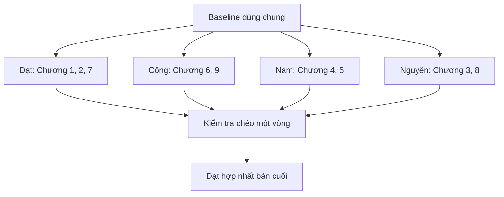

# Phân công báo cáo Quản lý dự án phần mềm

## 1. Thông tin chung

| Nội dung | Thông tin |
|---|---|
| Đề tài | Hệ thống quản lý bể bơi SunSwim |
| Môn học | Quản lý dự án phần mềm |
| Cơ sở đào tạo | PTIT |
| Thành viên | Đạt, Công, Nam, Nguyên |
| Số chương báo cáo | 9 chương |
| Yêu cầu thuyết trình | Mỗi thành viên trình bày phần mình phụ trách |

Theo yêu cầu của giảng viên, mỗi thành viên phải phụ trách ít nhất một trong bốn nội dung: quản lý phạm vi, quản lý thời gian, quản lý chi phí và quản lý nguồn nhân lực. Nhóm phân công bốn nội dung này cho bốn người khác nhau, sau đó ghép các chương còn lại theo mối liên hệ giữa công việc.

Số liệu dùng chung về phạm vi, lịch, đội dự án, chi phí, mua sắm, chất lượng và rủi ro được chốt tại [Baseline dự án SunSwim](07-academic-project-baseline.md). Nhờ đó, mỗi người có thể bắt đầu chương của mình ngay mà không phải chờ người khác lập số liệu đầu vào.

## 2. Bảng phân công tổng thể

| Thành viên | Chương phụ trách | Nội dung bắt buộc đã đáp ứng | Phần trình bày |
|---|---|---|---|
| Đạt | Chương 1, Chương 2, Chương 7 | Quản lý phạm vi | Tôn chỉ dự án, phạm vi và kế hoạch giao tiếp |
| Công | Chương 6, Chương 9 | Quản lý nguồn nhân lực | Tổ chức dự án, trách nhiệm và quản lý chất lượng |
| Nam | Chương 4, Chương 5 | Quản lý chi phí | Dự toán, ngân sách và kế hoạch mua sắm |
| Nguyên | Chương 3, Chương 8 | Quản lý thời gian | Tiến độ, đường găng và quản lý rủi ro |

Đạt phụ trách ba chương vì Charter, phạm vi và giao tiếp cùng thuộc nhóm tài liệu điều hành. Nam nhận chi phí và mua sắm vì hai chương dùng chung estimate, báo giá và điều khoản hợp đồng. Công ghép nguồn nhân lực với chất lượng vì năng lực, trách nhiệm, review và kiểm thử phải được tổ chức theo cùng một cơ cấu. Nguyên ghép thời gian với rủi ro vì biến động tiến độ, lead time tích hợp và phương án dự phòng được theo dõi trực tiếp trên schedule. Cách ghép này giảm số lần bàn giao giữa các thành viên.

## 3. Công việc của Đạt

### 3.1 Chương 1: Tôn chỉ dự án

Đạt chuẩn bị Project Charter của SunSwim, gồm:

1. Tên dự án và lý do thực hiện.
2. Vấn đề mà SunSwim cần giải quyết.
3. Mục tiêu của dự án và các chỉ tiêu đo được theo baseline.
4. Mô tả ngắn về sản phẩm và nhóm người sử dụng.
5. Phạm vi cấp cao và các sản phẩm bàn giao chính.
6. Các mốc dự án cấp cao từ 01/10/2026 đến 31/07/2027.
7. Cost baseline 10,7464 tỷ VND và tổng ngân sách cần cấp 11,41805 tỷ VND.
8. Các giả định, ràng buộc và rủi ro cấp cao.
9. Danh sách các bên liên quan.
10. Người phê duyệt, người quản lý dự án và quyền hạn theo vai trò đã chốt trong baseline.

Tài liệu có thể sử dụng:

- [Bối cảnh và phạm vi kinh doanh](../01-business/01-business-context-scope.md)
- [Giả định và quyết định baseline](../00-governance/03-assumptions-decisions-open-questions.md)
- [Kế hoạch phát hành](01-mvp-release-plan.md)
- [Risk register hiện có](03-risk-register.md)
- [Baseline dự án SunSwim](07-academic-project-baseline.md)

Sản phẩm bàn giao: một bảng Project Charter hoàn chỉnh, có ngày lập, phiên bản và khu vực xác nhận.

### 3.2 Chương 2: Quản lý phạm vi

Đạt chịu trách nhiệm:

1. Viết kế hoạch quản lý phạm vi và cách tiếp nhận yêu cầu.
2. Mô tả phạm vi sản phẩm và phạm vi dự án.
3. Liệt kê phần nằm trong phạm vi và ngoài phạm vi.
4. Liệt kê đầy đủ sản phẩm bàn giao.
5. Chuyển phạm vi thành WBS có mã công việc thống nhất.
6. Lập WBS Dictionary cho từng work package: mô tả, đầu ra, người phụ trách và điều kiện hoàn thành.
7. Xác định cách nghiệm thu phạm vi.
8. Viết quy trình kiểm soát thay đổi phạm vi.
9. Kiểm tra ma trận truy vết yêu cầu để không bỏ sót module.

Tài liệu có thể sử dụng:

- [Business context và scope](../01-business/01-business-context-scope.md)
- [Capability và domain map](../01-business/02-capability-domain-map.md)
- [Business rule catalog](../01-business/05-business-rules-catalog.md)
- [Ma trận truy vết](../00-governance/04-traceability.md)
- Tám file trong thư mục `03-functional`

Phần phải làm mới: Scope Management Plan, WBS, WBS Dictionary và biểu mẫu yêu cầu thay đổi. Thư mục hiện tại chưa có các tài liệu này.

Sản phẩm bàn giao: Scope Statement, WBS, WBS Dictionary, bảng phạm vi và biểu mẫu kiểm soát thay đổi.

### 3.3 Chương 7: Quản lý giao tiếp

Đạt lập kế hoạch giao tiếp trong dự án, không dùng nhầm phần notification của hệ thống làm kế hoạch giao tiếp của nhóm. Nội dung gồm:

1. Danh sách bên liên quan và nhu cầu thông tin của từng bên.
2. Ma trận giao tiếp: nội dung, người gửi, người nhận, hình thức, tần suất và nơi lưu.
3. Quy định họp nhóm, ghi biên bản và theo dõi việc cần làm.
4. Cách báo cáo tiến độ, chi phí, rủi ro và chất lượng.
5. Cách thông báo khi có thay đổi phạm vi hoặc thay đổi mốc thời gian.
6. Quy trình escalation từ đội dự án lên PM, Product Owner và Steering Committee.
7. Quy tắc đặt tên, quản lý phiên bản, lưu trữ và phát hành tài liệu dự án.
8. Ghi riêng cách nhóm bốn người ghép và nộp báo cáo học phần.

Phần phải làm mới: Stakeholder Register và Communication Matrix. Các file hiện có chỉ mô tả actor, thông báo và event của phần mềm.

Sản phẩm bàn giao: Stakeholder Register, Communication Matrix, mẫu biên bản họp và quy tắc quản lý tài liệu.

### 3.4 Phạm vi tự chủ và điểm đối chiếu

- Đạt dùng trực tiếp mục tiêu, WBS, milestone, ngân sách và quyền duyệt trong baseline, không phải chờ các chương khác.
- Đạt được phân rã WBS cho Chương 2 nhưng không đổi 12 work package cấp cao.
- Chương 1, Chương 2 và Chương 7 dùng cùng một Stakeholder Register và Change Control Process.
- Khi bốn phần hoàn thành, Đạt chỉ đối chiếu ngày với Nguyên, tiền với Nam, RACI và tiêu chí nghiệm thu với Công.
- Đạt hợp nhất báo cáo cuối nhưng không viết thay nội dung chuyên môn của người khác.

### 3.5 Phần Đạt thuyết trình

Đạt trình bày lý do làm dự án, mục tiêu, phạm vi, WBS và cách nhóm trao đổi thông tin. Khi trình bày WBS, Đạt cần giải thích mối liên hệ giữa phạm vi với tiến độ và chi phí, không đọc toàn bộ bảng.

## 4. Công việc của Công

### 4.1 Chương 6: Quản lý nguồn nhân lực

Công lập kế hoạch nhân lực cho đội triển khai thực tế, không dùng bảng actor và RBAC của phần mềm để thay cho cơ cấu dự án. Trách nhiệm của nhóm bốn người viết báo cáo được trình bày ở một bảng riêng. Công việc gồm:

1. Xác định vai trò của Sponsor, Product Owner, PM, BA, Architect, UI/UX, Developer, QA, DevOps, chuyên gia và Key User.
2. Lập sơ đồ tổ chức dự án.
3. Lập ma trận RACI theo WBS.
4. Mô tả trách nhiệm, quyền quyết định và đầu ra của từng vai trò.
5. Lập kế hoạch sử dụng nguồn lực theo từng giai đoạn.
6. Lập kế hoạch huy động, giải phóng và thay thế nguồn lực.
7. Ghi kỹ năng bắt buộc, nhu cầu đào tạo và kế hoạch phát triển nhóm.
8. Quy định cách bàn giao, hỗ trợ chéo và xử lý khi thiếu người.
9. Viết nguyên tắc đánh giá hiệu suất và giải quyết xung đột.
10. Ghi riêng ma trận trách nhiệm của Đạt, Công, Nam và Nguyên đối với báo cáo học phần.

Tài liệu có thể sử dụng:

- [Actors và RBAC của hệ thống](../01-business/03-actors-rbac.md)
- [Capability và domain map](../01-business/02-capability-domain-map.md)
- [Kế hoạch phát hành](01-mvp-release-plan.md)
- [Baseline dự án SunSwim](07-academic-project-baseline.md)
- File phân công này

Phần phải làm mới: Project Organization Chart, RACI cho đội dự án thật, Resource Histogram, Staffing Management Plan và cách đánh giá hiệu suất. Actor của SunSwim là người dùng hệ thống, không phải nhân sự triển khai.

Sản phẩm bàn giao: sơ đồ tổ chức, RACI, bảng mô tả vai trò, Resource Calendar, Resource Histogram và Staffing Management Plan.

### 4.2 Chương 9: Quản lý chất lượng

Công chuẩn bị kế hoạch chất lượng cho sản phẩm SunSwim và bản báo cáo:

1. Xác định tiêu chuẩn, metric và điều kiện nghiệm thu.
2. Gắn mỗi metric với nguồn đo, người đo, tần suất và ngưỡng đạt.
3. Phân biệt Quality Assurance với Quality Control.
4. Lập lịch review yêu cầu, kiến trúc, API, dữ liệu và mã nguồn.
5. Chọn loại kiểm thử theo mức rủi ro và yêu cầu phi chức năng.
6. Quy định cách phân loại, ưu tiên, sửa và đóng defect.
7. Lập quality gate cho từng release, UAT, pilot và go-live.
8. Lập checklist kiểm tra tính thống nhất của chín chương.
9. Quy định nghiệm thu nhà cung cấp về mặt kỹ thuật.

Tài liệu có thể sử dụng:

- [Acceptance và test strategy](02-acceptance-test-strategy.md)
- [NFR và SLO](../02-architecture/06-nfr-slo.md)
- [Review và sign-off](05-review-and-signoff.md)
- [Ma trận truy vết](../00-governance/04-traceability.md)
- [Baseline dự án SunSwim](07-academic-project-baseline.md)

Phần phải làm mới: Quality Management Plan, Quality Metrics, Quality Assurance Calendar, Defect Workflow và Acceptance Checklist.

Sản phẩm bàn giao: Quality Management Plan, bảng metric, lịch review, quy trình quản lý lỗi và checklist nghiệm thu.

### 4.3 Phạm vi tự chủ và điểm đối chiếu

- Công dùng cơ cấu nguồn lực và ngưỡng chất lượng đã có trong baseline, không chờ WBS hoặc lịch chi tiết.
- RACI bám 12 work package cấp cao. Resource Calendar có thể phân bổ theo các giai đoạn đã chốt.
- Chương 6 quyết định ai làm và ai chịu trách nhiệm; Chương 9 quyết định đầu ra phải đạt mức nào. Hai chương dùng chung vai trò nên Công tự kiểm soát được tính nhất quán.
- Cuối vòng viết, Công gửi tổng person-month cho Nam kiểm tra chi phí và gửi các quality gate có deadline cho Nguyên đối chiếu lịch.

### 4.4 Phần Công thuyết trình

Công trình bày cơ cấu đội dự án, cách phân quyền bằng RACI, kế hoạch huy động nhân lực và các quality gate trước UAT, pilot, go-live. Công nên chọn một metric kỹ thuật và một metric nghiệp vụ để giải thích cách đo.

## 5. Công việc của Nam

### 5.1 Chương 4: Quản lý chi phí

Nam chịu trách nhiệm:

1. Ghi rõ cơ sở và giả định dùng để ước lượng chi phí.
2. Liệt kê chi phí nhân lực, hạ tầng, thiết bị, phần mềm, dịch vụ và dự phòng.
3. Chọn phương pháp ước lượng phù hợp cho từng nhóm chi phí.
4. Phân bổ estimate 9.595 triệu VND chi phí trực tiếp theo WBS.
5. Lập cost baseline 10.746,40 triệu VND theo thời gian.
6. Tách contingency reserve khỏi management reserve nếu nội dung môn học yêu cầu.
7. Giải thích tổng ngân sách cần cấp 11.418,05 triệu VND và quyền sử dụng từng loại dự phòng.
8. Viết cách ghi nhận chi phí thực tế, xử lý vượt ngân sách và phê duyệt thay đổi.
9. Lập mẫu theo dõi PV, EV, AC, CV, SV, CPI, SPI và Estimate at Completion.

Tài liệu có thể sử dụng:

- [Solution architecture](../02-architecture/02-solution-architecture.md)
- [Deployment và operations](../02-architecture/07-deployment-operations.md)
- [Commerce và payment](../03-functional/06-commerce-payments.md)
- [Kế hoạch phát hành](01-mvp-release-plan.md)
- [Baseline dự án SunSwim](07-academic-project-baseline.md)

Phần phải làm mới: cost breakdown theo WBS, ngân sách theo tháng, đường S-curve và bảng Earned Value. Đơn giá và tổng ngân sách đã được chốt trong baseline, Nam không cần chờ thành viên khác cung cấp số liệu.

Sản phẩm bàn giao: Cost Estimate, Budget Summary, Cost Baseline và bảng kiểm soát chi phí.

### 5.2 Chương 5: Quản lý mua sắm

Nam dùng danh mục mua sắm trong baseline để phân tích make or buy và lập kế hoạch hợp đồng. Các nhóm chính gồm cloud, cổng đọc QR, bộ điều khiển locker, payment, dịch vụ kiểm thử độc lập, migration và đào tạo.

Công việc cụ thể:

1. Lập phân tích make or buy cho từng hạng mục.
2. Ghi phạm vi công việc và yêu cầu nghiệm thu của hàng hóa hoặc dịch vụ cần mua.
3. Xác định tiêu chí đánh giá nhà cung cấp, trọng số và cách chấm điểm.
4. Chọn loại hợp đồng phù hợp sau khi có thông tin giá và rủi ro.
5. Đưa thời gian lựa chọn, mua, giao và kiểm thử vào lịch của Nguyên.
6. Ghi rõ người đề xuất, người duyệt và người nghiệm thu.
7. Theo dõi thay đổi, thanh toán, vi phạm và đóng hợp đồng.
8. Ghi rủi ro phụ thuộc nhà cung cấp vào Risk Register do Nguyên quản lý.

Tài liệu có thể sử dụng:

- [System context](../02-architecture/01-system-context.md)
- [Deployment và operations](../02-architecture/07-deployment-operations.md)
- [Access và capacity](../03-functional/02-access-capacity.md)
- [Locker](../03-functional/05-lockers.md)
- [Commerce và payment](../03-functional/06-commerce-payments.md)
- [Baseline dự án SunSwim](07-academic-project-baseline.md)

Phần phải làm mới: Procurement Management Plan, danh sách hạng mục mua sắm đã duyệt, make or buy analysis, tiêu chí chọn nhà cung cấp, Statement of Work và kế hoạch quản lý hợp đồng. Các file hiện có chỉ nêu loại hệ thống bên ngoài, chưa chọn nhà cung cấp.

Sản phẩm bàn giao: Procurement Plan, Make or Buy Table, Vendor Scorecard và Statement of Work cho các hạng mục chính.

### 5.3 Phạm vi tự chủ và điểm đối chiếu

- Nam dùng trực tiếp 12 work package, lịch cấp cao, loaded rate và dự toán mua sắm trong baseline.
- Nam tự lập Cost Breakdown Structure, cash flow và Procurement Schedule trong hai chương của mình.
- Chương 4 là nguồn chuẩn về tiền; Chương 5 là nguồn chuẩn về hợp đồng, lead time và nghiệm thu nhà cung cấp.
- Cuối vòng viết, Nam chỉ cần gửi các mốc thanh toán cho Nguyên đối chiếu schedule và gửi tổng person-month cho Công đối chiếu Staffing Plan.
- Thay đổi số liệu phải cập nhật đồng thời estimate, contingency reserve, cost baseline, management reserve và funding requirement.

### 5.4 Phần Nam thuyết trình

Nam trình bày phương pháp ước lượng, cơ cấu ngân sách và các hạng mục phải mua hoặc thuê. Mọi con số trên slide phải trùng với bảng chi phí trong báo cáo.

## 6. Công việc của Nguyên

### 6.1 Chương 3: Quản lý thời gian

Nguyên dùng WBS và lịch cấp cao đã chốt trong baseline rồi thực hiện:

1. Chuyển work package thành danh sách hoạt động.
2. Xác định quan hệ trước sau và các hoạt động có thể làm song song.
3. Ước lượng effort và duration. Không gộp hai khái niệm này thành một.
4. Gán vai trò thực hiện theo cơ cấu nguồn lực baseline.
5. Đưa lead time chuẩn của mua sắm, tích hợp thiết bị, migration và pilot vào lịch.
6. Lập sơ đồ mạng công việc nếu mẫu báo cáo yêu cầu.
7. Lập biểu đồ Gantt.
8. Xác định critical path, total float và các milestone.
9. Tạo schedule baseline.
10. Viết cách cập nhật tiến độ, đo sai lệch và xử lý khi chậm.

Tài liệu có thể sử dụng:

- [Kế hoạch phát hành](01-mvp-release-plan.md)
- [Điều kiện sẵn sàng và nghiệm thu](05-review-and-signoff.md)
- [Capability map](../01-business/02-capability-domain-map.md)
- [Baseline dự án SunSwim](07-academic-project-baseline.md)
- Tám functional spec trong thư mục `03-functional`

Phần phải làm mới: danh sách hoạt động, quan hệ phụ thuộc, estimate, Gantt, critical path và schedule baseline. Release plan hiện có mới chia theo giai đoạn, chưa phải lịch dự án.

Sản phẩm bàn giao: Activity List, Network Diagram, Gantt Chart, Milestone List và Schedule Baseline.

### 6.2 Chương 8: Quản lý rủi ro

Nguyên mở rộng Risk Register hiện có thành kế hoạch quản lý rủi ro của dự án:

1. Quy định thang đo xác suất và tác động từ 1 đến 5.
2. Lập Risk Breakdown Structure theo phạm vi, thời gian, chi phí, nhân lực, kỹ thuật, dữ liệu, thiết bị, nhà cung cấp và vận hành.
3. Nhận diện cả threat và opportunity.
4. Chấm điểm, xếp hạng và lập ma trận xác suất, tác động.
5. Gán risk owner, trigger và ngày review.
6. Chọn chiến lược tránh, giảm, chuyển giao, chấp nhận hoặc khai thác cơ hội.
7. Lập contingency plan và fallback plan cho rủi ro mức Cao.
8. Gắn rủi ro tiến độ với buffer, critical path và milestone liên quan.
9. Phân biệt contingency reserve với management reserve.

Tài liệu có thể sử dụng:

- [Risk register](03-risk-register.md)
- [Giả định và quyết định baseline](../00-governance/03-assumptions-decisions-open-questions.md)
- [Kiến trúc hệ thống](../02-architecture/02-solution-architecture.md)
- [NFR và SLO](../02-architecture/06-nfr-slo.md)
- [Baseline dự án SunSwim](07-academic-project-baseline.md)

Phần phải bổ sung: Risk Management Plan, Risk Breakdown Structure, opportunity register, owner, trigger, contingency plan và cách review định kỳ.

Sản phẩm bàn giao: Risk Management Plan, Risk Breakdown Structure, ma trận xác suất và tác động, Risk Register và báo cáo top risks.

### 6.3 Phạm vi tự chủ và điểm đối chiếu

- Nguyên có sẵn ngày dự án, 12 work package, 10 milestone, cơ cấu nguồn lực và thang điểm rủi ro trong baseline.
- Chương 3 là nguồn chuẩn về ngày và quan hệ phụ thuộc; Chương 8 dùng các mốc đó để đặt trigger và lịch ứng phó.
- Nguyên tự đặt schedule reserve hợp lý trong giới hạn ngày kết thúc, không phải chờ chương chi phí.
- Cuối vòng viết, Nguyên gửi mốc thanh toán và huy động nguồn lực cho Nam, Công kiểm tra. Đây là bước đối chiếu, không phải đầu vào bắt buộc để bắt đầu.

### 6.4 Phần Nguyên thuyết trình

Nguyên trình bày cách lập lịch từ WBS, các mốc chính, đường găng và ba rủi ro có điểm cao nhất. Biểu đồ Gantt phải đủ lớn để đọc được. Với mỗi rủi ro chính, Nguyên nêu owner, trigger, phương án ứng phó và milestone bị ảnh hưởng.

## 7. Luồng bàn giao giữa bốn thành viên

Quy trình làm việc:

1. Cả bốn người đọc baseline và dùng đúng WBS, ngày, vai trò, ngân sách và ngưỡng chất lượng đã chốt.
2. Bốn nhánh viết đồng thời. Không ai phải chờ một chương khác hoàn thành mới bắt đầu.
3. Mỗi người tự kiểm tra tính nhất quán giữa các chương mình phụ trách.
4. Nhóm thực hiện đúng một vòng kiểm tra chéo khi bản nháp đã hoàn thành khoảng 80%.
5. Owner sửa nhận xét trong phần của mình. Người review không tự ý đổi số liệu nguồn.
6. Đạt hợp nhất, chạy checklist hình thức và gửi bản cuối cho cả nhóm xác nhận.

Các điểm giao nhau chỉ là bước kiểm tra: ngày giữa Chương 1 và 3, person-month giữa Chương 4 và 6, lead time giữa Chương 3 và 5, risk reserve giữa Chương 4 và 8, quality gate giữa Chương 3 và 9.

## 8. Quy tắc để chín chương thống nhất

- Chỉ dùng một danh sách mục tiêu và một phạm vi đã chốt.
- WBS code trong lịch, chi phí, nhân lực và rủi ro phải giống nhau.
- Ngày trong Project Charter phải khớp với schedule baseline.
- Tổng ngân sách trong Project Charter phải khớp với cost baseline.
- Hạng mục mua sắm phải xuất hiện trong lịch và ngân sách.
- Người sở hữu rủi ro phải có trong RACI.
- Tiêu chí nghiệm thu của Chương 2 phải xuất hiện trong kế hoạch chất lượng.
- Mọi thay đổi sau baseline phải có người đề xuất, người duyệt và ảnh hưởng đến phạm vi, thời gian, chi phí.
- Mỗi bảng phải ghi người lập, ngày cập nhật và phiên bản nếu mẫu báo cáo cho phép.

## 9. Kiểm tra chéo

| Người kiểm tra | Phần kiểm tra | Nội dung cần đối chiếu |
|---|---|---|
| Đạt | Chương 3 và Chương 8 | Lịch, rủi ro và milestone có phù hợp phạm vi không |
| Công | Toàn bộ bản ghép | Tiêu chí chất lượng, RACI, trình bày và checklist nghiệm thu |
| Nam | Chương 6 và Chương 8 | Person-month, risk reserve và trách nhiệm mua sắm có khớp không |
| Nguyên | Chương 1, Chương 4 và Chương 5 | Ngày, cash flow và lead time có khớp schedule không |

## 10. Mức độ đầy đủ của thư mục `specs`

Không có file rỗng trong thư mục. Tuy nhiên, nhiều tài liệu đang là spec sản phẩm hoặc tài liệu kỹ thuật, không phải tài liệu quản lý dự án theo chín chương của môn học.

| Chương | Nội dung đã có | Mức độ dùng được | Phần owner phải phát triển thành chương |
|---|---|---|---|
| 1. Tôn chỉ dự án | Bối cảnh, mục tiêu, Sponsor, PM, ngày, ngân sách và milestone | Đủ dữ liệu đầu vào | Trình bày thành Project Charter và khu vực phê duyệt |
| 2. Quản lý phạm vi | In scope, out of scope, capability, rule, traceability, acceptance | Khá đầy đủ về sản phẩm | Scope Management Plan, WBS, WBS Dictionary, cách validate và control scope |
| 3. Quản lý thời gian | Ngày dự án, giai đoạn, 10 milestone và release plan | Đủ để lập lịch | Activity list, dependency, network diagram, Gantt, critical path và schedule baseline |
| 4. Quản lý chi phí | Loaded rate, estimate 9.595 triệu VND, reserve và funding requirement | Đủ số liệu đầu vào | Cost breakdown theo WBS, cash flow, S-curve và EVM |
| 5. Quản lý mua sắm | Danh mục mua, loại hợp đồng, quyền duyệt và tiêu chí chọn | Đủ số liệu đầu vào | Make or buy, SOW, Procurement Schedule và Vendor Scorecard |
| 6. Quản lý nguồn nhân lực | Cơ cấu đội thực tế, quy mô và trách nhiệm chính | Đủ số liệu đầu vào | Organization Chart, RACI, Resource Calendar, histogram và Staffing Plan |
| 7. Quản lý giao tiếp | Có event và notification của hệ thống | Chưa đúng đối tượng | Stakeholder Register, Communication Matrix, lịch họp, báo cáo, escalation và quản lý file |
| 8. Quản lý rủi ro | Có Risk Register và thang điểm chung | Dùng được phần lớn | Risk Management Plan, RBS, owner, trigger, contingency plan và lịch review |
| 9. Quản lý chất lượng | Có NFR, SLO, test strategy, quality metric và điều kiện go-live | Dùng được phần lớn | Quality Management Plan, lịch review, quality gate và defect workflow |

Các quyết định nghiệp vụ từng để Open hoặc Pending đã có baseline học thuật để viết bài. Tên nhà cung cấp vẫn chưa ghi vì đó là kết quả của quy trình mua sắm, nhưng loại hợp đồng, ngân sách, tiêu chí chọn và điều kiện nghiệm thu đã đủ để Nam làm Chương 5.

## 11. Baseline nhóm phải dùng thống nhất

Những nội dung từng thiếu đã được chốt tại [Baseline dự án SunSwim](07-academic-project-baseline.md):

1. Dự án thật triển khai cho ba chi nhánh từ 01/10/2026 đến 31/07/2027.
2. Đạt giữ vai trò Project Manager giả định trong báo cáo.
3. Đội delivery cốt lõi có đầy đủ vai trò chuyên môn, cao điểm khoảng 18 người, chưa tính Sponsor và Key User bán thời gian.
4. WBS có 12 work package và lịch cấp cao có 10 milestone.
5. Chi phí trực tiếp là 9.595 triệu VND.
6. Cost baseline là 10.746,40 triệu VND.
7. Tổng ngân sách cần được cấp là 11.418,05 triệu VND.
8. Contingency reserve bằng 12% và management reserve bằng 7% chi phí trực tiếp.
9. Các nhóm mua sắm, loại hợp đồng, tiêu chí đánh giá và thẩm quyền phê duyệt đã được xác định.
10. Chất lượng, rủi ro, giao tiếp và kiểm soát thay đổi có ngưỡng và quy trình chung.

Nhóm chỉ cần bổ sung thông tin hành chính do giảng viên quy định, như mã lớp, mã sinh viên, mẫu bìa, số trang và cách trích dẫn. Những thông tin này không nên tự đặt khi chưa có dữ liệu thật.

## 12. Đoạn phân công đưa vào báo cáo

Nhóm gồm bốn thành viên: Đạt, Công, Nam và Nguyên. Đạt phụ trách Chương 1 về tôn chỉ dự án, Chương 2 về quản lý phạm vi và Chương 7 về quản lý giao tiếp. Công phụ trách Chương 6 về quản lý nguồn nhân lực và Chương 9 về quản lý chất lượng. Nam phụ trách Chương 4 về quản lý chi phí và Chương 5 về quản lý mua sắm. Nguyên phụ trách Chương 3 về quản lý thời gian và Chương 8 về quản lý rủi ro.

Mỗi thành viên chịu trách nhiệm viết nội dung, chuẩn bị bảng biểu, kiểm tra số liệu và trình bày phần mình đã làm. Đạt ghép bản cuối và quản lý phiên bản tài liệu. Công kiểm tra cơ cấu nhân lực, RACI và chất lượng. Nam kiểm tra số liệu chi phí và mua sắm. Nguyên kiểm tra tiến độ và Risk Register. Trước khi nộp, cả nhóm đọc lại toàn bộ báo cáo và xác nhận phần công việc của mình.

## Thuật ngữ cần biết

| Thuật ngữ | Giải thích dễ hiểu |
|---|---|
| Project Charter | Tài liệu cho biết lý do, mục tiêu, phạm vi lớn và quyền hạn của dự án. |
| WBS | Cách chia toàn bộ dự án thành các nhóm công việc nhỏ để quản lý. |
| RACI | Bảng chỉ rõ ai thực hiện, ai chịu trách nhiệm cuối, ai được hỏi ý kiến và ai cần được thông báo. |
| Critical path | Chuỗi công việc quyết định ngày kết thúc sớm nhất của dự án. |
| EVM | Phương pháp so sánh tiến độ và chi phí thực tế với kế hoạch. |
