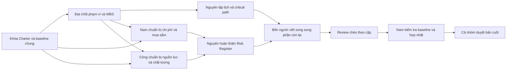

# Phân công thực hiện báo cáo Quản lý dự án phần mềm

## 1. Thông tin chung

| Nội dung | Thông tin |
|---|---|
| Đề tài | Hệ thống Quản lý Hoạt động Chuỗi Bể bơi SunSwim |
| Mã dự án | `SSMS-2026-BTL` |
| Lớp | D23CNPM02 |
| Học phần | Quản lý dự án phần mềm |
| Giảng viên hướng dẫn | ThS. Ngô Tiến Đức |
| Thời gian dự án | 15/08/2026 đến 25/11/2026, gồm 14 tuần |
| Kinh phí được duyệt | 150.000.000 VNĐ |

## 2. Hai loại trách nhiệm cần phân biệt

Vai trò trong dự án và phần viết báo cáo là hai việc khác nhau. Ví dụ, Trần Nhật Nam là Project Manager của dự án nhưng Phạm Tuấn Đạt vẫn có thể chịu trách nhiệm viết Chương 1 về Tôn chỉ dự án. Cách tách này giúp nhóm phân đều khối lượng mà không làm sai vai trò đã ghi trong Tôn chỉ.

### Vai trò trong dự án

| Thành viên | Mã sinh viên | Vai trò dự án |
|---|---|---|
| Trần Nhật Nam | B23DCCN592 | Project Manager và System Architect |
| Vũ Thành Công | B23DCCN103 | Business Analyst Lead và Back-end Developer |
| Phạm Tuấn Đạt | B23DCCN145 | Technical Lead và Full-stack Developer |
| Vũ Thành Nguyên | B23DCCN617 | QA/QC Lead và Tester |

### Phụ trách các chương báo cáo

| Thành viên | Chương phụ trách chính | Vai trò khi ghép bài |
|---|---|---|
| Phạm Tuấn Đạt | Chương 1, Chương 2, Chương 7 | Chuẩn hóa phạm vi và hình thức trình bày |
| Vũ Thành Công | Chương 6, Chương 9 | Kiểm tra nguồn lực và chất lượng |
| Trần Nhật Nam | Chương 4, Chương 5 | Kiểm soát ngân sách và mua sắm |
| Vũ Thành Nguyên | Chương 3, Chương 8 | Kiểm soát lịch và rủi ro |

Phân công này bảo đảm mỗi người phụ trách ít nhất một trong bốn nội dung bắt buộc: phạm vi, thời gian, chi phí và nguồn nhân lực. Nguyên phụ trách Chương 3 theo nguyện vọng của nhóm.

## 3. Công việc cụ thể của từng người

### 3.1 Phạm Tuấn Đạt

#### Chương 1: Tôn chỉ dự án

- Trình bày lý do hình thành dự án và vấn đề SunSwim cần giải quyết.
- Dùng đúng tên dự án, mã `SSMS-2026-BTL`, thời gian 14 tuần và kinh phí 150 triệu VNĐ.
- Nêu mục tiêu, phạm vi cấp cao, sản phẩm bàn giao và bốn milestone.
- Ghi đúng vai trò của Chủ đầu tư, Project Manager, nhóm phát triển và đại diện khách hàng.
- Dùng các tiêu chí SPI, CPI, yêu cầu bắt buộc trong SRS, lỗi nghiêm trọng và UAT đúng như Tôn chỉ.
- Đính kèm hoặc dẫn chiếu bản Tôn chỉ đã chuẩn hóa.

Đầu ra: Chương 1 hoàn chỉnh và bảng tóm tắt thông tin dự án thống nhất cho cả nhóm.

#### Chương 2: Quản lý phạm vi

- Viết kế hoạch quản lý phạm vi và cách thu thập yêu cầu.
- Xác định phạm vi trong, ngoài dự án; làm rõ RFID/QR, cửa xoay, tủ đồ, xếp lịch, dashboard và Local Cache.
- Lập WBS và WBS Dictionary từ tám gói công việc cấp cao trong baseline.
- Lập ma trận truy vết từ mục tiêu đến yêu cầu, sản phẩm bàn giao và test case.
- Mô tả cách xác nhận phạm vi với Hoàng Thị Mai và cách kiểm soát thay đổi qua CCB.
- Dùng nhận diện khuôn mặt AI làm ví dụ về yêu cầu nên chuyển sang giai đoạn 2.

Đầu ra: Scope Management Plan, Scope Statement, WBS, WBS Dictionary và Traceability Matrix.

#### Chương 7: Quản lý giao tiếp

- Xác định ai cần nhận thông tin gì, vào thời điểm nào và qua kênh nào.
- Lập Communication Matrix cho Nguyễn Văn Bình, Hoàng Thị Mai, bốn thành viên và giảng viên.
- Quy định họp nhóm, báo cáo tuần, quản lý biên bản, quyết định và Change Request.
- Lập đường dây báo cáo khi có blocker, trễ milestone, vượt chi phí hoặc lỗi nghiêm trọng.
- Chuẩn hóa tên file, phiên bản và cấu trúc bản báo cáo cuối.

Đầu ra: Communication Management Plan, Communication Matrix, mẫu biên bản và mẫu báo cáo trạng thái.

### 3.2 Vũ Thành Công

#### Chương 6: Quản lý nguồn nhân lực

- Lập sơ đồ tổ chức dự án từ đúng bốn thành viên và các bên liên quan đã có trong Tôn chỉ.
- Mô tả trách nhiệm của Project Manager, System Architect, BA Lead, Technical Lead, Developer, QA/QC Lead và Tester.
- Lập RACI cho tám gói công việc, bốn milestone và các quyết định quan trọng.
- Lập Resource Calendar theo 14 tuần, chú ý thời gian review SRS, thiết kế, phát triển, UAT và bàn giao.
- Xác định người thay thế hoặc người review chéo để tránh một công việc chỉ có một người biết.
- Trình bày cách xử lý xung đột, chia sẻ kiến thức và đánh giá đóng góp.

Đầu ra: Organization Chart, mô tả vai trò, RACI, Resource Calendar và kế hoạch phát triển nhóm.

#### Chương 9: Quản lý chất lượng

- Lập Quality Management Plan dựa trên các mục tiêu trong Tôn chỉ.
- Chuyển từng yêu cầu chất lượng thành cách đo, dữ liệu bằng chứng và người chịu trách nhiệm.
- Định nghĩa mức độ lỗi, vòng đời lỗi và điều kiện không được phép Go-live.
- Bao phủ kiểm thử chức năng, tích hợp, tải, bảo mật, Local Cache, chuyển đổi Excel và UAT.
- Lập checklist review tài liệu SRS, WBS, thiết kế, mã nguồn, hướng dẫn và biên bản UAT.
- Đối chiếu cùng Nguyên để mỗi yêu cầu bắt buộc trong SRS có test case và kết quả.

Đầu ra: Quality Management Plan, bộ chỉ số chất lượng, quy trình lỗi và checklist nghiệm thu.

### 3.3 Trần Nhật Nam

#### Chương 4: Quản lý chi phí

- Dùng tổng kinh phí cố định 150 triệu VNĐ.
- Trình bày phương pháp ước lượng và cơ sở của từng nhóm chi phí.
- Dùng bảng phân bổ: 135 triệu chi phí trực tiếp, 10 triệu dự phòng rủi ro, Cost Baseline 145 triệu và 5 triệu dự phòng quản lý.
- Phân bổ chi phí theo WBS và theo 14 tuần để tạo đường cơ sở chi phí.
- Lập mẫu theo dõi PV, EV, AC, CV, SV, CPI và SPI.
- Nêu rõ CPI phải từ 1,0 và tổng chi phí thực tế không được vượt 150 triệu.
- Mô tả quyền sử dụng dự phòng và cách xử lý khi dự báo vượt ngân sách.

Đầu ra: Cost Management Plan, bảng ước lượng, Cost Baseline, dòng tiền theo thời gian và mẫu EVM.

#### Chương 5: Quản lý mua sắm

- Thực hiện phân tích tự làm hay mua cho hạ tầng, thiết bị RFID/QR, tích hợp cửa xoay và công cụ hỗ trợ.
- Bám nguyên tắc tận dụng máy tính và máy quét sẵn có của SunSwim.
- Viết phạm vi công việc, tiêu chí kỹ thuật, cách nghiệm thu và trách nhiệm của bên cung cấp cho từng gói mua sắm.
- Lập lịch mua sắm khớp mốc thiết kế tuần 6 và pilot tuần 11.
- Xây dựng bảng chấm nhà cung cấp theo kỹ thuật, chi phí, tiến độ và hỗ trợ.
- Kiểm tra mọi khoản cam kết đều nằm trong tổng ngân sách 150 triệu.

Đầu ra: Procurement Management Plan, Make-or-Buy Analysis, Procurement Schedule, SOW và Vendor Scorecard.

### 3.4 Vũ Thành Nguyên

#### Chương 3: Quản lý thời gian

- Dùng ngày bắt đầu 15/08/2026 và ngày kết thúc 25/11/2026.
- Chuyển WBS thành danh sách hoạt động có thời lượng, người thực hiện và quan hệ trước sau.
- Lập sơ đồ mạng, xác định critical path và lượng dự trữ thời gian.
- Lập Gantt Chart cho đủ 14 tuần và đánh dấu bốn milestone ngày 05/09, 26/09, 30/10 và 25/11.
- Xác định công việc có thể làm song song để giảm phụ thuộc: thiết kế UI cùng thiết kế dữ liệu; chuẩn bị test case trong khi phát triển; chuẩn bị dữ liệu và tài liệu đào tạo trước UAT.
- Nêu cách cập nhật tiến độ, xử lý chậm việc và tính SPI; mục tiêu SPI từ 0,95.
- Kiểm tra milestone không trễ quá 5 ngày làm việc.

Đầu ra: Schedule Management Plan, Activity List, Network Diagram, Critical Path, Gantt Chart và Schedule Baseline.

#### Chương 8: Quản lý rủi ro

- Viết Risk Management Plan, thang xác suất, tác động và quy tắc ưu tiên.
- Bắt buộc đưa bốn rủi ro trong Tôn chỉ lên đầu Risk Register.
- Với rủi ro mất Internet, mô tả Local Cache, hàng đợi lịch sử quét và đồng bộ ngầm.
- Với scope creep, mô tả CCB và hướng chuyển yêu cầu như AI nhận diện khuôn mặt sang giai đoạn 2.
- Với rủi ro người dùng khó thích ứng, đưa vào đào tạo và video trước Go-live 2 tuần.
- Với dữ liệu Excel, đưa vào kiểm tra trùng số điện thoại, mã thẻ, chuyển đổi thử và đối soát song song.
- Theo dõi trigger, owner, phương án dự phòng, trạng thái và số tiền dự phòng tối đa 10 triệu.

Đầu ra: Risk Management Plan, Risk Register, ma trận xác suất và tác động, cùng báo cáo review rủi ro hằng tuần.

## 4. Cách làm việc để giảm chồng chéo

### 4.1 Những dữ liệu dùng chung bị khóa

Mọi thành viên lấy số liệu từ [Baseline dự án](07-academic-project-baseline.md). Không tự đổi ngày, ngân sách, vai trò, milestone, công nghệ hay tiêu chí thành công trong chương riêng. Nếu phát hiện cần thay đổi, người phát hiện ghi vấn đề để Trần Nhật Nam điều phối xử lý.

### 4.2 Ranh giới nội dung

| Nội dung | Người tạo bản gốc | Những người còn lại làm gì |
|---|---|---|
| Tôn chỉ và phạm vi | Đạt | Chỉ dẫn chiếu, không viết lại một phiên bản khác |
| WBS | Đạt | Dùng mã WBS để lập lịch, chi phí, nguồn lực và rủi ro |
| Lịch và milestone | Nguyên | Các chương khác chỉ dùng ngày đã chốt |
| Chi phí | Nam | Các chương khác không tự tạo thêm khoản tiền |
| Nguồn lực và RACI | Công | Các chương khác dùng đúng tên vai trò và trách nhiệm |
| Risk Register | Nguyên | Mỗi người gửi rủi ro thuộc chương mình cho Nguyên tổng hợp |
| Chỉ tiêu chất lượng | Công | Nguyên gắn test case; Nam gắn chi phí; Đạt gắn yêu cầu |
| Bản hợp nhất | Trần Nhật Nam | Cả nhóm review chéo trước khi nộp |

### 4.3 Các giao diện bàn giao sớm

Để bốn người có thể làm song song, mỗi người chỉ cần bàn giao sớm một phần đầu vào nhỏ:

1. Đạt chốt Scope Statement và WBS cấp cao trước khi Nguyên lập lịch, Nam phân bổ chi phí và Công lập RACI.
2. Nguyên chốt danh sách hoạt động cùng milestone trước khi Nam hoàn thiện dòng tiền và Công hoàn thiện Resource Calendar.
3. Nam chốt nhóm chi phí và danh mục mua sắm để Nguyên bổ sung rủi ro chi phí, tiến độ cung ứng.
4. Công chốt chỉ tiêu chất lượng để Nguyên liên kết với test case và Risk Register.

Sau khi nhận các đầu vào này, mỗi người tiếp tục làm chương của mình mà không cần chờ toàn bộ chương khác hoàn tất.

## 5. Flow thực hiện và ghép báo cáo

Quy trình làm việc:

1. Khóa baseline chung và mẫu trình bày.
2. Chốt bốn giao diện đầu vào ở mục 4.3.
3. Mỗi người viết chương mình phụ trách và tự kiểm tra số liệu.
4. Review chéo: Đạt kiểm tra Nam, Nam kiểm tra Nguyên, Nguyên kiểm tra Công, Công kiểm tra Đạt.
5. Trần Nhật Nam kiểm tra xung đột, mục lục, phiên bản, bảng biểu và phụ lục.
6. Cả nhóm đọc bản cuối; mỗi người xác nhận phần mình đã làm trước khi nộp.
7. Khi thuyết trình, mỗi người trình bày đúng các chương mình phụ trách.

## 6. Tiêu chí hoàn thành của mỗi chương

- Nội dung đúng Tôn chỉ và baseline chung.
- Có đầu vào, phương pháp thực hiện, bảng kế hoạch và đầu ra rõ ràng.
- Số liệu có đơn vị, tổng cộng đúng và không mâu thuẫn với chương khác.
- Các thuật ngữ tiếng Anh khó có giải thích cuối chương hoặc cuối file.
- Có tên người thực hiện và người review.
- Không còn mục Pending nếu nhóm đã đủ cơ sở đưa ra giả định hợp lý; giả định phải được ghi rõ.
- File có liên kết tới tài liệu nguồn cần thiết.

## 7. Bảng xác nhận đóng góp

| Thành viên | Phần đã hoàn thành | Người review | Trạng thái | Xác nhận |
|---|---|---|---|---|
| Phạm Tuấn Đạt | Chương 1, 2, 7 | Vũ Thành Công | Chưa cập nhật |  |
| Vũ Thành Công | Chương 6, 9 | Vũ Thành Nguyên | Chưa cập nhật |  |
| Trần Nhật Nam | Chương 4, 5 và bản hợp nhất | Phạm Tuấn Đạt | Chưa cập nhật |  |
| Vũ Thành Nguyên | Chương 3, 8 | Trần Nhật Nam | Chưa cập nhật |  |

## Thuật ngữ cần biết

| Thuật ngữ | Giải thích dễ hiểu |
|---|---|
| Project Charter | Tôn chỉ dự án, văn bản chốt mục tiêu, phạm vi lớn, quyền hạn và nguồn lực ban đầu. |
| WBS | Cấu trúc chia dự án thành các gói công việc nhỏ để dễ giao và theo dõi. |
| WBS Dictionary | Bảng giải thích chi tiết nội dung, đầu ra và điều kiện hoàn thành của từng gói WBS. |
| RACI | Bảng chỉ rõ ai thực hiện, ai chịu trách nhiệm cuối, ai được hỏi ý kiến và ai cần được thông báo. |
| Critical Path | Chuỗi công việc quyết định thời điểm sớm nhất dự án có thể hoàn thành. |
| Gantt Chart | Biểu đồ thể hiện công việc nằm ở tuần nào và kéo dài bao lâu. |
| EVM | Cách so sánh khối lượng hoàn thành, tiến độ và chi phí với kế hoạch. |
| SOW | Tài liệu mô tả phạm vi công việc và đầu ra mà nhà cung cấp phải thực hiện. |
