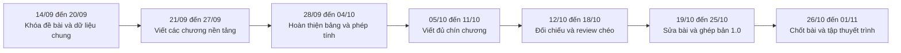
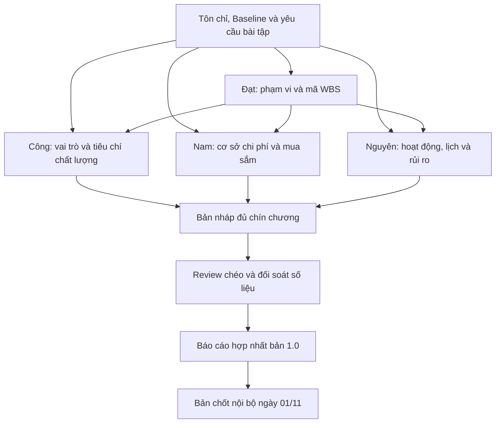

# Kế hoạch làm bài tập lớn theo tuần từ 14/09 đến 01/11/2026

## 1. Phạm vi của kế hoạch

Đây là kế hoạch làm bài tập lớn môn Quản lý dự án phần mềm của nhóm, sử dụng đề tài Hệ thống Quản lý Hoạt động Chuỗi Bể bơi SunSwim làm tình huống nghiên cứu. Trong giai đoạn từ 14/09 đến 01/11/2026, nhóm tập trung xây dựng quyển báo cáo quản lý dự án, các bảng biểu và phụ lục đi kèm. Nhóm không đặt mục tiêu phải lập trình, triển khai hoặc nghiệm thu toàn bộ hệ thống SunSwim trong bảy tuần này.

Các nội dung như phát triển phần mềm, kiểm thử, mua sắm, triển khai và nghiệm thu được trình bày dưới dạng kế hoạch cho dự án giả định. Nếu dùng số liệu minh họa, người viết phải ghi rõ đó là số liệu giả định, không mô tả như một kết quả đã xảy ra.

Đầu ra chung của giai đoạn gồm:

- Quyển báo cáo đủ chín chương theo yêu cầu của giảng viên.
- Các bảng tính, sơ đồ, ma trận và biểu mẫu được dẫn chiếu trong từng chương.
- Bảng ghi nhận công việc của từng thành viên và lịch sử review.
- Dàn ý thuyết trình, phần nói của từng người và danh sách câu hỏi cần thống nhất.

Kế hoạch này không yêu cầu tạo file PowerPoint.

### Hai loại lịch cần phân biệt

| Loại lịch | Mục đích | Cách sử dụng |
|---|---|---|
| Lịch dự án SunSwim 14 tuần | Mô tả kế hoạch quản lý của tình huống dự án trong Chương 3 | Giữ các mốc từ [Baseline dự án](07-academic-project-baseline.md); đây là nội dung của bài tập |
| Lịch làm báo cáo 7 tuần | Tổ chức công việc thật của bốn thành viên từ 14/09 đến 01/11 | Dùng để giao việc, review, ghép bài và chuẩn bị thuyết trình |

Hai lịch có mục đích khác nhau. Nguyên phụ trách cả việc trình bày lịch dự án giả định trong Chương 3 và theo dõi lịch làm bài của nhóm, nhưng không được trộn hai bộ mốc vào cùng một bảng.

## 2. Căn cứ xây dựng kế hoạch

Nhóm dùng các tài liệu sau làm nguồn chung:

- [Tôn chỉ dự án](00-project-charter.md).
- [Baseline dự án](07-academic-project-baseline.md).
- [Phân công thực hiện báo cáo](06-phan-cong-bao-cao-ptit.md).
- Bài giảng Quản lý dự án phần mềm do người học cung cấp.
- Yêu cầu về cấu trúc báo cáo và phân công thành viên do giảng viên đưa ra.

Thứ tự chương trong bài giảng không trùng với thứ tự chương của quyển báo cáo. Nhóm đối chiếu theo nội dung như sau:

| Chương trong báo cáo | Nội dung cần đối chiếu trong bài giảng |
|---|---|
| Chương 1: Tôn chỉ dự án | Phát biểu bài toán và Tôn chỉ dự án ở Chương 2; quá trình lập kế hoạch ở Chương 3 |
| Chương 2: Quản lý phạm vi | Quản lý phạm vi, WBS và ước lượng ở Chương 4; phần tóm tắt quản lý phạm vi trong Phụ lục 1 |
| Chương 3: Quản lý thời gian | Quan hệ phụ thuộc, sơ đồ mạng và kỹ thuật lập lịch ở Chương 5; phần tóm tắt quản lý thời gian trong Phụ lục 1 |
| Chương 4: Quản lý chi phí | Ước lượng ở Chương 4, phân tích giá trị thu được ở Chương 8 và phần tóm tắt quản lý chi phí trong Phụ lục 1 |
| Chương 5: Quản lý mua sắm | Phần tóm tắt quản lý mua sắm trong Phụ lục 1 |
| Chương 6: Quản lý nguồn nhân lực | Cơ cấu nhóm, ma trận trách nhiệm và phát triển nhóm ở Chương 7; phần tóm tắt nguồn nhân lực trong Phụ lục 1 |
| Chương 7: Quản lý giao tiếp | Kiểm soát và báo cáo dự án ở Chương 8; quản lý truyền thông trong Phụ lục 1; kỹ năng giao tiếp trong Phụ lục 2 |
| Chương 8: Quản lý rủi ro | Quản lý rủi ro, kiểm soát thay đổi và quản lý cấu hình ở Chương 6; phần tóm tắt rủi ro trong Phụ lục 1 |
| Chương 9: Quản lý chất lượng | Quản lý chất lượng và kết thúc dự án ở Chương 9; phần tóm tắt chất lượng trong Phụ lục 1 |

Bài giảng chỉ tóm tắt quản lý chi phí, giao tiếp và mua sắm. Khi viết ba phần này, nhóm dùng thêm Tôn chỉ, Baseline và các biểu mẫu đã thống nhất trong bộ spec. Nếu bổ sung tài liệu bên ngoài, người viết phải ghi nguồn để cả nhóm kiểm tra.

## 3. Phân công chương và trách nhiệm

| Thành viên | Chương phụ trách chính | Nội dung bắt buộc đã đáp ứng | Người review |
|---|---|---|---|
| Phạm Tuấn Đạt | Chương 1, 2 và 7 | Quản lý phạm vi | Vũ Thành Công |
| Vũ Thành Công | Chương 6 và 9 | Quản lý nguồn nhân lực | Vũ Thành Nguyên |
| Trần Nhật Nam | Chương 4 và 5; hợp nhất bản báo cáo | Quản lý chi phí | Phạm Tuấn Đạt |
| Vũ Thành Nguyên | Chương 3 và 8; theo dõi lịch làm bài | Quản lý thời gian | Trần Nhật Nam |

Phân công này bảo đảm mỗi thành viên phụ trách ít nhất một trong bốn nội dung bắt buộc: phạm vi, thời gian, chi phí và nguồn nhân lực. Khi thuyết trình, mỗi người trình bày đúng phần mình đã viết và chịu trách nhiệm trả lời câu hỏi liên quan.

## 4. Flow thực hiện trong bảy tuần

Flow nội dung được tổ chức theo quan hệ đầu vào như sau:

## 5. Nhịp làm việc chung trong mỗi tuần

1. Đầu tuần, mỗi người ghi việc sẽ làm, tài liệu đầu vào và sản phẩm phải bàn giao.
2. Trong tuần, thành viên tự hoàn thiện phần của mình theo bảng dữ liệu chung. Nếu cần một đầu vào từ người khác, chỉ yêu cầu bảng hoặc mã liên quan, không chờ cả chương hoàn chỉnh.
3. Trước cuối tuần, người thực hiện gửi bản có ngày cập nhật và số phiên bản cho người review.
4. Người review ghi rõ vị trí, vấn đề và đề xuất sửa. Góp ý không được chỉ trao đổi miệng.
5. Nam cập nhật bản hợp nhất. Nguyên cập nhật lịch, việc chậm và rủi ro ảnh hưởng đến mốc 01/11.
6. Cuối tuần, cả nhóm chốt đầu ra của tuần và xác nhận đầu vào cho tuần tiếp theo.

Các mốc nội bộ được dùng để kiểm soát tiến độ:

| Mốc | Kết quả cần có |
|---|---|
| 20/09 | Khung chín chương, bảng dữ liệu chung và dàn ý của từng người |
| 27/09 | Bản nháp các chương nền tảng: 1, 2, 3, 4 và 6 |
| 04/10 | Các bảng WBS, lịch, chi phí, nguồn lực và khung của bốn chương còn lại |
| 11/10 | Bản nháp đủ chín chương |
| 18/10 | Hoàn thành review chéo và danh sách vấn đề cần sửa |
| 25/10 | Báo cáo hợp nhất bản 1.0 và dàn ý thuyết trình của từng người |
| 01/11 | Bản chốt nội bộ, bảng đóng góp và biên bản tập thuyết trình |

## 6. Tuần 1, từ 14/09 đến 20/09

Mục tiêu tuần: hiểu đúng đề bài, thống nhất nguồn số liệu và tạo khung để bốn người có thể làm song song.

| Thành viên | Nhiệm vụ cụ thể | Sản phẩm đầu ra |
|---|---|---|
| Phạm Tuấn Đạt | Đối chiếu Tôn chỉ với yêu cầu báo cáo. Tạo mục lục chín chương, trích các thông tin dùng cho Chương 1 và xác định phạm vi trong, phạm vi ngoài. Lập WBS cấp cao để các chương khác có mã tham chiếu ban đầu. | Mục lục báo cáo; bảng dữ liệu cho Chương 1; Scope Statement bản nháp; WBS cấp cao có mã |
| Vũ Thành Công | Tổng hợp tên thành viên, bên liên quan và vai trò dự án. Trích các tiêu chí chất lượng đã có trong Tôn chỉ và Baseline. Tạo dàn ý Chương 6 và Chương 9. | Danh sách vai trò; sơ đồ tổ chức bản nháp; bảng tiêu chí chất lượng nguồn; dàn ý Chương 6 và 9 |
| Trần Nhật Nam | Tạo bảng dữ liệu chung về tên dự án, thời gian, ngân sách, milestone và quy ước phiên bản. Kiểm tra cơ cấu ngân sách 150 triệu đồng; phân loại khoản chi phí và nhu cầu mua sắm chỉ mang tính kế hoạch. | Bảng dữ liệu chung; quy ước tên file và phiên bản; bảng giả định chi phí; danh sách nhu cầu mua sắm giả định; dàn ý Chương 4 và 5 |
| Vũ Thành Nguyên | Lập lịch làm báo cáo trong bảy tuần và danh sách mốc nội bộ. Tạo khung lịch dự án 14 tuần cho Chương 3 nhưng tách riêng khỏi lịch làm bài. Tổng hợp các rủi ro có thể ảnh hưởng đến việc hoàn thành báo cáo. | Lịch làm bài bảy tuần; khung Activity List của dự án; danh sách mốc nội bộ; Risk Register bản đầu; dàn ý Chương 3 và 8 |

Điểm bàn giao cuối tuần:

- Nam phát hành một bảng dữ liệu chung để cả nhóm sử dụng.
- Đạt bàn giao mã WBS cấp cao cho Công, Nam và Nguyên.
- Mỗi người có dàn ý và danh sách đầu ra cho các chương mình phụ trách.
- Nhóm ghi các thông tin chưa đủ cơ sở vào sổ giả định, không để rải rác dưới dạng `Pending` trong từng chương.

## 7. Tuần 2, từ 21/09 đến 27/09

Mục tiêu tuần: hoàn thành bản nháp các nội dung nền tảng gồm Tôn chỉ, phạm vi, thời gian, chi phí và nguồn nhân lực.

| Thành viên | Nhiệm vụ cụ thể | Sản phẩm đầu ra |
|---|---|---|
| Phạm Tuấn Đạt | Viết Chương 1 từ Tôn chỉ đã có. Hoàn thiện mục tiêu, sản phẩm bàn giao, phạm vi trong, phạm vi ngoài và tiêu chí chấp nhận. Chi tiết hóa WBS theo hướng mỗi gói công việc có thể gắn với lịch, chi phí và người phụ trách. | Chương 1 bản nháp; Scope Statement; WBS; WBS Dictionary bản đầu |
| Vũ Thành Công | Viết phần cơ cấu tổ chức, mô tả vai trò và trách nhiệm. Lập RACI theo mã WBS do Đạt bàn giao. Xác định kỹ năng cần có và mức tham gia dự kiến của từng vai trò trong các giai đoạn của dự án. | Chương 6 bản nháp; Organization Chart; bảng mô tả vai trò; RACI; Skills Matrix; Resource Calendar bản đầu |
| Trần Nhật Nam | Chọn cách ước lượng chi phí và ghi rõ cơ sở ước lượng. Phân bổ ngân sách 150 triệu đồng theo nhóm chi phí và mã WBS; tách chi phí trực tiếp, dự phòng rủi ro và dự phòng quản lý theo Baseline. | Chương 4 bản nháp; bảng cơ sở ước lượng; Cost Breakdown Structure; bảng phân bổ ngân sách theo WBS |
| Vũ Thành Nguyên | Chuyển WBS thành danh sách hoạt động. Xác định thứ tự, thời lượng dự kiến và quan hệ trước sau. Lập sơ đồ mạng ban đầu và xác định chuỗi công việc có thể tạo thành đường găng. | Activity List; bảng quan hệ phụ thuộc; Network Diagram bản nháp; Critical Path bản nháp |

Điểm bàn giao cuối tuần:

- Đạt khóa mã WBS. Nếu cần sửa tên gói công việc sau mốc này, mã cũ vẫn được giữ để không làm hỏng bảng của người khác.
- Công bàn giao mã vai trò; Nam bàn giao mã nhóm chi phí; Nguyên bàn giao mã hoạt động.
- Bốn chương bắt buộc là phạm vi, thời gian, chi phí và nguồn nhân lực đều có bản nháp và đầu ra kèm theo.

## 8. Tuần 3, từ 28/09 đến 04/10

Mục tiêu tuần: hoàn thiện bảng, sơ đồ và phương pháp tính của các chương nền tảng; đồng thời tạo khung cho bốn chương còn lại.

| Thành viên | Nhiệm vụ cụ thể | Sản phẩm đầu ra |
|---|---|---|
| Phạm Tuấn Đạt | Viết kế hoạch quản lý phạm vi, cách thu thập và xác nhận yêu cầu, cùng quy trình kiểm soát thay đổi. Liên kết mục tiêu, yêu cầu, WBS và sản phẩm bàn giao. Tạo dàn ý Chương 7. | Chương 2 bản đầy đủ; Scope Baseline; Requirements Traceability Matrix; mẫu xác nhận phạm vi; mẫu Change Request; dàn ý Chương 7 |
| Vũ Thành Công | Hoàn thiện Resource Calendar, cách xử lý xung đột, chia sẻ kiến thức và đánh giá đóng góp. Tạo khung quản lý chất lượng, phân biệt hoạt động bảo đảm chất lượng với kiểm soát chất lượng. | Chương 6 bản đầy đủ; Resource Calendar; kế hoạch phát triển nhóm; khung Quality Management Plan |
| Trần Nhật Nam | Phân bổ Cost Baseline theo thời gian. Tạo mẫu PV, EV, AC, CV, SV, CPI và SPI để minh họa cách kiểm soát. Nếu dùng một kỳ báo cáo mẫu, ghi rõ số liệu là giả định. Tạo dàn ý Chương 5. | Chương 4 bản đầy đủ; Cost Baseline; bảng ngân sách theo thời gian; mẫu EVM có hướng dẫn; dàn ý Chương 5 |
| Vũ Thành Nguyên | Hoàn thiện Network Diagram, Critical Path, thời gian dự trữ, Gantt Chart và Schedule Baseline của dự án giả định. Viết quy tắc cập nhật tiến độ và xử lý chậm việc. Xây dựng thang xác suất, tác động cho Chương 8. | Chương 3 bản đầy đủ; Network Diagram; bảng Critical Path và Slack; Gantt Chart; Schedule Baseline; mẫu báo cáo tiến độ; thang đánh giá rủi ro |

Điểm bàn giao cuối tuần:

- Lịch, chi phí và nguồn lực phải dùng cùng mã WBS.
- Các mốc của dự án giả định phải khớp Tôn chỉ và Baseline.
- Công thức EVM có tên biến, đơn vị và cách đọc kết quả.
- Mọi con số chưa phải dữ liệu thực tế đều được đánh dấu là giả định hoặc minh họa.

## 9. Tuần 4, từ 05/10 đến 11/10

Mục tiêu tuần: hoàn thành bốn chương còn lại gồm mua sắm, giao tiếp, rủi ro và chất lượng để có bản nháp đủ chín chương.

| Thành viên | Nhiệm vụ cụ thể | Sản phẩm đầu ra |
|---|---|---|
| Phạm Tuấn Đạt | Viết Chương 7. Xác định các bên liên quan, ai gửi, ai nhận, loại thông tin, thời điểm và kênh trao đổi. Soạn cách báo cáo khi chậm việc, vượt chi phí, xuất hiện rủi ro hoặc có yêu cầu thay đổi. | Chương 7 bản nháp; Stakeholder Register; Communication Management Plan; Communication Matrix; mẫu biên bản họp; mẫu báo cáo tuần; Issue Log mẫu |
| Vũ Thành Công | Viết Chương 9. Xác định tiêu chí chất lượng, cách đo, người kiểm tra và bằng chứng cần thu thập nếu dự án được triển khai. Lập quy trình review tài liệu, chiến lược kiểm thử và mẫu theo dõi lỗi ở mức kế hoạch. | Chương 9 bản nháp; Quality Management Plan; bảng chỉ số chất lượng; checklist review tài liệu; test case minh họa; Defect Log mẫu |
| Trần Nhật Nam | Viết Chương 5. Thực hiện phân tích tự làm hay mua, lập lịch mua sắm giả định, mô tả phạm vi công việc của nhà cung cấp và tiêu chí đánh giá. Kiểm tra mọi khoản dự kiến nằm trong Cost Baseline và mô tả cách đóng từng gói mua sắm. | Chương 5 bản nháp; Make-or-Buy Analysis; Procurement Schedule; SOW mẫu; Vendor Scorecard; checklist đóng mua sắm |
| Vũ Thành Nguyên | Viết Chương 8. Đưa các rủi ro trong Tôn chỉ vào Risk Register và bổ sung để có ít nhất 10 rủi ro ưu tiên theo bài tập cuối Chương 6 của bài giảng. Ghi nguyên nhân, dấu hiệu cảnh báo, chủ sở hữu, cách ứng phó và phần dự phòng liên quan. | Chương 8 bản nháp; Risk Management Plan; Risk Register có ít nhất 10 rủi ro được xếp hạng; ma trận xác suất và tác động; mẫu báo cáo review rủi ro |

Điểm bàn giao cuối tuần:

- Báo cáo có bản nháp đủ chín chương.
- Mỗi chương có nội dung chính, bảng kế hoạch và phụ lục hoặc biểu mẫu tương ứng.
- Chương 9 chỉ mô tả kế hoạch, tiêu chí và cách thu thập bằng chứng. Nhóm không tạo kết quả kiểm thử giả như thể hệ thống đã chạy.
- Chương 5 mô tả quyết định mua sắm trong tình huống dự án, không ghi rằng nhóm sinh viên đã ký hợp đồng hoặc mua thiết bị thật.

## 10. Tuần 5, từ 12/10 đến 18/10

Mục tiêu tuần: nối dữ liệu giữa chín chương và review chéo để phát hiện mâu thuẫn trước khi ghép bài.

| Thành viên | Nhiệm vụ cụ thể | Sản phẩm đầu ra |
|---|---|---|
| Phạm Tuấn Đạt | Kiểm tra phạm vi có được phản ánh trong lịch, chi phí, RACI và kế hoạch chất lượng hay không. Hoàn thiện ma trận truy vết. Review Chương 4 và 5 của Nam, tập trung vào quan hệ giữa WBS, ngân sách và mua sắm. | Requirements Traceability Matrix hoàn chỉnh; phiếu đối chiếu liên chương; danh sách góp ý cho Chương 4 và 5 |
| Vũ Thành Công | Kiểm tra tên vai trò và trách nhiệm trong toàn bộ báo cáo. Liên kết tiêu chí chất lượng với yêu cầu, người phụ trách và bằng chứng dự kiến. Review Chương 1, 2 và 7 của Đạt. | RACI đã đối chiếu; bảng truy vết chất lượng; danh sách góp ý cho Chương 1, 2 và 7 |
| Trần Nhật Nam | Kiểm tra tổng ngân sách, dự phòng và các khoản mua sắm. Đối chiếu chi phí theo WBS với lịch do Nguyên lập. Review Chương 3 và 8, chú ý rủi ro có ảnh hưởng đến chi phí hoặc tiến độ. | Bảng đối soát chi phí; danh sách chênh lệch số liệu; danh sách góp ý cho Chương 3 và 8 |
| Vũ Thành Nguyên | Kiểm tra ngày, thời lượng, milestone và quan hệ phụ thuộc trong toàn bộ báo cáo. Đối chiếu rủi ro với phạm vi, chi phí và chất lượng. Review Chương 6 và 9 của Công. | Bảng đối soát tiến độ; bảng liên kết rủi ro; danh sách góp ý cho Chương 6 và 9 |

Điểm bàn giao cuối tuần:

- Mỗi chương có một người viết và một người review.
- Mỗi góp ý có vị trí, mô tả vấn đề, người sửa, hạn sửa và trạng thái.
- Nhóm chốt một danh sách duy nhất cho tên dự án, vai trò, mã WBS, mốc thời gian, ngân sách và thuật ngữ.
- Không sửa trực tiếp số liệu của chương khác khi chưa báo người phụ trách.

## 11. Tuần 6, từ 19/10 đến 25/10

Mục tiêu tuần: xử lý góp ý, hoàn thiện từng chương và tạo bản báo cáo hợp nhất để cả nhóm đọc lần cuối.

| Thành viên | Nhiệm vụ cụ thể | Sản phẩm đầu ra |
|---|---|---|
| Phạm Tuấn Đạt | Sửa Chương 1, 2 và 7 theo góp ý. Kiểm tra lại phạm vi, WBS, ma trận giao tiếp, thuật ngữ và dẫn chiếu. Chuẩn bị dàn ý nói cho phần mình phụ trách. | Chương 1, 2 và 7 bản hoàn thiện; nhật ký xử lý góp ý; dàn ý thuyết trình cá nhân |
| Vũ Thành Công | Sửa Chương 6 và 9. Dùng checklist chất lượng để kiểm tra cấu trúc, bảng biểu, người phụ trách và bằng chứng trong toàn bộ báo cáo. Gửi danh sách lỗi tài liệu cho từng người. | Chương 6 và 9 bản hoàn thiện; Quality Checklist đã điền; danh sách lỗi tài liệu và người xử lý; dàn ý thuyết trình cá nhân |
| Trần Nhật Nam | Sửa Chương 4 và 5. Nhận các chương đã chốt, hợp nhất mục lục, bảng biểu, phụ lục, nguồn tham khảo và bảng đóng góp. Quản lý thay đổi sau thời điểm ghép. | Chương 4 và 5 bản hoàn thiện; báo cáo hợp nhất bản 1.0; nhật ký phiên bản; danh sách mục còn thiếu; dàn ý thuyết trình cá nhân |
| Vũ Thành Nguyên | Sửa Chương 3 và 8. Kiểm tra lần cuối các ngày, milestone, đường găng và rủi ro. Lập lịch sửa bài, đọc thử và tập thuyết trình trong tuần cuối. | Chương 3 và 8 bản hoàn thiện; bảng kiểm tra lịch và rủi ro; lịch tuần cuối; dàn ý thuyết trình cá nhân |

Điểm bàn giao cuối tuần:

- Mỗi người khóa nội dung chính của chương mình trước khi Nam ghép bản 1.0.
- Mọi thay đổi sau khi ghép được ghi trong nhật ký phiên bản.
- Các bảng hoặc sơ đồ lớn có tên, đơn vị, nguồn dữ liệu và phần giải thích cách đọc.
- Bản 1.0 có đủ phần ghi nhận công việc của từng thành viên.

## 12. Tuần 7, từ 26/10 đến 01/11

Mục tiêu tuần: chốt quyển báo cáo, xác nhận đóng góp và chuẩn bị để mỗi thành viên trình bày đúng phần mình đã thực hiện.

| Thành viên | Nhiệm vụ cụ thể | Sản phẩm đầu ra |
|---|---|---|
| Phạm Tuấn Đạt | Kiểm tra lần cuối Chương 1, 2 và 7. Tập trình bày Tôn chỉ, phạm vi và giao tiếp. Soạn các câu hỏi có thể gặp về thay đổi phạm vi và cách phối hợp trong nhóm; cập nhật câu trả lời sau buổi tập. | Ba chương đã xác nhận; ghi chú thuyết trình; bộ câu hỏi và câu trả lời cho phần phụ trách; xác nhận đóng góp cá nhân |
| Vũ Thành Công | Kiểm tra Chương 6 và 9. Chạy checklist chất lượng lần cuối trên bản hợp nhất. Tập trình bày nguồn nhân lực và chất lượng; ghi lại lỗi nội dung hoặc bảng biểu phát hiện khi đọc thành tiếng. | Hai chương đã xác nhận; Quality Checklist cuối; ghi chú thuyết trình; danh sách lỗi cuối; xác nhận đóng góp cá nhân |
| Trần Nhật Nam | Kiểm tra Chương 4 và 5. Sửa lỗi định dạng, đánh số bảng, mục lục, phụ lục và dẫn chiếu. Quản lý bản chốt nội bộ; tập trình bày chi phí và mua sắm. | Báo cáo chốt nội bộ; nhật ký phiên bản; hai chương đã xác nhận; ghi chú thuyết trình; xác nhận đóng góp cá nhân |
| Vũ Thành Nguyên | Kiểm tra Chương 3 và 8. Điều phối buổi trình bày thử, ghi thời lượng từng người và các câu trả lời chưa thống nhất. Tập trình bày lịch và rủi ro; cập nhật kế hoạch xử lý những việc còn lại. | Hai chương đã xác nhận; biên bản trình bày thử; bảng thời lượng; danh sách câu hỏi chung; xác nhận đóng góp cá nhân |

Đầu ra chung ngày 01/11:

- Bản báo cáo chốt nội bộ, đủ chín chương.
- Phụ lục chứa các biểu mẫu, bảng tính, sơ đồ và ma trận đã được dẫn chiếu.
- Bảng xác nhận công việc của từng thành viên.
- Nhật ký review và chỉnh sửa.
- Phần giải thích thuật ngữ khó trong từng chương hoặc tài liệu liên quan.
- Dàn ý thuyết trình chung và ghi chú nói của từng người.
- Biên bản trình bày thử và danh sách câu hỏi đã thống nhất.

## 13. Quy tắc bàn giao để giảm phụ thuộc

| Nội dung dùng chung | Người tạo bản gốc | Thời điểm cần bàn giao | Cách các thành viên khác sử dụng |
|---|---|---|---|
| Bảng dữ liệu chung | Nam | Tuần 1 | Dẫn lại số liệu, không tự tạo một phiên bản khác |
| Mã WBS và Scope Statement | Đạt | Bản cấp cao ở Tuần 1; bản chi tiết ở Tuần 2 | Nguyên gắn hoạt động; Nam gắn chi phí; Công gắn vai trò và chất lượng |
| Mã vai trò và RACI | Công | Tuần 2 | Các chương dùng đúng tên vai trò và người chịu trách nhiệm |
| Mã hoạt động, lịch và milestone | Nguyên | Tuần 2 và Tuần 3 | Nam lập ngân sách theo thời gian; các chương khác dẫn đúng ngày |
| Nhóm chi phí và Cost Baseline | Nam | Tuần 2 và Tuần 3 | Nguyên gắn rủi ro; Đạt và Công không tự thêm khoản chi |
| Tiêu chí chất lượng | Công | Khung ở Tuần 1; bản đầy đủ ở Tuần 4 | Đạt gắn yêu cầu; Nguyên gắn rủi ro và lịch review |
| Risk Register | Nguyên | Bản đầu ở Tuần 1; bản đầy đủ ở Tuần 4 | Mỗi người gửi rủi ro thuộc chương mình để Nguyên tổng hợp |
| Bản báo cáo hợp nhất | Nam | Tuần 6 | Mỗi người sửa chương của mình qua nhật ký thay đổi |

Người nhận chỉ cần đầu vào ngắn đã nêu trong bảng. Ví dụ, Nam có thể bắt đầu cấu trúc chi phí từ WBS cấp cao mà không chờ Đạt viết xong toàn bộ Chương 2. Công có thể dựng sơ đồ tổ chức từ Tôn chỉ trước khi có Resource Calendar. Nguyên có thể tạo danh sách hoạt động từ mã WBS rồi cập nhật thời lượng sau.

## 14. Điều kiện hoàn thành một sản phẩm đầu ra

Một sản phẩm chỉ được đánh dấu hoàn thành khi đáp ứng các điều kiện sau:

- Có tên người thực hiện, ngày cập nhật và trạng thái.
- Dùng đúng dữ liệu chung đã khóa.
- Có thể mở và kiểm tra được, không chỉ ghi "đã làm".
- Bảng hoặc sơ đồ có tiêu đề, đơn vị và nguồn dữ liệu.
- Nội dung giả định được ghi rõ là giả định.
- Thuật ngữ tiếng Anh khó có giải thích dễ hiểu.
- Người review đã ghi nhận kết quả kiểm tra.
- Không còn mục `Pending`. Nếu chưa có dữ liệu thực tế, nhóm ghi một giả định hợp lý vào sổ giả định và dùng nhất quán.
- Không tuyên bố đã lập trình, kiểm thử, triển khai, mua sắm hoặc nghiệm thu hệ thống thật khi nhóm không có bằng chứng cho hoạt động đó.

## 15. Mẫu theo dõi đóng góp hằng tuần

Nam duy trì bảng này trong bản hợp nhất. Mỗi người tự cập nhật dòng của mình trước khi kết thúc tuần.

| Tuần | Sản phẩm | Người thực hiện | Người review | Phiên bản hoặc liên kết | Trạng thái | Ghi chú |
|---|---|---|---|---|---|---|
|  |  |  |  |  | Chưa làm / Đang làm / Chờ review / Hoàn thành |  |

Khi nộp báo cáo, nhóm dùng nhật ký này để lập bảng công việc của từng thành viên. Phần xác nhận phải phản ánh đúng sản phẩm đã bàn giao và nội dung mà người đó sẽ thuyết trình.

## Thuật ngữ cần biết

| Thuật ngữ | Giải thích dễ hiểu |
|---|---|
| Flow | Luồng công việc, cho biết việc nào làm trước, việc nào làm sau và các đầu ra được bàn giao như thế nào. |
| Project Charter | Tôn chỉ dự án, tài liệu nêu lý do thực hiện, mục tiêu, phạm vi lớn, các bên liên quan và quyền hạn ban đầu. |
| Baseline | Bộ số liệu hoặc kế hoạch đã được chốt để các phần khác cùng sử dụng và đối chiếu. |
| Scope Statement | Bản mô tả dự án làm những gì, bàn giao gì và không làm những gì. |
| Scope Baseline | Bộ phạm vi đã chốt, thường gồm Scope Statement, WBS và WBS Dictionary, dùng làm mốc kiểm soát thay đổi. |
| WBS | Cấu trúc chia phạm vi dự án thành các gói công việc nhỏ, có mã để gắn với lịch, chi phí và người phụ trách. |
| WBS Dictionary | Bảng giải thích nội dung, đầu ra và điều kiện hoàn thành của từng gói WBS. |
| Activity List | Danh sách các hoạt động cần thực hiện, thường có mã, thời lượng, người làm và quan hệ trước sau. |
| Network Diagram | Sơ đồ thể hiện thứ tự và quan hệ phụ thuộc giữa các hoạt động. |
| Critical Path | Chuỗi hoạt động quyết định thời điểm sớm nhất dự án có thể hoàn thành. Nếu một hoạt động trên chuỗi này chậm, mốc cuối có thể chậm theo. |
| Slack | Khoảng thời gian một hoạt động có thể chậm mà chưa làm chậm mốc cuối hoặc hoạt động kế tiếp. |
| Gantt Chart | Biểu đồ cho biết mỗi hoạt động bắt đầu, kết thúc và kéo dài trong khoảng thời gian nào. |
| Schedule Baseline | Lịch dự án đã được chốt, dùng làm mốc để so sánh với tiến độ cập nhật sau này. |
| Cost Baseline | Ngân sách đã được phân bổ theo công việc và thời gian để làm mốc theo dõi chi phí. |
| Cost Breakdown Structure | Cấu trúc chia tổng chi phí thành các nhóm nhỏ và gắn chúng với công việc tương ứng. |
| EVM | Cách so sánh phần việc dự kiến, phần việc đã hoàn thành và chi phí đã dùng. |
| PV, EV, AC | Lần lượt là giá trị công việc theo kế hoạch, giá trị công việc đã hoàn thành và chi phí thực tế. |
| CV, SV | Lần lượt là chênh lệch chi phí và chênh lệch tiến độ so với kế hoạch. |
| CPI, SPI | Chỉ số hiệu quả chi phí và chỉ số hiệu quả tiến độ. |
| Organization Chart | Sơ đồ cho biết các vai trò trong dự án và quan hệ báo cáo giữa các vai trò đó. |
| RACI | Bảng chỉ rõ ai thực hiện, ai chịu trách nhiệm cuối, ai được hỏi ý kiến và ai cần được thông báo. |
| Skills Matrix | Bảng đối chiếu kỹ năng cần có với khả năng của từng thành viên để phân công và bổ sung kiến thức. |
| Resource Calendar | Bảng cho biết một người hoặc vai trò có thể tham gia vào giai đoạn nào và ở mức nào. |
| Communication Matrix | Bảng quy định ai cần gửi thông tin gì, cho ai, khi nào và qua kênh nào. |
| Communication Management Plan | Kế hoạch quy định nhu cầu thông tin, kênh trao đổi, tần suất và trách nhiệm giao tiếp trong dự án. |
| Stakeholder Register | Danh sách các bên liên quan, mức độ ảnh hưởng, nhu cầu thông tin và cách nhóm làm việc với họ. |
| Issue Log | Danh sách vấn đề đã xảy ra, người xử lý, hạn xử lý và trạng thái hiện tại. |
| Requirements Traceability Matrix | Ma trận liên kết mục tiêu, yêu cầu, WBS, sản phẩm bàn giao và tiêu chí kiểm tra để tránh bỏ sót. |
| Change Request | Phiếu đề nghị thay đổi phạm vi, lịch, chi phí hoặc nội dung đã được chốt. |
| Risk Register | Danh sách rủi ro kèm nguyên nhân, xác suất, tác động, người theo dõi, dấu hiệu cảnh báo và cách ứng phó. |
| Risk Management Plan | Kế hoạch quy định cách nhận diện, đánh giá, ứng phó và theo dõi rủi ro. |
| Quality Assurance | Hoạt động kiểm tra quy trình làm việc có phù hợp kế hoạch chất lượng hay không. |
| Quality Control | Hoạt động kiểm tra sản phẩm đầu ra có đạt tiêu chí đã đặt ra hay không. |
| Quality Management Plan | Kế hoạch quy định tiêu chí chất lượng, cách đo, người kiểm tra và bằng chứng cần lưu. |
| Quality Checklist | Danh sách tiêu chí dùng để kiểm tra nhanh một chương hoặc toàn bộ báo cáo. |
| Test Case | Kịch bản kiểm tra gồm điều kiện, các bước thực hiện, dữ liệu và kết quả mong đợi. Trong bài này, nhóm chỉ cần ví dụ minh họa nếu chưa có hệ thống thật. |
| Defect Log | Bảng ghi lỗi hoặc điểm không đạt, mức độ, người xử lý và trạng thái. |
| Make-or-Buy Analysis | Phân tích nên tự thực hiện hay mua sản phẩm, dịch vụ từ bên ngoài. |
| Procurement Schedule | Lịch dự kiến cho các bước chuẩn bị, lựa chọn, theo dõi và đóng hoạt động mua sắm. |
| SOW | Tài liệu mô tả công việc, kết quả và điều kiện mà bên cung cấp phải đáp ứng. |
| Vendor Scorecard | Bảng chấm nhà cung cấp theo các tiêu chí đã thống nhất, chẳng hạn kỹ thuật, chi phí và tiến độ. |
| Review | Việc một thành viên khác đọc và kiểm tra nội dung trước khi chấp nhận. |
| Milestone | Mốc dùng để xác nhận một nhóm công việc hoặc giai đoạn đã đạt kết quả dự kiến. |
| Pending | Trạng thái chưa có đủ thông tin hoặc chưa được xử lý xong. Trong báo cáo cuối, nội dung này phải được giải quyết hoặc chuyển thành giả định có ghi chú. |
