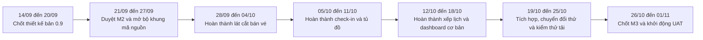

# Kế hoạch thực hiện theo tuần từ 14/09 đến 01/11/2026

## 1. Mục đích

Kế hoạch này chia công việc cho bốn thành viên trong bảy tuần liên tiếp, từ ngày 14/09 đến hết ngày 01/11/2026. Mỗi tuần có nhiệm vụ, sản phẩm đầu ra và điểm bàn giao rõ ràng. Cách chia bám theo [Tôn chỉ dự án](00-project-charter.md), [Baseline dự án](07-academic-project-baseline.md), [Kế hoạch 14 tuần](01-mvp-release-plan.md) và [Phân công báo cáo](06-phan-cong-bao-cao-ptit.md).

Hai mốc phải giữ trong giai đoạn này:

- M2 ngày 26/09/2026: hoàn thành hồ sơ thiết kế kiến trúc, cơ sở dữ liệu và UI Prototype.
- M3 ngày 30/10/2026: có bản phần mềm sẵn sàng UAT tại một cơ sở mẫu, gồm bán vé, check-in, tủ đồ và xếp lịch.

Ngày 31/10 và 01/11 chỉ dùng để khởi động UAT. Nhóm chưa coi UAT là hoàn tất tại thời điểm này.

## 2. Cách chia trách nhiệm

| Thành viên | Trách nhiệm chính trong giai đoạn 14/09 đến 01/11 |
|---|---|
| Trần Nhật Nam | Quản lý dự án, kiến trúc hệ thống, hợp đồng tích hợp, môi trường chạy và bản tích hợp hằng tuần |
| Vũ Thành Công | Làm rõ nghiệp vụ, thiết kế dữ liệu, phát triển backend và hỗ trợ chuyển đổi dữ liệu Excel |
| Phạm Tuấn Đạt | Phụ trách kỹ thuật triển khai, frontend, thiết bị tại quầy, Local Cache và tích hợp đầu cuối |
| Vũ Thành Nguyên | Quản lý lịch, rủi ro, kế hoạch kiểm thử, kiểm thử thực tế và bằng chứng nghiệm thu |

Local Cache được chia thành bốn phần để tránh dồn toàn bộ việc cho một người. Nam chốt kiến trúc đồng bộ, Công xử lý phía máy chủ, Đạt làm phần chạy tại máy quầy, Nguyên kiểm thử mất mạng và kết nối lại.

## 3. Flow thực hiện chung

Trong mỗi tuần, nhóm làm theo một nhịp cố định:

1. Thứ Hai: Nam chốt mục tiêu tuần, đầu vào dùng chung và người chịu trách nhiệm.
2. Thứ Ba đến Thứ Tư: Công và Đạt làm song song theo hợp đồng API. Nguyên chuẩn bị test case ngay từ đặc tả thay vì chờ code xong.
3. Thứ Năm: nhóm tạo bản tích hợp và lưu hướng dẫn chạy.
4. Thứ Sáu: Nguyên chạy kiểm thử, phân loại lỗi; Nam cập nhật tiến độ, chi phí và rủi ro.
5. Cuối tuần: người phụ trách sửa lỗi, lưu bằng chứng và cập nhật chương báo cáo của mình.

Đạt cập nhật Chương 1, 2 và 7. Công cập nhật Chương 6 và 9. Nam cập nhật Chương 4 và 5. Nguyên cập nhật Chương 3 và 8.

## 4. Tuần 1, từ 14/09 đến 20/09

Mục tiêu tuần: hoàn thành thiết kế bản 0.9 để nhóm có đủ dữ liệu review trước M2.

| Thành viên | Nhiệm vụ cụ thể | Sản phẩm đầu ra |
|---|---|---|
| Trần Nhật Nam | Chốt kiến trúc phân tầng và ranh giới module. Xác định luồng tích hợp giữa frontend, Spring Boot, PostgreSQL, thiết bị và Local Cache. Điều phối việc chọn React hoặc Vue. Chuẩn bị checklist cho M2. | Tài liệu kiến trúc bản 0.9; sơ đồ thành phần và triển khai; danh sách quyết định kỹ thuật; checklist M2 |
| Vũ Thành Công | Chốt quy trình bán vé, check-in, tủ đồ và xếp lịch. Hoàn thiện ERD, DFD, từ điển dữ liệu và các business rule liên quan. Kiểm tra dữ liệu nào cần lấy từ Excel cũ. | ERD và DFD bản 0.9; từ điển dữ liệu; danh mục business rule; danh sách trường dữ liệu cần chuyển đổi |
| Phạm Tuấn Đạt | Hoàn thiện prototype quầy lễ tân và giao diện admin. Thử kết nối tối thiểu giữa Spring Boot, PostgreSQL và đầu đọc RFID/QR. Làm thử cơ chế lưu hàng đợi tại máy quầy. | Prototype có thể trình diễn; báo cáo thử nghiệm kỹ thuật; bản nháp giao diện API; bằng chứng thử Local Cache |
| Vũ Thành Nguyên | Phân rã lịch từ 14/09 đến 30/10, xác định critical path và điểm phụ thuộc. Soạn kế hoạch kiểm thử, ma trận test ban đầu và tiêu chí review thiết kế. Cập nhật Risk Register. | Schedule Baseline; sơ đồ mạng và critical path; test matrix bản đầu; Risk Register đã cập nhật |

Điểm bàn giao cuối tuần: Nam nhận ERD, DFD và prototype để hợp nhất hồ sơ thiết kế. Nguyên nhận đủ thiết kế để review khả năng kiểm thử.

## 5. Tuần 2, từ 21/09 đến 27/09

Mục tiêu tuần: duyệt M2 ngày 26/09 và mở bộ khung phát triển từ ngày 27/09.

| Thành viên | Nhiệm vụ cụ thể | Sản phẩm đầu ra |
|---|---|---|
| Trần Nhật Nam | Hợp nhất hồ sơ thiết kế, kiểm tra truy vết với SRS và xử lý ý kiến review. Chốt quy ước API, kiến trúc đồng bộ ngoại tuyến và cấu trúc module. Tổ chức review M2. | Hồ sơ M2 bản 1.0; biên bản review ngày 26/09; danh sách ADR; cấu trúc kho mã nguồn và kế hoạch tích hợp |
| Vũ Thành Công | Hoàn thiện mô hình dữ liệu, ràng buộc chống trùng và hợp đồng dữ liệu cho API. Lập bảng ánh xạ dữ liệu hội viên từ Excel sang PostgreSQL. Chuẩn bị migration đầu tiên. | Thiết kế cơ sở dữ liệu bản 1.0; bảng ánh xạ Excel; migration nháp; hợp đồng dữ liệu cho bốn module chính |
| Phạm Tuấn Đạt | Chốt prototype theo góp ý. Tạo bộ khung frontend, adapter thiết bị và phần Local Cache tại máy quầy. Thống nhất cách dùng mock data khi backend chưa hoàn thành. | UI Prototype bản 1.0; frontend scaffold; thiết kế adapter RFID/QR; bộ khung Local Cache; bộ mock data dùng chung |
| Vũ Thành Nguyên | Review tính kiểm thử được của thiết kế. Viết test case cho bán vé, check-in, tủ đồ và xếp lịch. Xác định bộ dữ liệu test và điều kiện chặn khi thiết kế chưa đạt. | Báo cáo QA cho M2; test suite bản 0.1; bộ dữ liệu test; biên bản xác nhận chất lượng thiết kế |

Điểm bàn giao cuối tuần: nhóm đóng M2 với một bộ thiết kế thống nhất. Từ ngày 27/09, mọi thay đổi ảnh hưởng kiến trúc hoặc phạm vi phải được ghi thành quyết định hoặc Change Request.

## 6. Tuần 3, từ 28/09 đến 04/10

Mục tiêu tuần: hoàn thành lát cắt bán vé từ giao diện đến cơ sở dữ liệu.

| Thành viên | Nhiệm vụ cụ thể | Sản phẩm đầu ra |
|---|---|---|
| Trần Nhật Nam | Xây phần dùng chung gồm phân quyền, ngữ cảnh chi nhánh, audit và môi trường tích hợp. Review contract giữa frontend và backend. Theo dõi tiến độ cùng chi phí tuần. | Nền tảng tích hợp; cấu hình môi trường; checklist kỹ thuật; báo cáo tiến độ và chi phí tuần |
| Vũ Thành Công | Phát triển backend cho hồ sơ hội viên, vé lượt, thẻ tháng, bán vé và ghi nhận thanh toán tại quầy. Viết migration PostgreSQL và unit test cho quy tắc nghiệp vụ. | API hội viên và bán vé; migration có thể chạy lại an toàn; unit test; dữ liệu mẫu cho lát cắt bán vé |
| Phạm Tuấn Đạt | Phát triển màn hình tìm hoặc tạo hội viên, chọn sản phẩm và bán vé. Kết nối frontend với API; dùng mock data cho phần backend chưa sẵn sàng. Hoàn thiện luồng lỗi cơ bản tại quầy. | Giao diện bán vé; bản tích hợp từ frontend đến PostgreSQL; hướng dẫn chạy; danh sách trường hợp lỗi đã xử lý |
| Vũ Thành Nguyên | Chạy test chức năng và tích hợp cho lát cắt bán vé. Kiểm tra quét lặp, cấp vé trùng, phân quyền và dữ liệu sai. Cập nhật lịch cùng rủi ro theo kết quả thực tế. | Báo cáo kiểm thử bán vé; danh sách lỗi có mức độ; ma trận truy vết đã cập nhật; báo cáo SPI và Risk Register tuần |

Điểm bàn giao cuối tuần: bản tích hợp phải tạo được hội viên, bán vé và ghi nhận quyền sử dụng. Các lỗi nghiêm trọng của lát cắt này phải có người xử lý và hạn hoàn thành.

## 7. Tuần 4, từ 05/10 đến 11/10

Mục tiêu tuần: hoàn thành check-in, sức chứa, tủ đồ và luồng ngoại tuyến tại quầy.

| Thành viên | Nhiệm vụ cụ thể | Sản phẩm đầu ra |
|---|---|---|
| Trần Nhật Nam | Chốt hợp đồng đồng bộ, cách chống ghi trùng và quy trình đối soát sau khi có mạng. Review luồng giao tiếp với thiết bị và giới hạn dữ liệu trong Local Cache. Hợp nhất bản tích hợp tuần. | Hợp đồng đồng bộ; ADR cho chế độ ngoại tuyến; sơ đồ luồng đối soát; integration build của tuần |
| Vũ Thành Công | Phát triển backend check-in/out, kiểm soát sức chứa, vòng đời tủ đồ và tiếp nhận bản ghi ngoại tuyến. Bổ sung ràng buộc dữ liệu để ngăn dùng vé hoặc cấp tủ trùng. | API access, capacity, locker và sync; migration tương ứng; unit test cho xử lý đồng thời; log đối soát phía server |
| Phạm Tuấn Đạt | Phát triển màn hình quầy, adapter đầu đọc RFID/QR, sơ đồ tủ xanh/đỏ và hàng đợi Local Cache. Kết nối luồng cho phép hoặc từ chối với cửa xoay trong môi trường thử nghiệm. | Lát cắt check-in và tủ đồ; hàng đợi ngoại tuyến; giao diện trạng thái tủ; báo cáo thử thiết bị khi có mạng và mất mạng |
| Vũ Thành Nguyên | Kiểm thử quét lặp, mất mạng, kết nối lại, cấp trùng tủ và tranh chỗ cuối. Đo toàn bộ thời gian từ lúc quét đến lúc nhận tủ. Ghi bằng chứng đồng bộ đúng một lần. | Báo cáo test access và locker; kết quả đo luồng dưới 5 giây; bằng chứng đồng bộ; danh sách lỗi cần sửa |

Điểm bàn giao cuối tuần: hệ thống phải chạy được check-in và gán tủ ở cả chế độ có mạng lẫn mất mạng có kiểm soát. Mọi bản ghi ngoại tuyến phải có `requestId` và trạng thái đồng bộ.

## 8. Tuần 5, từ 12/10 đến 18/10

Mục tiêu tuần: hoàn thành xếp lịch, điểm danh và dashboard cơ bản.

| Thành viên | Nhiệm vụ cụ thể | Sản phẩm đầu ra |
|---|---|---|
| Trần Nhật Nam | Review kiến trúc, bảo mật, quyền theo chi nhánh và tính nhất quán của API. Kiểm tra việc bốn module cùng chạy trên môi trường tích hợp. Cập nhật kế hoạch cho phần còn thiếu trước M3. | Báo cáo review kiến trúc; integration baseline mới; danh sách việc còn thiếu và người xử lý trước M3 |
| Vũ Thành Công | Phát triển backend cho huấn luyện viên, lớp học, ca học, xếp lịch, chống trùng và điểm danh. Bổ sung truy vấn phục vụ dashboard cơ bản. | API scheduling và attendance; truy vấn báo cáo; ràng buộc chống trùng lịch; unit test cho các biên thời gian |
| Phạm Tuấn Đạt | Phát triển lịch kéo thả, màn hình điểm danh và dashboard cơ bản. Kết nối thông báo lỗi trùng lịch với kết quả kiểm tra từ server. Chạy tích hợp cùng các module đã hoàn thành. | Lát cắt xếp lịch và điểm danh; dashboard cơ bản; bản tích hợp giao diện với API; hướng dẫn thao tác |
| Vũ Thành Nguyên | Kiểm thử trùng lịch, phân quyền, điểm danh và các biên thời gian. Chạy regression cho bán vé, check-in và tủ đồ. Đối chiếu test case với yêu cầu bắt buộc trong SRS. | Báo cáo test tuần; coverage matrix; báo cáo regression; danh sách lỗi theo thứ tự ưu tiên |

Điểm bàn giao cuối tuần: hệ thống không được chấp nhận hai ca trùng thời gian cho cùng huấn luyện viên. Dashboard có thể dùng dữ liệu tích hợp để phục vụ bản pilot.

## 9. Tuần 6, từ 19/10 đến 25/10

Mục tiêu tuần: tạo Release Candidate đầu tiên, chuyển đổi dữ liệu thử và kiểm tra các ngưỡng hiệu năng.

| Thành viên | Nhiệm vụ cụ thể | Sản phẩm đầu ra |
|---|---|---|
| Trần Nhật Nam | Khóa phạm vi bản chạy thử. Chuẩn bị kế hoạch triển khai pilot, phương án quay lui và checklist sẵn sàng. Tổng hợp EVM để đánh giá tiến độ, chi phí. | Kế hoạch Release Candidate; kế hoạch pilot và rollback; readiness checklist; báo cáo EVM tuần |
| Vũ Thành Công | Hoàn thiện công cụ nhập Excel, kiểm tra trùng số điện thoại và mã thẻ. Chạy chuyển đổi thử, đối soát kết quả và sửa lỗi backend còn lại. | Công cụ migration; báo cáo chuyển đổi thử; bảng đối soát; backend RC1; danh sách lỗi dữ liệu còn mở |
| Phạm Tuấn Đạt | Tích hợp toàn hệ thống, tối ưu giao diện và thời gian phản hồi. Gia cố kết nối thiết bị, Local Cache và luồng phục hồi sau mất mạng. Chuẩn bị cấu hình cho cơ sở mẫu. | Bản RC1; báo cáo tích hợp; hướng dẫn cấu hình máy quầy; gói triển khai thử; kết quả tối ưu frontend |
| Vũ Thành Nguyên | Chạy regression đầy đủ và kiểm thử ít nhất 200 giao dịch đồng thời. Xác nhận API không quá 1,5 giây và luồng check-in cùng gán tủ dưới 5 giây. Lập danh sách lỗi phải đóng trước M3. | Báo cáo hiệu năng; báo cáo regression; kết quả kiểm tra SRS; danh sách lỗi chặn M3 và người xử lý |

Điểm bàn giao cuối tuần: RC1 phải có đủ bốn module dùng cho pilot. Nếu một yêu cầu không đạt, Nam quyết định sửa ngay hoặc đưa ra CCB khi việc sửa ảnh hưởng phạm vi, lịch hoặc ngân sách.

## 10. Tuần 7, từ 26/10 đến 01/11

Mục tiêu tuần: đóng lỗi, xác nhận M3 ngày 30/10 và khởi động UAT tại cơ sở mẫu.

| Thành viên | Nhiệm vụ cụ thể | Sản phẩm đầu ra |
|---|---|---|
| Trần Nhật Nam | Điều hành xử lý lỗi hằng ngày. Tổ chức đánh giá sẵn sàng ngày 29/10 và xác nhận M3 ngày 30/10. Phối hợp với Hoàng Thị Mai để mở buổi UAT đầu tiên. | RC2; biên bản M3; báo cáo trạng thái; gói phát hành pilot; lịch UAT tiếp theo |
| Vũ Thành Công | Đóng lỗi backend, chạy chuyển đổi thử lần cuối và đối soát dữ liệu. Chuẩn bị mô tả nghiệp vụ cho người dùng pilot và hỗ trợ xử lý lỗi trong buổi UAT đầu tiên. | Backend ổn định; báo cáo đối soát; release notes nghiệp vụ; dữ liệu pilot đã kiểm tra |
| Phạm Tuấn Đạt | Đóng lỗi giao diện và thiết bị. Triển khai RC2 tại cơ sở mẫu, kiểm tra cấu hình, Local Cache và phương án quay lui. Hỗ trợ thao tác tại quầy trong buổi UAT. | Pilot build; deployment log; rollback package; checklist máy quầy và thiết bị; hướng dẫn xử lý sự cố ngắn |
| Vũ Thành Nguyên | Chạy kiểm thử cuối cho bán vé, check-in, tủ đồ và xếp lịch. Xác nhận không còn lỗi nghiêm trọng. Chuẩn bị UAT kit và ghi nhận kết quả buổi thử ngày 31/10 hoặc 01/11. | QA sign-off cho M3; test summary; UAT kit; danh sách người tham gia; biên bản buổi UAT đầu tiên |

Điểm bàn giao cuối tuần: M3 phải có biên bản xác nhận và bộ bằng chứng kiểm thử. Các vấn đề phát hiện trong UAT được ghi thành defect hoặc Change Request, không sửa miệng rồi bỏ qua lịch sử.

## 11. Quy tắc bàn giao để giảm phụ thuộc

| Nội dung bàn giao | Người chuẩn bị | Người nhận | Hạn lặp lại |
|---|---|---|---|
| Hợp đồng API và quyết định kiến trúc | Nam và Công | Đạt, Nguyên | Trước khi bắt đầu code của từng lát cắt |
| Mock data và mô tả lỗi | Công | Đạt | Chậm nhất chiều Thứ Hai |
| Bản tích hợp cùng hướng dẫn chạy | Nam và Đạt | Nguyên | Chiều Thứ Năm |
| Báo cáo test và danh sách lỗi | Nguyên | Nam, Công, Đạt | Cuối ngày Thứ Sáu |
| Bằng chứng và phần báo cáo đã cập nhật | Mỗi người | Nam | Cuối tuần |

Đạt có thể làm frontend bằng mock data trong lúc Công hoàn thiện backend. Nguyên viết test case từ SRS và contract nên không phải chờ bản tích hợp mới bắt đầu. Nam chỉ thay đổi contract sau khi báo cho cả nhóm và ghi lại quyết định.

## 12. Điều kiện hoàn thành mỗi tuần

- Sản phẩm đầu ra đã được lưu đúng nơi và có phiên bản hoặc ngày cập nhật.
- Người nhận đã review phần bàn giao có ảnh hưởng tới công việc của mình.
- Bản tích hợp chạy được theo hướng dẫn đã ghi.
- Lỗi có mức độ, người xử lý và hạn hoàn thành.
- Tiến độ, rủi ro và chương báo cáo liên quan đã được cập nhật.
- Không dùng một bộ ngày, số liệu hoặc phạm vi khác với baseline chung.

## Thuật ngữ cần biết

| Thuật ngữ | Giải thích dễ hiểu |
|---|---|
| Design Baseline | Bộ thiết kế đã được nhóm chốt để dùng làm mốc khi phát triển. |
| API Contract | Quy ước về dữ liệu mà frontend, backend hoặc thiết bị gửi và nhận. |
| Frontend Scaffold | Bộ khung ban đầu của phần giao diện, gồm cấu trúc thư mục và cấu hình cần thiết. |
| Mock Data | Dữ liệu giả có cấu trúc giống dữ liệu thật, dùng khi phần cung cấp dữ liệu chưa hoàn thành. |
| Integration Build | Bản phần mềm ghép các phần của nhóm để chạy và kiểm thử cùng nhau. |
| Release Candidate hoặc RC | Bản phần mềm gần hoàn chỉnh, được dùng để kiểm tra trước khi phát hành hoặc pilot. |
| Regression Test | Kiểm thử lại các chức năng cũ sau khi nhóm thêm hoặc sửa chức năng. |
| Rollback | Quay lại bản phần mềm hoặc trạng thái ổn định trước đó khi triển khai gặp lỗi. |
| QA Sign-off | Xác nhận của người phụ trách chất lượng rằng bản phần mềm đã đạt điều kiện kiểm thử đã thống nhất. |
| UAT Kit | Bộ tài liệu cho buổi nghiệm thu người dùng, gồm kịch bản, dữ liệu, kết quả mong đợi và biểu mẫu xác nhận. |

